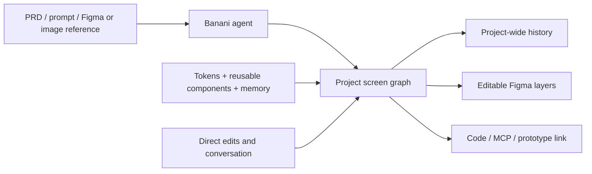

# Banani

> Research status: **Architecture-level** · Last reviewed: **2026-08-11**

| Field | Value |
|---|---|
| Team | Banani · founders named publicly; team region not established |
| Ordinary job | turn a PRD or reference into a connected screen flow and keep refining it as one component-based project |
| Native authority | Banani screens components tokens and project history |
| Delivery | shared canvas/prototype link editable Figma layers images code and MCP context |

## Agent Mode moves history to the project level

Banani's current component-based project type lets the agent create entire flows while reusing components and design tokens. Memory carries preferences and brand rules across the session. Unified history moves undo and redo from a single screen to the project so deleted screens can be recovered. These contracts make the project—not an individual generated picture—the durable unit.

## Handoff has several ownership boundaries

Figma transfer retains editable layers and auto layout according to current pricing/help contracts. Code and MCP support carry the design into engineering. Public evidence does not establish a bidirectional merge from Figma or changed source back to Banani, so these are treated as downstream projections rather than one synchronized authority.

Agent Mode is a beta product mode inside Banani and is not counted separately. Regular and component-based projects may have different editing capabilities; claims about unified history and shared components apply specifically to the documented mode.

## Evidence ceiling

No native schema or implementation is public. Component-instance semantics, history retention, prototype interaction graph, export fidelity and concurrent conflict handling remain unknown.

## Primary evidence

- [Banani AI UI Agent](https://www.banani.co/product/ai-ui-agent)
- [Agent Mode and components beta](https://intercom.help/banani/en/articles/14431725-agent-mode-and-components-beta-overview)
- [Project creation contract](https://intercom.help/banani/en/articles/11695827-create-a-new-project)
