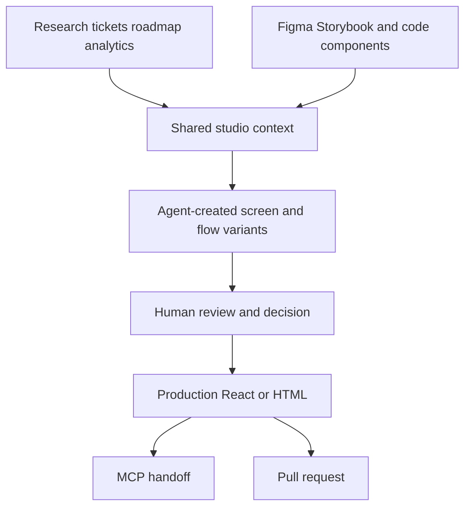

# Dawn

> Research status: **Architecture-level** · Last reviewed: **2026-08-12**

| Field | Verified boundary |
|---|---|
| Lifecycle | private beta |
| Maintainer | Dawnlabs Intelligence Ltd |
| Team region | United Kingdom from the legal-entity footer |
| Working authority | production-oriented React or HTML source grounded in a company's real components and tokens |
| Human surface | multiplayer design studio containing screens flows variants and decisions |
| Delivery | MCP handoff to coding agents or pull request |

Dawn treats product design as a shared environment in which people and agents work against organizational evidence. Its distinguishing mechanism is not prompt-to-screenshot generation; it is the attempt to keep research roadmap data real components screen decisions and production source in one causal chain.

## Company context is an input authority

Projects can draw on research tickets roadmaps and product signals from services such as Notion Linear PostHog Pendo and internal sources. Dawn also says it uses components and tokens from Figma Storybook or an internal library. This means a generated screen is expected to be grounded by two different authorities:

- product evidence constrains what should be built;
- the design system constrains what it may look and behave like.

The closed implementation does not expose the retrieval index ranking rules conflict resolution or freshness guarantees. “Uses context” is therefore a product contract and not proof that every relevant fact reaches every generation.

## People and agents share one decision surface

The studio supports several screens and parallel variants. A person can review compare and continue an agent's work while other people remain in the same multiplayer environment. The important durable object is the accepted direction and its source representation rather than every generated candidate.

Decision memory is consequential because later agents can reuse prior reasoning instead of treating each prompt as a blank request. Public evidence does not reveal the memory schema deletion semantics or whether rejected directions remain retrievable.

## Delivery is the authority test

Dawn claims production React and HTML rather than an image or disposable mockup. MCP can give a coding agent the design output and a pull request can enter normal repository review. Human review is still explicit; a studio preview and a merged implementation are different lifecycle states.

The source mapper model prompts multiplayer consistency protocol and PR generator are closed. No public evidence proves lossless round-tripping from a manually edited repository back into the same Dawn screen. The dossier therefore classifies Dawn as a source-oriented design studio without claiming a bidirectional compiler.

## Primary evidence

- [Dawn product and private-beta contract](https://www.dawn.design/)
- [Dawn legal identity and product workflow](https://www.dawn.design/)
