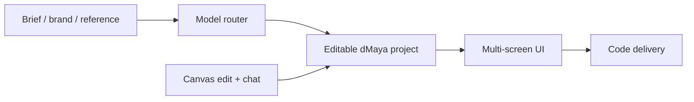

# dMaya

> Research status: **Architecture-level** · Last reviewed: **2026-08-11**

| Field | Value |
|---|---|
| Team | dMaya / Ekyon · team region not established |
| Ordinary job | create an initial interface from product context and keep shaping it through chat on a multi-screen canvas |
| Managed authority | hosted dMaya project and editable screen set |
| Model boundary | a routing layer can choose among models without changing the project unit |

## The continuing object is the screen project

dMaya accepts a plain-language idea plus a brief brand inspiration or existing product reference. Its multi-model agent selects a model or lets the user choose one and places the result on a canvas. Subsequent conversation reshapes that screen and additional screens stay in the same project before code-oriented export.

## Model plurality is not product plurality

Different underlying models are execution choices inside dMaya. They do not become separate products or artifacts. The managed project keeps the ordinary identity and interaction loop. Public evidence does not expose whether screens are native nodes or code-backed projections so the census does not select either hidden representation.

The service is included at architecture level because the live creation surface and explicit edit/refine loop establish more than a landing-page claim. Persistence and recovery depth remain a gap.

## Evidence ceiling

No public help or source describes serialization autosave undo versions collaboration code format or model routing policy. Export ownership and round-trip behavior must be tested in the application.

## Primary evidence

- [dMaya product](https://dmaya.ai/)
- [dMaya privacy policy](https://dmaya.ai/privacy)
- [dMaya terms](https://dmaya.ai/terms)
