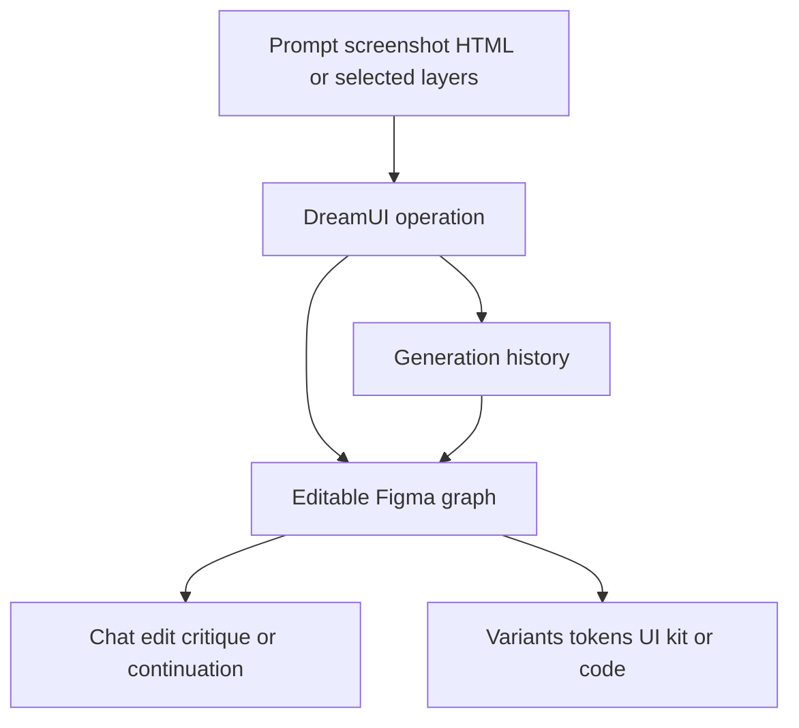

# DreamUI

> Research status: **Architecture-level** · Last reviewed: **2026-08-12**

DreamUI is a recent Figma plugin by Noor Maqsood that combines screen generation, product flows, selected-layer chat editing, screenshot and HTML reconstruction, design variants, critique, tokens and history in one native-canvas surface.

## One plugin spans several different artifact loops

The feature list should not be collapsed into a claim that every operation shares one internal representation. Public evidence establishes these user-visible paths:

- prompt to an editable screen or connected multi-screen product;
- screenshot or HTML to real Figma layers;
- selected layers to conversational edits, critique or continuation;
- one screen to five to ten redesign variants;
- previous generations to restore or remix;
- colors and typography to reusable tokens and a generated UI kit.

## Native editability is stronger evidence than implementation detail

The creator explicitly describes editable Figma output, but the hosted implementation is closed. Node identity across chat turns, screenshot decomposition, token extraction, variant lineage, generated-code fidelity, model selection and history persistence are not publicly disclosed. “Restore” therefore means a product capability, not proof of lossless Figma-version recovery.

The product also includes non-AI utilities such as contrast checking and Iconify insertion. They belong to the same plugin surface but are not evidence of agentic behavior.

DreamUI's creator identity is public; no reliable first-party team-location statement was found, so region remains unknown.

## Primary evidence

- [Creator's complete feature announcement](https://forum.figma.com/showcase-your-work-14/dreamui-figma-plugin-by-noor-maqsood-56341)
- [Figma Community plugin](https://www.figma.com/community/plugin/1656620010944492160/dreamui-ai-ui-generator-design-system-wireframe-generator-ai-design-copilot-tokens-html)
