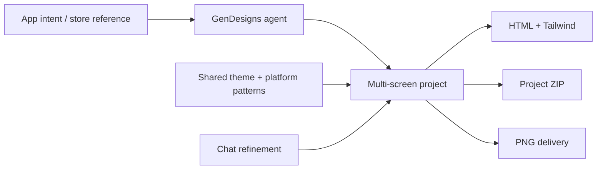

# GenDesigns

> Research status: **Architecture-level** · Last reviewed: **2026-08-11**

| Field | Value |
|---|---|
| Team | GenDesigns · team region not established by first-party product evidence |
| Ordinary job | generate a coherent mobile-app screen set and refine it conversationally before taking code or presentation assets |
| Working artifact | component-backed HTML and Tailwind screen project with shared theme state |
| Delivery | standalone HTML project ZIP and high-resolution images |

## Screens share code and theme rather than only appearance

GenDesigns creates several iOS or Android screens from one application description. Generated output uses editable components with a shared color typography and spacing theme. Follow-up prompts can change layout color features and platform treatment while maintaining the screen set. Its cloning flow applies the same representation to an analyzed reference.

## Code is the editable carrier

First-party pages describe production-oriented HTML and Tailwind output rather than a native vector graph. The census therefore treats generation as a hosted artifact with source-authority projection. “Production-ready” does not establish application behavior or framework integration; the output is a visual frontend starting point.

Platform patterns and consistent theme state are project governance. They do not prove automatic compliance with iOS Human Interface Guidelines or Material Design. Reference cloning likewise requires legal and product-design judgment beyond technical similarity.

## Evidence ceiling

No implementation or project schema is public. Persistence versioning code editor depth component identity export completeness and history after conversational updates remain unknown.

## Primary evidence

- [GenDesigns product](https://gendesigns.ai/)
- [Clone UI workflow](https://gendesigns.ai/features/clone-ui-design)
- [GenDesigns roadmap](https://gendesigns.featurebase.app/roadmap)
