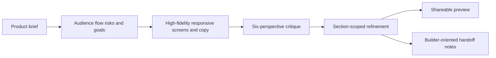

# GlideDesign

> Research status: **Architecture-level** · Last reviewed: **2026-08-12**

| Field | Verified value |
|---|---|
| Current name | GlideDesign |
| Launch name | Glide Design AI |
| Founder | Brian Permut |
| Team region | United States; founder profile says Rohnert Park, California |
| Canonical surface | hosted design project with screens, critique, preview and handoff |

GlideDesign starts before layout. One brief produces an audience and product strategy, flow, UX risks and success criteria; these decisions feed responsive screens, component notes and product copy. The user then reviews the result from six named design perspectives, applies section-scoped changes, shares a preview and exports implementation direction.

## Strategy and screen state travel together

The official workspace describes breakpoints, states and copy as connected while a selected region is refined. That makes the hosted project—not a downloaded screenshot—the observable working artifact. Its handoff is intentionally explanatory: component structure, layout logic, interaction behavior and design rationale are prepared for developers or coding agents.

## Authority and delivery boundaries

The public site says designs can be handed to Figma for deeper work, but it does not document a round-trip identity model or prove that later Figma edits synchronize back. It likewise does not disclose the stored project schema, generation models, version graph, undo semantics or whether a one-click critique fix is a structured patch or regeneration. A browser acceptance run requiring account state was not performed.

## Primary evidence

- [Current product and workflow](https://www.glidedesign.ai/)
- [Product-design output contract](https://www.glidedesign.ai/ai-product-design-generator)
- [Founder launch post](https://forum.figma.com/showcase-your-work-14/i-built-an-ai-design-workspace-that-turns-product-prompts-into-high-fidelity-screens-would-love-feedback-from-figma-designers-53900)
- [Founder profile and region evidence](https://www.linkedin.com/in/brian-permut-519566182)
