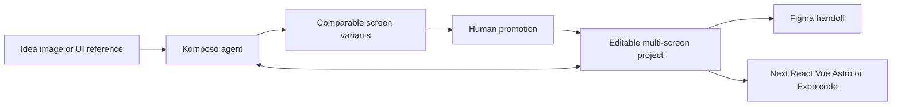

# Komposo

> Research status: **Architecture-level** · Last reviewed: **2026-08-12**

| Field | Value |
|---|---|
| Team | CopyCoder → Komposo · team region not established |
| Ordinary job | turn a product idea or reference into comparable editable UI screens and then code |
| Authority transition | Komposo project while designing; exported Figma or application source after handoff |
| Lifecycle | active rebrand transition |

## Variants are promoted before code is generated

The conversational agent plans multi-screen applications creates screens and can produce several visual directions for selection. Follow-up prompts modify layouts sections color and structure in the retained project. Only after a direction is ready does the user export to Figma or responsive framework code.

This sequence keeps exploration distinct from delivery. Exported source is a new authority; current evidence does not show arbitrary code edits synchronizing back into Komposo.

## CopyCoder and Komposo are one lineage

The official rebrand page says accounts projects and pricing stayed intact. It also explains the conceptual shift: the former code-copying name no longer fit a product centered on composing exploring and iterating UI. Counting both names would create a false second team and obscure that technical direction change.

## Evidence ceiling

The native design schema autosave versions Figma representation component mapping and code-generator internals are closed. Framework names establish targets not production quality or lossless semantic equivalence.

## Primary evidence

- [Komposo current design and export loop](https://www.komposo.ai/)
- [Official CopyCoder-to-Komposo lineage](https://www.komposo.ai/copycoder)
- [Komposo terms](https://www.komposo.ai/terms)
