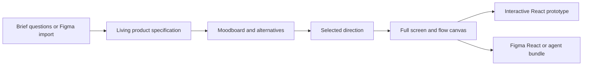

# Mowgli

> Research status: **Architecture-level** · Last reviewed: **2026-08-12**

Mowgli makes a product specification the context spine for visual exploration. The canvas is not organized as a series of unrelated prompt results.

## Specification and moodboard are different decision layers

A new project begins with questions about users functions states and flows or by importing an existing Figma file. The answers become a living specification. Before generating the complete product Mowgli proposes multiple flagship-screen directions and a larger moodboard of visual themes. Users can remix attributes across options then explicitly choose a direction.

Only after that decision does the system expand the direction across every screen flow and state. Targeted chat edits operate on a selected button card or section while global prompts can rework a whole page or product. The specification is kept in sync so later screens are not generated from visual style alone.

## Reversibility and delivery

Version history and branching make conversational experiments reversible. Interactive prototypes add real navigation and transitions and update when a screen or flow changes. Delivery can be an editable Figma file React and Tailwind reference code or an agent-ready package containing specification styling and prompts.

The public export documentation calls the React output structurally flat and assumption-free. It is intended as an implementation reference that a coding agent can reorganize rather than a claimed production component architecture. That caveat is central to the authority boundary.

## Primary evidence

- [Mowgli product and whole-product canvas](https://mowgli.ai/)
- [AI design-generation workflow](https://mowgli.ai/features/ai-design-generation)
- [Conversational editing and version history](https://mowgli.ai/features/chat-with-your-design)
- [Code Figma and agent delivery](https://mowgli.ai/features/export-to-code)
- [Mowgli team](https://mowgli.ai/about)
