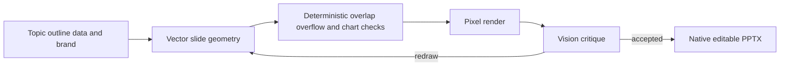

# PPTCraft

> Research status: **Architecture-level** · Last reviewed: **2026-08-12**

| Field | Value |
|---|---|
| Team | PPTCraft · team region not established |
| Availability | invite-only preview build rather than public launch |
| Ordinary job | turn an outline and data into a checked deck that remains native PowerPoint after export |
| Working authority | internal vector slide geometry until PPTX materialization |
| Lifecycle | active transition |

## Validation is the mechanism that defines the product

PPTCraft builds slides as vector geometry and checks overlap clipping and dimensions before delivery. Data charts are plotted from supplied values rather than inferred visually. It then renders the actual draft into pixels for a vision critique and redraws weak slides before repeating geometry checks.

The exported file contains text boxes shapes and charts as native objects so PowerPoint Keynote or Google Slides becomes the new authority. PDF and image outputs are delivery projections. The product also claims whole-deck restyling and a saved brand kit but does not publish an internal version or persistence model.

## Preview-state limit

The landing page explicitly says the product is not launched and public signup is closed. It is included as an accessible first-party preview with downloadable example artifacts and a described ordinary workflow not presented as a generally available incumbent. Claims of guaranteed aesthetic quality are not treated as evidence.

## Primary evidence

- [PPTCraft preview workflow and validation loop](https://www.pptcraft.com/en/)
- [Editable PowerPoint boundary](https://www.pptcraft.com/en/#editable-export)
