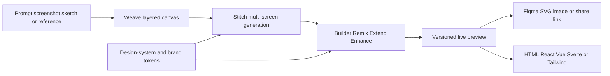

# Quby Weave

> Research status: **Architecture-level** · Last reviewed: **2026-08-12**

| Field | Value |
|---|---|
| Team | Quby · United States |
| Current naming | Weave platform entry; Stitch prompt-prototyping surface; UI Studio editing modes |
| Ordinary job | generate or reconstruct a layered multi-screen UI then refine and deliver it as design or code |
| Authority | Quby's layered canvas and design-token project until export |
| Lifecycle | active naming and product transition |

## Three names expose different stages of one UI line

The Quby homepage calls Weave the canvas that combines sketches references and generations. The `/tools/weave` route presents Stitch as prompt-to-multi-screen prototyping with design systems chat revision and version history. UI Studio exposes Builder Remix Extend and Enhance modes for new UI style transfer matching extensions and accessibility or spacing revisions.

Full layer separation is the product's claimed reconstruction boundary: elements remain individually editable instead of being one image. Design tokens can be exported separately to preserve system decisions across components.

## Authority after delivery

Quby owns the layered project and version history. A Figma copy structured SVG or generated code is a materialized downstream artifact. Public material does not establish changes in all those targets synchronizing back into Weave.

## Evidence ceiling

The internal layer schema model routing token format version graph and code generator are closed. The overlapping current names and some inconsistent page labels are recorded explicitly; capabilities are consolidated only where Quby itself presents them inside the same platform.

## Primary evidence

- [Quby platform and Weave entry](https://www.quby.app/)
- [Stitch multi-screen workflow on the Weave route](https://www.quby.app/tools/weave)
- [UI Studio layered editing and delivery](https://www.quby.app/tools/ui-remixer)
