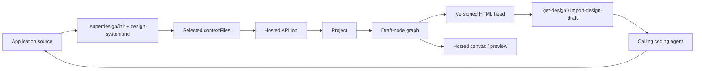

# Superdesign

> Research status: **Source-level for the current skill and published CLI; protocol-level for the hosted canvas · v1.0** · Last reviewed: **2026-08-11**

| Field | Verified value |
|---|---|
| Organization | Superdesign dev, Inc. |
| Current product | Hosted web design agent plus an installable coding-agent skill and CLI |
| Category | Local code-context staging over a hosted, versioned design-draft graph |
| Current releases in this snapshot | Skill/plugin `0.4.2`; npm CLI `0.10.0` |
| Current artifact center | Server-held HTML draft nodes and their version histories |
| Application-code center | The user's repository, changed later by the calling coding agent |
| Current source boundary | MIT skill source and MIT compiled npm CLI are public; hosted web app, renderer and backend are not |
| Historical product | The separate 2025 VS Code extension, now explicitly kept for history and no longer actively maintained |
| Pinned current skill revision | [`dc59c1b1b9661580831f0b6e0eff8e879967d282`](https://github.com/superdesigndev/superdesign-skill/tree/dc59c1b1b9661580831f0b6e0eff8e879967d282) |
| Pinned legacy revision | [`49e2b9dd9615c6dae936b326b1ddb85d4f1d6f19`](https://github.com/superdesigndev/superdesign/tree/49e2b9dd9615c6dae936b326b1ddb85d4f1d6f19) |

## Start with the identity split

“Superdesign” currently names one maintained product assembled from several public and private surfaces, while the best-known open-source repository implements an older product.

| Surface | Role in 2026 | What is public | What it is not |
|---|---|---|---|
| `superdesign.dev` web app | Hosted canvas, prompt library and direct web entry | Product pages and user-visible behavior | The current canvas/backend source is not public |
| `superdesign-skill` | Agent policy and workflow orchestration for Codex, Claude Code, Cursor and other agents | Full MIT prose skill, references and plugin manifests | It is not the canvas implementation |
| `@superdesign/cli` | Authenticated protocol client for projects, drafts, jobs, assets, components and handoff | Exact `0.10.0` npm tarball, compiled JS and declarations under MIT | Its npm metadata points to `superdesign-platform`, but that repository is not publicly reachable |
| `superdesigndev/superdesign` | Original 2025 VS Code extension with a local iframe canvas | Historical TypeScript/React source | The repository itself says it is no longer actively maintained and directs users to the web app and skill |

The current skill README makes the separation explicit: the old extension is an “older, separate project,” while the skill and web app are the maintained product. The official site goes further and calls the current product non-open-source. GitHub's `isArchived` flag is still false for the old repository, so “archived” here is the maintainers' lifecycle statement, not a GitHub repository setting.

## The ordinary route is a staged handoff, not one shared document

For an existing application, the maintained skill specifies this user journey:

1. Run the CLI preflight and authenticate.
2. Detect whether a meaningful frontend codebase exists.
3. If it does, analyze it into six local `.superdesign/init/` files and read all six before designing.
4. Route the task by what actually exists: reproduce an existing rendered target first, design a genuinely new target directly, or use a separate blank-project, website-extraction or graphics path.
5. Send selected source context and a design prompt through the CLI. AI generation becomes an asynchronous server job.
6. Review the returned draft on the hosted canvas, branch alternatives or replace the current head, and continue from a chosen draft/version.
7. Fetch the winning HTML with `get-design`, then let the coding agent implement it in the real repository **after user approval**.

The arrows are workflow transitions, not a live bidirectional binding. No public current protocol carries a selected canvas element back to an application file/line or stable component identity. The coding agent reads a design and writes application code as a new implementation step.

## The decisive mechanism: the skill curates what the remote designer can see

The current skill is not decorative prompt text. It is the orchestration runtime that decides which evidence reaches the closed design service.

### Local discovery layer

On the real-codebase path, init is complete only when all six files exist and are non-empty:

| Local file | Required content |
|---|---|
| `.superdesign/init/components.md` | Shared primitives with full component source |
| `.superdesign/init/layouts.md` | Shared nav/sidebar/header/footer implementations |
| `.superdesign/init/routes.md` | Route-to-page mapping |
| `.superdesign/init/theme.md` | Tokens, CSS variables and Tailwind configuration |
| `.superdesign/init/pages.md` | Page dependency trees used to choose context |
| `.superdesign/init/extractable-components.md` | Candidates for hosted reusable DraftComponents |

Other local files serve narrower roles:

- `.superdesign/design-system.md` is the portable product and visual constraint set passed on design calls.
- `.superdesign/tmp/*.html` stages complete caller-authored drafts before `import-design-draft`.
- `.superdesign/website/<domain>/` receives extracted design DNA, tokens, content structure, brand material or a reference clone.
- `.superdesign/replica_html_template/` is still described by the repository's long root README, but it is absent from the current authoritative `SKILL.md`/`SUPERDESIGN.md` path. The current path creates its ground-truth draft remotely from source context. Treat the replica directory as documentation drift, not a current hard requirement.

The CLI does not upload a repository by magic. Its published code resolves every `--context-file`, reads it as UTF-8, and sends an array of `{ filename, content }`. Optional one-based `path:start:end` ranges are merged; omission markers are inserted between disjoint ranges. The skill requires agents to trace the actual render branch and recursive UI imports, while trimming files around 900 lines to avoid a server `400`.

That produces a lossy chain:

`real application → agent-authored analysis → selected snippets → generated HTML draft`

The first remote reproduction is therefore a generated baseline informed by source, not a mechanically proven pixel clone and not a preserved source map. The skill calls it “ground truth,” but no public current implementation performs screenshot-diff acceptance or establishes component identity across the boundary.

### Task routing is part of fidelity

| Target shape | Current skill behavior | Why the distinction matters |
|---|---|---|
| Existing rendered page | Read the real render branch, create one reproduction draft, then branch design variants | Prevents a redesign from inventing a nonexistent starting state |
| New page in an existing app | Reuse a sibling page/shell and shared components, but skip reproduction | There is no current page to reproduce |
| No meaningful codebase | Skip init; gather product/audience/style context conversationally | Avoids pretending an empty workspace contains product truth |
| Static graphic | Use a fixed-canvas `graphic` draft and an explicit key-visual workflow | App routes/components are normally irrelevant |
| Live-site reference | Extract style/content/brand inputs, then rebuild | CLI extraction is explicitly style-informed, not a faithful editable clone |
| Caller-model design | Author one complete HTML document locally and import it | Bypasses generation while preserving the hosted review/version path |

## The public artifact is a remote draft graph

The exact npm `0.10.0` declarations expose enough of the protocol to distinguish project, branch and version semantics.

| Entity | Public fields or contract | Meaning |
|---|---|---|
| Project | `projectId`, title, `projectUrl`, optional initial `draftId`/`previewUrl` | Hosted container and canvas |
| Design node / draft | `id`, title, screenshot, `parentDraftId`, `iterationDepth`, `previewUrl`, `currentVersion` | One branchable design identity in the project graph |
| Draft version | version number, prompt, timestamp and `isCurrent`; timeline metadata is returned beside the current head's full `htmlContent` | Historical or current HTML state inside one draft |
| Job | `processing`, `completed` or `failed`; completion carries a typed result and `creditsConsumed` | Asynchronous generation envelope |
| DraftComponent | Hosted Petite-Vue template plus bounded props/slots/events/CSS-import metadata | Reusable canvas-side component, not the application's React component |
| Asset | Public URL, storage path and optional canvas node | Uploaded image material that can be referenced by prompts/drafts |

The imported draft contract is deliberately narrower than a general web application:

- one complete `<!DOCTYPE html> ... </html>` document;
- exactly one screen, with no hidden alternate pages or JS page switching;
- Tailwind utility styling; the CDN can be injected if absent;
- Iconify icons require their own script;
- an unclassed `<body>` with one root `
`;
- unique descriptive anchor IDs and only full HTTPS or hash links.

The CLI validates option combinations and viewport bounds locally, but the compiled client sends the HTML to the API without locally parsing this document contract. Rejection/warning behavior for the HTML itself is therefore a hosted-backend contract, not verified open implementation.

### Branches and versions are different axes

- `iterate-design-draft --mode branch` creates separate draft nodes. Multiple prompts or `--count` can produce one to four siblings.
- `--mode replace` updates one draft in place and is limited to one prompt/variation.
- `import-design-draft --into <draftId>` pushes caller-authored HTML as a new, no-generation version on that draft.
- `iterate-design-draft --from-version <n>` generates from a selected historical version without first making it current.
- `revert-design-draft --to-version <n>` snapshots the current head before restoring the target, so the revert itself is reversible.
- `get-design` returns the current version and complete version timeline; `--output` materializes the current HTML locally.

Branching preserves alternative design identities; versioning preserves the history of one identity. Calling both “versions” hides the actual recovery model.

## The published CLI is the observable control plane

The default API base is `https://api.superdesign.dev/v1`; an environment/config override exists. Authenticated requests use a bearer token. The compiled client exposes these consequential routes:

| Operation | Route shape | Observable consequence |
|---|---|---|
| Create project | `POST /external/projects` | Creates the hosted container and optionally a baseline HTML draft |
| Create / iterate draft | `POST /external/projects/:id/drafts/create`; `POST /external/drafts/:id/iterate` | Starts an AI job |
| Poll job | `GET /external/jobs/:id` | Resolves generation to drafts plus consumed credits or an error |
| Add / revert version | `POST /external/drafts/:id/versions`; `POST /external/drafts/:id/revert` | Synchronous, no-generation history mutation |
| Read graph / HTML | `GET /external/projects/:id/design-nodes`; `GET /external/drafts/:id/html` | Recovers draft IDs, lineage, head HTML and versions |
| Flow expansion | `POST /external/drafts/:id/flow/execute` | Generates 1–10 sibling pages from a source draft |
| Components / assets | Project-scoped component and asset routes | Adds reusable templates or public image inputs |
| Embedded handoff | `POST /external/handoff` | Mints a restricted project-scoped browser session bridge |

Generation jobs poll every two seconds and normally time out locally after five minutes; multi-page flow timeout grows with page count. A timeout does not cancel the server job—the CLI explicitly warns it may still be processing.

The CLI's direct output is agent-optimized compact text plus next-step hints; `--json` returns the full machine payload. This matters because the published package README still contains older “always use JSON” guidance.

## Review and implementation are intentionally separated

The maintained skill forbids application implementation until the user approves the design or explicitly asks to skip design. After approval, `get-design` provides HTML reference material and the **calling coding agent** writes the application's React/components using repository conventions.

This resolves an apparent marketing ambiguity:

- Official pages truthfully describe a journey that ends with code in the user's repo.
- The directly fetchable protocol artifact is HTML, and hosted reusable components use Petite-Vue templates.
- The public skill, not the backend, assigns final framework implementation to the coding agent.

There is therefore no demonstrated automatic React round-trip or persistent canvas-to-source binding. “No export-and-paste step” describes an agent-mediated user journey, not one canonical artifact shared by canvas and source tree.

## Trust boundaries that affect an ordinary user

### Repository and prompt disclosure

`contextFiles` contain actual selected source. The skill also recommends sending the user's verbatim current request through `--user-request`; it says this optional field is stored server-side to improve generation and is capped at 16 KB. Those are separate disclosure channels from CLI usage telemetry.

### Credentials and canvas handoff

- `SUPERDESIGN_TOKEN` overrides disk config and is not persisted by the CLI.
- Otherwise credentials live under `SUPERDESIGN_CONFIG_DIR`, `$XDG_CONFIG_HOME/superdesign`, or the legacy `~/.superdesign/config.json` path.
- `canvas-link` mints a single-use handoff code, places it in a URL fragment, and binds the resulting embedded session to one user/team/project. The code expires in roughly 60 seconds; the resulting embedded session is described as lasting about an hour.
- The clean project URL carries no credential and requires normal login.

### Telemetry promise and implementation do not fully align

The `0.10.0` package README says usage telemetry never sends prompts, file contents, paths, hostnames or credentials. The compiled implementation does correctly omit `prompt`, `userRequest` and credentials from its allowlist and supports `DO_NOT_TRACK=1` / `SUPERDESIGN_TELEMETRY_DISABLED=1`.

However, the same implementation allowlists option keys including `html`, `htmlFile`, `context`, `pages`, `projectId` and `draftId`, and retains allowed string/number/boolean values up to 2,000 characters. A local HTML-file path, short inline HTML value or prose flow context can therefore enter the telemetry payload. Failure telemetry can also include bounded error-message text. This is a client-code discrepancy with the literal README promise; it does **not** establish what the backend ultimately retains. No live telemetry capture or server-retention audit was performed here.

## Where an ordinary route can break

| Breakpoint | User-visible effect | Established boundary |
|---|---|---|
| No shell or failed auth | No design call can start | The skill stops rather than pretending it used the canvas |
| Incomplete six-file init | Existing-app generation is blocked | This is a skill hard gate, not a backend capability check |
| Wrong render branch | “Ground-truth” draft reproduces a fallback/mobile/flagged layout | The agent must inspect the branch before selecting ranges |
| Oversized context | Server returns `400`; a thinner retry can become generic | The skill explicitly warns against dropping the real page and retrying with only design-system prose |
| Generated baseline differs from the app | Later variants refine the wrong starting point | No current screenshot-diff or source-map acceptance is public |
| Branch/version confusion | A user overwrites one head when they expected a sibling, or branches when they expected a reversible tweak | Distinct node lineage and per-node history must be surfaced |
| Remote job timeout | CLI exits while work may continue server-side | Local timeout is not cancellation |
| Import-contract rejection | Caller-authored HTML does not enter the graph | HTML conformance is enforced by the closed service; CLI returns errors/warnings |
| Documentation drift | An agent follows stale package/root-README examples or assumes the skill and CLI command lists are identical | Published CLI help is the repository's declared ground truth |
| Hosted service unavailable or credits exhausted | Skill and CLI cannot produce new AI drafts | Local context files do not constitute a design artifact by themselves |
| Telemetry expectation mismatch | Short inline HTML/context may be reported despite README wording | Opt-out variables are the currently verifiable client-side control |

## The historical extension used a different source of truth

The 2025 extension is useful chiefly because it shows what Superdesign moved away from.

1. Agent/provider prompts instructed tools to write `.html`, `.svg` and `.css` into `.superdesign/design_iterations/`.
2. A VS Code file watcher reloaded those files.
3. The extension read HTML/SVG from disk, inlined local CSS for HTML and sent content to a React webview.
4. `CanvasView` laid the files out in a zoom/pan grid or inferred hierarchy, and `DesignFrame` rendered them in iframes.
5. Selecting a frame sent its local file path back to chat, so file identity—not a server draft ID—was the bridge.

The durable artifact was the local HTML/SVG file. Canvas zoom, frame positions and viewport choices were React component state in the traced implementation; no persistence path for those layout choices was found. This is materially different from the current hosted project/draft/version graph.

The legacy license says unmarked files are AGPL-3.0 and files marked `/* @license Enterprise */` are under a commercial license. A full scan at the pinned revision found no files carrying that marker, but the license mechanism itself remains part of the repository's terms.

## History that changes the architectural reading

| Date | Evidence | Why it matters |
|---|---|---|
| 2025 | Original IDE extension | Local `.superdesign/design_iterations` files were the artifact and VS Code webview was the canvas |
| 2026-06-29 | [`fd91f8d`](https://github.com/superdesigndev/superdesign/commit/fd91f8dd26350e3daa19cc55f66e9a6304cb92bf) | README declares the extension historical and points to web app + skill |
| 2026-07-23 | [`bbb38ba`](https://github.com/superdesigndev/superdesign-skill/commit/bbb38ba9f299f4c27f17cd8ffe6fe9f1fc358182) | Current skill separates existing rendered targets, new targets in a repo and no-codebase work |
| 2026-08-05 | [`982ae5d`](https://github.com/superdesigndev/superdesign-skill/commit/982ae5d0b7f697cd2b357d2978da2d10ee0bbef6) | Caller-model HTML import becomes an explicit fallback path |
| 2026-08-05 | [`3d2ca34`](https://github.com/superdesigndev/superdesign-skill/commit/3d2ca340c1afe9f52a7d07d25c49f5b9e5efe69e) and [`dc59c1b`](https://github.com/superdesigndev/superdesign-skill/commit/dc59c1b1b9661580831f0b6e0eff8e879967d282) | Shared skill is packaged for multiple plugin surfaces and bumped to `0.4.2` |
| 2026-08-05 | npm `@superdesign/cli@0.10.0` | Published protocol client adds the exact executable surface audited here |

The skill repository has no tags, GitHub releases, CI workflow or build/test suite; its explicit manifest version is the marketplace update key. The CLI is released independently through npm.

## Pinned implementation map

### Current skill

- Product identity and legacy split: [`README.md`](https://github.com/superdesigndev/superdesign-skill/blob/dc59c1b1b9661580831f0b6e0eff8e879967d282/README.md#L15-L24)
- Codebase/no-codebase routing, six-file init, CLI preflight and canvas URLs: [`skills/superdesign/SKILL.md`](https://github.com/superdesigndev/superdesign-skill/blob/dc59c1b1b9661580831f0b6e0eff8e879967d282/skills/superdesign/SKILL.md#L34-L127)
- Existing/new target routing and source-context discipline: [`SUPERDESIGN.md`](https://github.com/superdesigndev/superdesign-skill/blob/dc59c1b1b9661580831f0b6e0eff8e879967d282/skills/superdesign/references/SUPERDESIGN.md#L7-L70)
- Reproduction, branch variants and post-approval flow expansion: [`SUPERDESIGN.md`](https://github.com/superdesigndev/superdesign-skill/blob/dc59c1b1b9661580831f0b6e0eff8e879967d282/skills/superdesign/references/SUPERDESIGN.md#L121-L186)
- User-request storage, history/revert and command traps: [`SUPERDESIGN.md`](https://github.com/superdesigndev/superdesign-skill/blob/dc59c1b1b9661580831f0b6e0eff8e879967d282/skills/superdesign/references/SUPERDESIGN.md#L275-L352)
- Required init contents: [`INIT.md`](https://github.com/superdesigndev/superdesign-skill/blob/dc59c1b1b9661580831f0b6e0eff8e879967d282/skills/superdesign/references/INIT.md)
- Caller-model import path: [`design-with-your-model.md`](https://github.com/superdesigndev/superdesign-skill/blob/dc59c1b1b9661580831f0b6e0eff8e879967d282/skills/superdesign/references/design-with-your-model.md)
- Website-extraction scope: [`WEBSITE.md`](https://github.com/superdesigndev/superdesign-skill/blob/dc59c1b1b9661580831f0b6e0eff8e879967d282/skills/superdesign/references/WEBSITE.md)
- Petite-Vue component contract: [`COMPONENTS.md`](https://github.com/superdesigndev/superdesign-skill/blob/dc59c1b1b9661580831f0b6e0eff8e879967d282/skills/superdesign/references/COMPONENTS.md)
- Plugin identity and source boundary: [Codex manifest](https://github.com/superdesigndev/superdesign-skill/blob/dc59c1b1b9661580831f0b6e0eff8e879967d282/.codex-plugin/plugin.json) and [MIT license](https://github.com/superdesigndev/superdesign-skill/blob/dc59c1b1b9661580831f0b6e0eff8e879967d282/LICENSE)

### Published CLI

- Exact package metadata: [`@superdesign/cli@0.10.0`](https://registry.npmjs.org/@superdesign/cli/0.10.0)
- Immutable tarball used for the implementation audit: [`cli-0.10.0.tgz`](https://registry.npmjs.org/@superdesign/cli/-/cli-0.10.0.tgz), SHA-1 `96614a01e469fd0c9e460fefc3941cbbf2519f60`

### Historical extension

- Lifecycle declaration and local-artifact claim: [`README.md`](https://github.com/superdesigndev/superdesign/blob/49e2b9dd9615c6dae936b326b1ddb85d4f1d6f19/README.md#L1-L13) and [`README.md`](https://github.com/superdesigndev/superdesign/blob/49e2b9dd9615c6dae936b326b1ddb85d4f1d6f19/README.md#L62-L88)
- Disk-to-webview loader: [`src/extension.ts`](https://github.com/superdesigndev/superdesign/blob/49e2b9dd9615c6dae936b326b1ddb85d4f1d6f19/src/extension.ts#L1797-L1868)
- Canvas state and local-file selection bridge: [`CanvasView.tsx`](https://github.com/superdesigndev/superdesign/blob/49e2b9dd9615c6dae936b326b1ddb85d4f1d6f19/src/webview/components/CanvasView.tsx#L66-L98) and [`CanvasView.tsx`](https://github.com/superdesigndev/superdesign/blob/49e2b9dd9615c6dae936b326b1ddb85d4f1d6f19/src/webview/components/CanvasView.tsx#L270-L308)
- Mixed-license rule: [`LICENSE`](https://github.com/superdesigndev/superdesign/blob/49e2b9dd9615c6dae936b326b1ddb85d4f1d6f19/LICENSE)

## Verification performed for this dossier

- Cloned and pinned both public repositories; inspected the current skill at `dc59c1b…` and legacy extension at `49e2b9d…`.
- Read the full current skill entrypoint and all routed references used by UI, init, graphics, website extraction, components and caller-model import.
- Verified plugin manifests at `0.4.2`, the MIT license, absence of tags/releases/CI and the prose-only nature of the skill repository.
- Queried npm metadata, packed `@superdesign/cli@0.10.0`, checked its integrity, read its compiled ESM/declarations and executed read-only `--help` surfaces through the exact published version.
- Ran `auth status --json` with `SUPERDESIGN_CONFIG_DIR` pointed at a new isolated temporary directory and telemetry disabled; it reported unauthenticated without reading the user's normal credentials.
- Did **not** log in, spend generation credits, create a hosted project, upload repository content or assert canvas/backend behavior beyond the public protocol and official product evidence.

## Evidence boundary and open questions

### Established

- The current product is the web app plus skill/CLI, not the old IDE extension.
- The skill stages selected repository evidence locally, then the CLI uploads that evidence to a hosted design service.
- The hosted durable design model has projects, branchable draft nodes, per-draft versions and HTML heads.
- Final application code is a downstream coding-agent implementation after design approval.
- The current public CLI has an observable telemetry/documentation mismatch around some short option values.

### Inference, labeled

- Calling `.superdesign/init` a **context index** is an architectural interpretation of its mandated contents and use.
- Calling the workflow **lossy** follows from source reduction plus generated HTML and the absence of a public reverse mapping; it does not claim a particular model failure rate.
- The server likely owns HTML conformance checks because the published client does not; the backend implementation remains unseen.

### Unknown

- Hosted canvas document schema, renderer, database, collaboration model, undo internals and screenshot generation.
- How backend drafts/components/assets are stored, deduplicated, retained or deleted.
- Exact model orchestration, prompt construction and design-system enforcement inside generation.
- Whether any private web-app path has stronger source mapping than the public CLI/skill path.
- Server-side telemetry retention and whether the documented client discrepancy has been mitigated after `0.10.0`.

## Primary sources

- [Official product site](https://superdesign.dev/)
- [Official design-to-code description](https://superdesign.dev/design-to-code)
- [Official 2026 product/lifecycle statement](https://superdesign.dev/blog/how-to-build-ai-landing-page)
- [Current skill repository at the audited revision](https://github.com/superdesigndev/superdesign-skill/tree/dc59c1b1b9661580831f0b6e0eff8e879967d282)
- [Published CLI 0.10.0 metadata](https://registry.npmjs.org/@superdesign/cli/0.10.0)
- [Historical extension at the audited revision](https://github.com/superdesigndev/superdesign/tree/49e2b9dd9615c6dae936b326b1ddb85d4f1d6f19)
