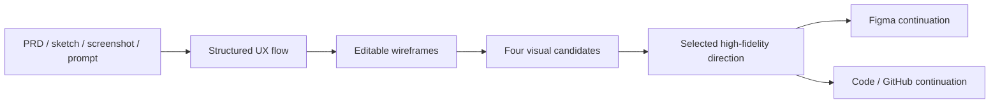

# UX Pilot

> Research status: **Architecture-level** · Last reviewed: **2026-08-11**

| Field | Value |
|---|---|
| Team | UX Pilot Inc. · New York, United States |
| Ordinary job | carry a product idea from UX flow through wireframes and high-fidelity screens into Figma or implementation code |
| Native continuity | structured connected screens in the hosted UX workspace |
| External continuations | Figma retrieval/two-way workflow and GitHub code delivery |

## The flow is upstream of the screen

UX Pilot treats a user journey as a connected artifact rather than a bag of generated images. A prompt becomes a sequence of screens, interactions and decision points. Follow-up prompts can add screens, reroute navigation or restructure the journey in place; high-fidelity generation then uses that flow as its foundation.

This makes “screen generation” an incomplete description. The design authority carries both individual layouts and their role in an end-to-end experience.

## Four directions are explicit candidates

The product can generate four visual directions together, compare them and let the user choose a direction. Inputs can include a sketch, PDF, screenshot or PRD, which the product describes as becoming structured editable layouts. Wireframes can move from low to high fidelity within the same workflow.

The public contract proves candidate isolation and selection conceptually, but does not expose an internal branch schema or guarantee that rejected directions remain indefinitely recoverable.

## Design-system grounding changes the generation context

UX Pilot can import Figma components, unify them, save custom models, synchronize a design system and run consistency checks. That means generation can be constrained by a reusable component identity rather than only a style screenshot. The public pages describe a two-way Figma connection and retrieval into Figma; they do not document conflict resolution or perfect preservation for every Figma property.

GitHub delivery is a second projection: ready-to-use code can be sent to a repository. Evidence does not show that later GitHub edits update the hosted UX graph. Figma and source should therefore be tested as separate downstream authorities.

## Persistence and implementation unknowns

The live service and share workflow imply hosted projects, and the official product surface supports continuing refinements. Public documentation does not expose project record formats, version retention, multiplayer merge semantics, code-generation stack, source mapping or transaction boundaries. The dossier stays architecture-level.

## Primary evidence

- [UX Pilot product](https://uxpilot.ai/)
- [UX flow generator and continuation contract](https://uxpilot.ai/ux-flow-generator)
- [First-party privacy and company address](https://uxpilot.ai/privacy)
