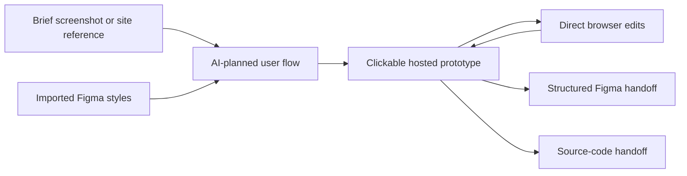

# UX Studio AI

> Research status: **Architecture-level** · Last reviewed: **2026-08-12**

| Field | Value |
|---|---|
| Team | UX Studio AI · team region not established |
| Ordinary job | describe a site or app flow then test edit and hand off the connected screens |
| Working authority | the hosted UX Studio flow and interactive prototype |
| Escape routes | structured Figma design or source code |
| Lifecycle | active |

## It plans a flow rather than returning disconnected images

The user chooses wireframe or visual-design mode and asks for one screen or a full flow. UX Studio says it decomposes business logic into screens and relationships then makes the result interactive: buttons tabs and modals can be exercised through a shared prototype before implementation.

Style extraction from a reference site and imported Figma styles constrain generation. The reverse path exports an editable Figma layout rather than only a JPEG. Source export is another terminal representation. Public material does not establish that edits made later in Figma or code merge back into the UX Studio project so these are authority transfers not a proven bidirectional synchronization protocol.

## Evidence ceiling

The live marketing surface establishes the ordinary loop and delivery options but does not publish its flow schema prototype runtime Figma serialization or generated-code contract. Team geography is not inferred from the `.ru` domain or Russian-language interface.

## Primary evidence

- [UX Studio AI current product](https://uxstudio-ai.ru/)
- [UX Studio feature and delivery surface](https://uxstudio-ai.ru/#features)
