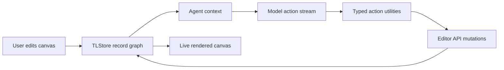

# tldraw SDK / Agent Starter Kit

> Research status: **Source-level** · Last reviewed: **2026-08-11**

| Field | Value |
|---|---|
| Team | tldraw |
| Ordinary job | build an AI-enabled canvas whose agent can inspect and change the same structured drawing the user is editing |
| Artifact authority | a tldraw `TLStore` record graph containing pages, shapes, bindings and assets |
| Product boundary counted here | the open SDK, editor and Agent Starter Kit; not every downstream product built with them |
| Pinned source | [`c47a5bd9ff3b923279253b4a286512ec7eb7f0d2`](https://github.com/tldraw/tldraw/tree/c47a5bd9ff3b923279253b4a286512ec7eb7f0d2) |

## The important object is the store, not the screenshot

tldraw supplies a visual editor, but its decisive AI mechanism is the typed reactive record store beneath that editor. Pages, shapes, bindings, assets and document metadata are records governed by a schema. The `Editor` API reads and changes those records; rendering is a projection of them. An agent therefore does not have to infer a drawing only from pixels or replace the canvas with a generated image.

The official Agent Starter Kit demonstrates the intended loop: the application gathers canvas context, the model proposes actions, action utilities validate or interpret them, and the editor applies operations such as create, move, resize, label, align, distribute or review. The checked-in `templates/agent/client/actions/` directory makes this an inspectable implementation surface rather than a generic statement that the SDK is “AI ready.”

## Persistence is deliberately a host choice

The SDK does not pretend that one persistence mode fits every product. A host can:

- pass a `persistenceKey` for browser IndexedDB storage and same-browser tab synchronization;
- serialize and restore document or session snapshots;
- connect a custom backend;
- use `@tldraw/sync` for multiplayer synchronization and server-side room storage.

That choice matters when evaluating an AI canvas. An agent action is durable only to the degree that the embedding application actually persists the store. The starter kit proves an action path and a graph authority; it does not by itself guarantee a production backup policy, user-level version history or conflict resolution for every adopter.

## Human and agent share one graph

The starter kit does not create a detached HTML mockup and later import it. Both participants operate through the editor/store boundary. This enables immediate correction: a user can select or move a generated shape, then ask the agent to reason about the updated graph. It also means stale context is a real risk. A robust host needs to decide what happens if a human changes records after the model has planned but before its actions are applied.

The public template exposes many small action types rather than one unrestricted script executor. That narrows and describes the mutation surface, although the security and approval semantics remain the embedding application's responsibility.

## What source inspection establishes

| Concern | Pinned path | Evidence |
|---|---|---|
| canonical graph | `packages/store/`, `packages/tlschema/` | typed records, schema and reactive store operations |
| editor mutation boundary | `packages/editor/` | APIs that apply graph changes and project them to the canvas |
| agent implementation | `templates/agent/client/agent/`, `templates/agent/client/actions/` | context/action loop and concrete canvas operations |
| local persistence examples | `apps/examples/src/examples/configuration/persistence-key/` | browser persistence wiring |
| product guidance | `apps/docs/content/starter-kits/agent.mdx` | supported Agent Starter Kit workflow |

## Census boundary

This record represents visual-editor infrastructure with an implemented AI canvas loop. It does not claim that tldraw.com itself exposes every starter-kit capability, and it does not multiply the census for applications that merely embed the SDK. A downstream project is separate only when it establishes its own ordinary-user workflow, team lineage and artifact authority.

## Primary evidence

- [Pinned repository](https://github.com/tldraw/tldraw/tree/c47a5bd9ff3b923279253b4a286512ec7eb7f0d2)
- [Official AI documentation](https://tldraw.dev/docs/ai)
- [Official store documentation](https://tldraw.dev/sdk-features/store)
- [Official persistence documentation](https://tldraw.dev/docs/persistence)
- [Official sync documentation](https://tldraw.dev/docs/sync)
