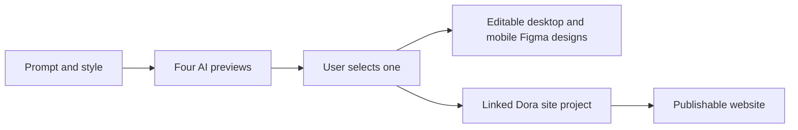

# Dora AI

> Research status: **Architecture-level** · Last reviewed: **2026-08-12**

Dora AI combines a Figma plugin for editable site-design generation with Dora's hosted website project. A prompt and optional style produce four previews; the user selects one before desktop and mobile designs are inserted into Figma.

## Candidate selection precedes native materialization

Credits distinguish preview generation from conversion to Figma, making the candidate-to-artifact boundary observable. The plugin and hosted platform share a Dora account and credit balance, but a Figma account is not the identity authority.

## Coupled surfaces, uncertain synchronization

The help center says a paid plugin plan creates a Dora project and that Dora can publish generated sites. Public evidence does not establish whether later Figma edits update that project, whether generated desktop and mobile frames share responsive constraints, or how variants, animations and components are represented. The four previews are candidates, not documented durable branches with merge semantics.

The implementation and models are closed. Team geography remains unknown in reviewed first-party evidence.

## Primary evidence

- [Dora AI Figma plugin help](https://help.dora.run/en/articles/9669498-dora-ai-figma-plugin)
- [Dora AI product](https://www.dora.run/ai)
