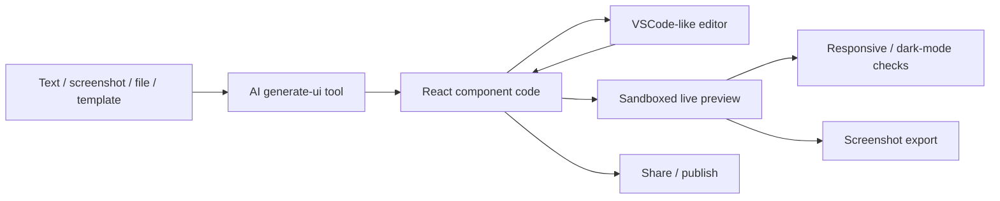

# PageGen

> Research status: **Source-level** · Last reviewed: **2026-08-12**

PageGen is the design-relevant product surface inside the broader MemFree repository. It turns text, screenshots, templates or files into React/Tailwind/shadcn pages and keeps generated code editable beside a live responsive preview.

## Product identity

MemFree is primarily a hybrid search engine. Its repository and navigation also expose a separately branded PageGen surface at `pagegen.ai`. The census counts PageGen—not the generic search product—because PageGen has its own user promise, URL, generator route, editor/preview and publishing loop.

## Code is the working artifact

The preview consumes the current editor buffer, so a manual edit is immediately reflected without another model generation. The toolbar can switch dark mode, capture the iframe and publish the current code. This makes generated source—not a screenshot—the continuing authority.

## Pinned implementation

At MemFree revision [`3163843`](https://github.com/memfreeme/memfree/commit/3163843f3475e767d0a6154ab20462f12cbb82dc):

- [`generate-ui.ts`](https://github.com/memfreeme/memfree/blob/3163843f3475e767d0a6154ab20462f12cbb82dc/frontend/lib/tools/generate-ui.ts) implements the generation tool.
- the [generate-ui API route](https://github.com/memfreeme/memfree/blob/3163843f3475e767d0a6154ab20462f12cbb82dc/frontend/app/api/generate-ui/route.ts) exposes it to the application.
- [`code-viewer.tsx`](https://github.com/memfreeme/memfree/blob/3163843f3475e767d0a6154ab20462f12cbb82dc/frontend/components/code/code-viewer.tsx) owns the editable buffer and switches between code and preview.
- [`editor.tsx`](https://github.com/memfreeme/memfree/blob/3163843f3475e767d0a6154ab20462f12cbb82dc/frontend/components/code/editor.tsx), [`preview.tsx`](https://github.com/memfreeme/memfree/blob/3163843f3475e767d0a6154ab20462f12cbb82dc/frontend/components/code/preview.tsx) and [`iframe-renderer.ts`](https://github.com/memfreeme/memfree/blob/3163843f3475e767d0a6154ab20462f12cbb82dc/frontend/components/code/iframe-renderer.ts) implement correction and rendering.
- [`toolbar.tsx`](https://github.com/memfreeme/memfree/blob/3163843f3475e767d0a6154ab20462f12cbb82dc/frontend/components/code/toolbar.tsx) couples preview controls, screenshot capture and publishing.

## Delivery and evidence limits

The official site advertises one-click publishing, responsive/dark previews and screenshot export. The repository is MIT-licensed. This review did not sign in or publish a page, so account-level persistence and production deployment internals are not inferred beyond the public code. No reliable organization region was established.

## Decisive sources

- [PageGen product page](https://pagegen.ai/)
- [MemFree repository README](https://github.com/memfreeme/memfree/blob/3163843f3475e767d0a6154ab20462f12cbb82dc/README.md)
- [MIT license](https://github.com/memfreeme/memfree/blob/3163843f3475e767d0a6154ab20462f12cbb82dc/LICENSE)
