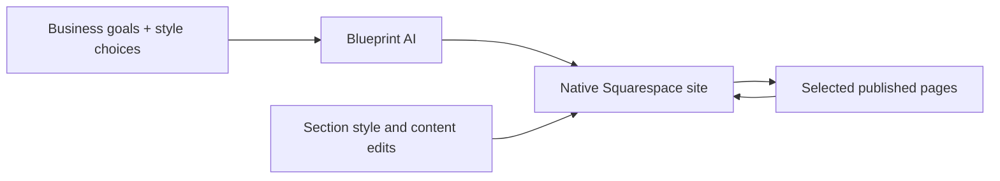

# Squarespace Blueprint AI

> Research status: **Architecture-level** · Last reviewed: **2026-08-11**

| Field | Value |
|---|---|
| Team | Squarespace · New York United States |
| Ordinary job | obtain a tailored starting site then continue in the ordinary Squarespace editor until pages are published |
| Native authority | managed Squarespace site sections styles content and platform settings |
| Agent boundary | AI-guided initial structure and content do not become a separate site format |

## Blueprint begins a normal site lineage

Blueprint asks about goals personality and content and uses Squarespace's design system to assemble a responsive starting site. The user then changes text images links styles and sections in the standard editor and publishes selected pages. The generated starting point therefore enters the established site graph rather than ending as a static proposal.

## Guided generation and continuous agency are different

The strongest current evidence is an AI design system for site setup followed by normal visual editing. It does not establish a continuously autonomous agent equivalent to Wix Aria. Inclusion rests on AI participation in creation and the continuing managed Design artifact not on overstating agent autonomy.

Squarespace infrastructure owns hosting commerce and site operations. There is no documented code round trip in this Blueprint workflow so managed-app-project architecture remains primary.

## Evidence ceiling

Public pages do not disclose Blueprint's layout representation generation constraints version linkage or whether later AI actions preserve the original brief. Exact editor history and rollback behavior should be assessed through current product documentation.

## Primary evidence

- [Squarespace Blueprint AI](https://www.squarespace.com/design/blueprint)
- [Starting a website with Blueprint](https://www.squarespace.com/blog/starting-a-website-with-squarespace-blueprint)
- [Squarespace company](https://www.squarespace.com/about/company)
