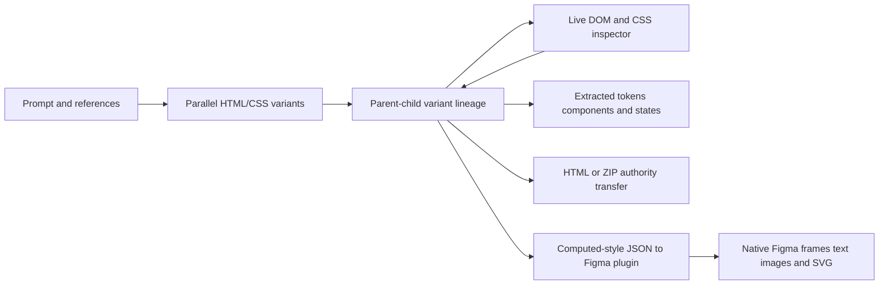

# EaseUI

> Research status: **Architecture-level** · Last reviewed: **2026-08-12**

| Field | Value |
|---|---|
| Team | EaseUI · made by Jang · team region not established |
| Ordinary job | compare generated HTML/CSS directions then refine one visually and materialize it as code or native Figma layers |
| Working authority | saved HTML variant tree plus extracted design-system records |
| Storage boundary | browser IndexedDB/local storage with explicit ZIP backup paths |
| Lifecycle | active |

## HTML is live authority inside the canvas

Each prompt produces a configurable set of HTML/CSS artboards. Selecting one and prompting again creates a child whose parent HTML is context; curved links make the lineage visible. The infinite canvas saves artboard position and project state. A DOM layer tree and property inspector read `getComputedStyle()` from the iframe and send mutations back through `postMessage` so visual edits affect the rendered source rather than an unrelated screenshot overlay.

Figma import takes both a node tree and screenshot then prunes the tree before multimodal conversion to HTML. Export traverses computed styles into a JSON tree copied to the plugin which recreates native Figma layers and auto-layout. These are materialization steps; the docs do not claim an ongoing two-way synchronization channel.

## Local-first is bounded rather than absolute

Project data and provider keys are browser-scoped and clearing browser data can remove projects. Provider calls differ: some keys connect directly while documented server proxies handle other providers. The implementation source is not public so this dossier records architecture-level documentation rather than source-level proof.

## Primary evidence

- [EaseUI complete technical documentation](https://easeui.design/docs)
- [EaseUI application surface](https://app.easeui.design/)
