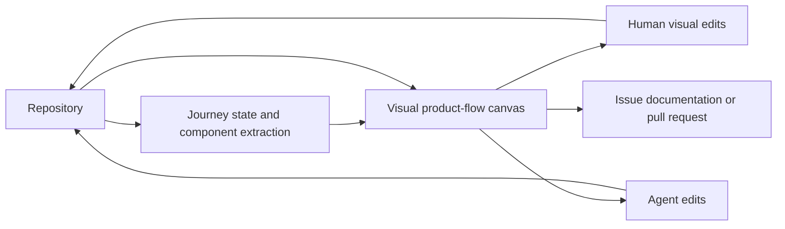

# Statecraft

> Research status: **Architecture-level** · Last reviewed: **2026-08-12**

Statecraft makes an existing repository's product journeys visible and editable. Its canonical authority remains the source code; the canvas is a structured projection of screens states branches and error paths grounded in real components props tokens and routes.

## Import recovers product behavior from code

A project starts from a repository or folder. Statecraft maps user journeys and missing or alternate states from live code rather than asking a designer to redraw every screen. A person can drag on the visual surface edit code or ask an agent to change the flow and see the canvas update.

The product also exposes PR impact so a code change can be interpreted against affected journeys. That is a stronger relationship than a static screenshot board but does not prove perfect program analysis.

## Review artifacts and source authority

Clickable shared flows comments and snapshot versions support design review. Issues and documents can carry a decision outward; a real pull request carries the implementation. A snapshot of the canvas is not necessarily a branch snapshot and a comment does not mutate source until a person or agent applies it.

## Known and unknown boundary

Statecraft says source is the source of truth and identifies a Germany-based team. Its parser supported-framework matrix source-coordinate representation incremental update algorithm agent permissions branch isolation and PR generator are closed. Dynamic runtime states feature flags backends and generated DOM can exceed what static import can recover. The dossier therefore records a source projection without claiming a complete behavioral twin.

## Primary evidence

- [Statecraft product](https://statecraftapp.com/)
- [Statecraft code-to-flow and pull-request workflow](https://statecraftapp.com/)
