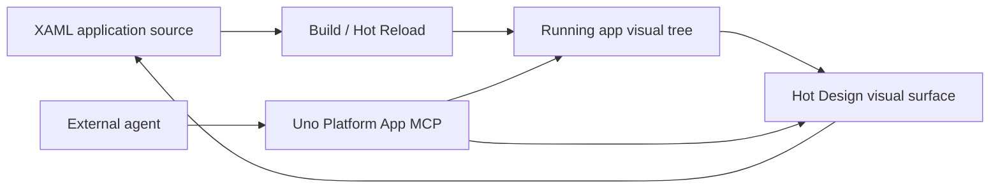

# Uno Platform Studio / Hot Design

> Research status: **Architecture-level** · Last reviewed: **2026-08-11**

| Field | Value |
|---|---|
| Team | Uno Platform · Montreal, Canada |
| Ordinary job | inspect a running cross-platform .NET application, change it visually or through an agent and keep the underlying XAML as the application source |
| Canonical artifact | the application project and XAML source |
| Runtime design surface | Hot Design over the running application's visual tree |
| Public platform revision inspected | [`87fd7739b8190fadf2a4576fd796db8fea41d90f`](https://github.com/unoplatform/uno/tree/87fd7739b8190fadf2a4576fd796db8fea41d90f) |

## Design happens against the running app

Hot Design is not a detached mockup canvas. Uno describes it as a visual designer over the application while it runs. A designer selects real UI elements, changes layout and properties, and sees the application update. Adopted changes are reflected in underlying XAML, so runtime inspection and source authoring meet at one surface.

That direction of truth distinguishes it from screenshot annotation tools. The runtime visual tree helps identify what the user is looking at; the durable result remains the project source that rebuilds the app.

## MCP exposes the application rather than a generic filesystem

Uno Platform App MCP gives an AI client application-aware operations: inspect the visual tree, read or set properties, interact with pointer and keyboard paths and gather runtime context. This means an agent can target a concrete live control instead of guessing only from file names. Source changes and Hot Reload then close the loop back to the running result.

The evidence does not justify claiming that every MCP operation directly rewrites XAML atomically. Some actions manipulate or inspect runtime state, while the Studio workflow is responsible for translating adopted design changes into source. Acceptance has to verify both sides: the visible app changed and a clean rebuild from source reproduces it.

## Studio is a product layer over a larger open platform

The candidate was discovered through the `unoplatform/uno` repository, but the census record is Uno Platform Studio / Hot Design, not the whole UI framework. The public Uno repository establishes the underlying cross-platform platform and source lineage. First-party product documentation establishes Studio and MCP behavior. The full Studio implementation is not sufficiently exposed in that repository to claim source-level coverage for the product layer.

That evidence ceiling is why this dossier remains architecture-level despite a pinned open-source platform commit.

## Authority and recovery questions

XAML and project source can use ordinary version control, reviews and builds. Runtime selection IDs are transient and can change as controls are recreated; they are not a durable cross-version identity scheme. A safe agent workflow therefore needs to resolve runtime context to stable source targets, review diffs and rebuild after changes.

The strongest acceptance sequence is: open an existing project, select a nested runtime control, make a constrained visual change, inspect the XAML diff, restart from clean source, exercise another target platform and then revert through version control. A live preview alone does not prove source convergence.

## Evidence boundary

First-party sources establish:

- a running-app visual design surface;
- source/XAML reflection of design changes;
- an application-aware MCP interface;
- cross-platform .NET application context.

They do not establish from public evidence reviewed here:

- atomic rollback of every multi-control agent operation;
- a product-owned immutable version graph beyond source control;
- identical Hot Design support for every Uno target and control;
- the internal source mapping algorithm used by all Studio releases.

## Primary evidence

- [Uno Platform Studio overview](https://platform.uno/docs/articles/studio/studio-overview.html)
- [Hot Design product page](https://platform.uno/hot-design/)
- [Uno Platform App MCP](https://platform.uno/mcp/)
- [Pinned public platform repository](https://github.com/unoplatform/uno/tree/87fd7739b8190fadf2a4576fd796db8fea41d90f)
