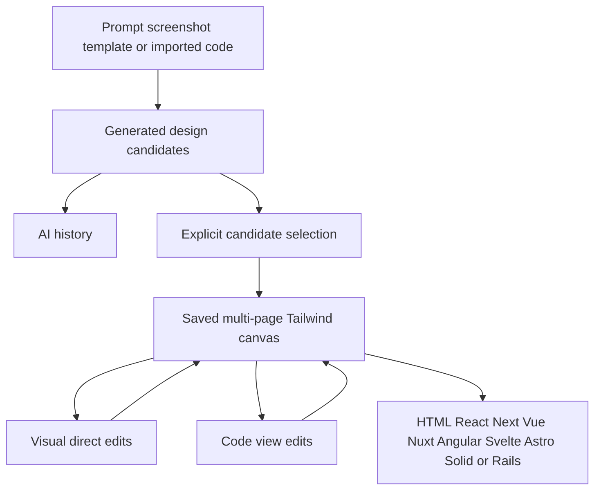

# Windframe

> Research status: **Architecture-level** · Last reviewed: **2026-08-12**

Windframe is a Tailwind-oriented visual IDE in which AI generation, direct canvas editing and code inspection converge on a saved web project. Its newer MCP surface is an additional agent entrance into the same design-system lineage rather than a separately counted product.

## Generated alternatives become project material only by selection

The AI panel accepts text or a screenshot, applies a chosen style and color direction and returns several design thumbnails. Follow-up prompts refine the current candidate. Checkboxes select one or more candidates to add to the project canvas; direct export instead uses only the currently previewed candidate. That distinction prevents a thumbnail history from being mistaken for the canonical project.

Once added, the design is visually editable. The canvas can import HTML or JSX, add elements and switch between visual and code views; a code edit is reflected in the rendered view. Selected elements also expose targeted Ask AI and code-copy actions.

## Persistence has two histories

Project history stores recoverable saved states and the editor autosaves ongoing work. Restoring an older state does not delete the latest state. AI history separately retains prior generated candidates so they can be reopened, refined or later added to the canvas. These histories answer different questions: one restores the project authority; the other revisits generation evidence.

## MCP grounds an external coding agent but does not mirror the canvas

Windframe MCP uses OAuth 2.0 with PKCE and gives compatible clients access to named design systems, components and Tailwind tokens. The resulting code is written into the coding agent's repository. Public material does not claim continuous synchronization between that repository and a Windframe project, so the MCP path is classified as an external agent context surface rather than a bidirectional document binding.

## Authority and delivery limits

Windframe's project couples the visual tree and Tailwind source closely enough for code and canvas edits to remain mutually visible. Framework export is a materialization step from that project; the docs do not establish that all exported framework trees can be re-imported without loss. Screenshot conversion is also explicitly approximate for complex icons, images and charts.

## Primary evidence

- [Windframe product](https://windframe.dev/)
- [AI generation and candidate-selection workflow](https://windframe.dev/docs/windframe-ai)
- [Canvas and code-view controls](https://windframe.dev/docs/canvas-toolbar)
- [Project history](https://windframe.dev/docs/history)
- [Windframe MCP](https://windframe.dev/mcp)
- [Supported delivery targets](https://windframe.dev/ai)
