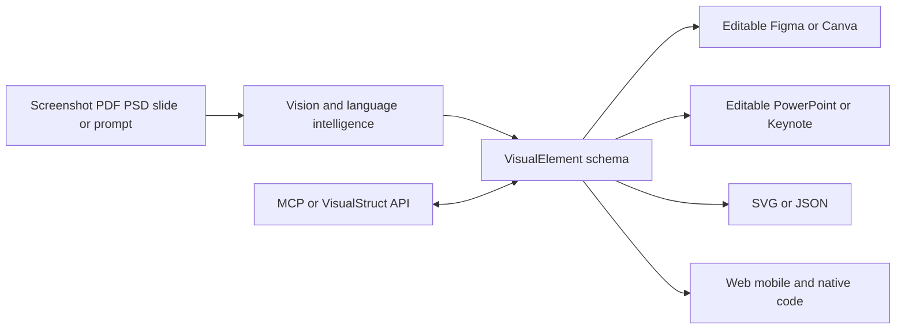

# Codia

> Research status: **Architecture-level** · Last reviewed: **2026-08-12**

| Field | Value |
|---|---|
| Team | Codia AI · team region not established |
| Ordinary job | reconstruct locked visual material into editable structure then move that structure across design and code formats |
| Intermediate authority | proprietary VisualElement schema |
| User authorities | editable Figma PowerPoint Canva Keynote SVG JSON or application code outputs |
| Lifecycle | active |

## Reconstruction precedes format conversion

Codia's Vision layer decomposes screenshots PDFs slides images and design files into text shapes vectors layers grids hierarchy and style. A VisualElement schema represents that structure independently of one destination. Output adapters rebuild it as editable artifacts or framework code. Language models add prompt-to-design and conversational generation over the same platform.

The schema is the technical center of the product family. Studio NoteSlide Figma/Canva plugins converters API and code generator are delivery surfaces around one reconstruction lineage rather than independent teams.

## Editable does not mean original semantics are recovered

OCR and visual hierarchy can produce useful layers from a flat source but the original component identities constraints interaction logic and accessibility semantics may never have been visible. Codia itself recommends designer review. Each destination becomes authoritative once a user continues editing it; no universal cross-format live synchronization is claimed.

## Evidence ceiling

VisualElement's public field specification model weights training data confidence values and mapping code are not available. Accuracy and “production-ready” figures are product claims. The dossier records the observable architecture and explicit review boundary rather than treating appearance as semantic proof.

## Primary evidence

- [Codia current platform and editable workflows](https://codia.ai/)
- [Official architecture and VisualElement description](https://codia.ai/about-us)
- [Screenshot reconstruction workflow](https://codia.ai/screenshot-to-figma)
- [Design-to-code surface](https://codia.ai/design-to-code)
