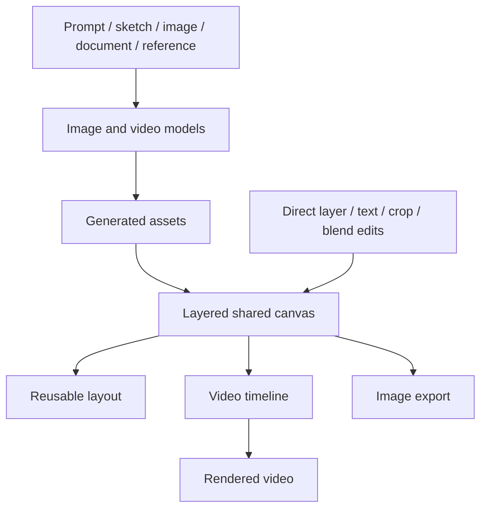

# Dreamina

> Research status: **Architecture-level** · Last reviewed: **2026-08-11**

| Field | Value |
|---|---|
| Team | ByteDance / CapCut Dreamina product lineage |
| Ordinary job | generate images or video, combine and refine them on a layered creative canvas and finish them through image or timeline tools |
| Managed authority | Dreamina account workspace with canvas layers, generated assets, layouts and video timeline state |
| Delivery | downloaded images and rendered video |

## Generation is an input to a continuing canvas

Dreamina's landing page presents many generators, but the qualifying Design loop is the canvas around them. Users can upload several images, arrange, hide, flip and blend layers, fit canvas dimensions, add text and continue with generative edits such as expansion, removal or restyling. Reusable layouts let a creator replace content while retaining composition.

The newer creative-workspace surface also accepts images, video, audio, documents and references on a shared canvas. Concepts and reference material can move into a timeline editor for sequencing and final polish. This is broader than a one-shot text-to-image endpoint.

## Canvas layers are the editable authority before export

A downloaded image flattens the current composition. A rendered video flattens canvas assets, timing and audio into delivery media. Neither can reconstruct the full managed project. The account workspace therefore owns continuing editability, while exports own distribution.

Public guidance supports layers and reusable layouts but does not expose the internal project schema, cross-device version model or stable links between a generated model output and later edited layers. “Native graph authority” here is an architecture-level inference from observable structured controls, not a claim about hidden database tables.

## Image and video models are replaceable engines

Dreamina lists several image and video models. The product project is not identical to any one model: model output becomes an asset, and the canvas/timeline coordinates refinement. This matters for identity counting. Seedream or Seedance model versions are not separate Design products in this census.

## Acceptance boundaries

Tests should reopen a saved layered composition, swap one generated asset without losing layout, edit a shared reference, verify text/layer ordering, move a scene into the timeline and inspect the final resolution/audio. Model prompt fidelity alone does not verify the workspace.

The team region remains unknown. Korean discovery language and CapCut's global localization are product-market evidence, not proof of which team built this surface.

## Primary evidence

- [Dreamina product](https://dreamina.capcut.com/)
- [First-party layered-canvas guide](https://dreamina.capcut.com/resource/photo-editor-with-layers)
- [First-party creative-workspace guide](https://dreamina.capcut.com/ai-video/ai-creative-workspace)
- [First-party social-content workflow](https://dreamina.capcut.com/ai-image/how-to-use-ai-high-quality-social-media-content-dreamina)
