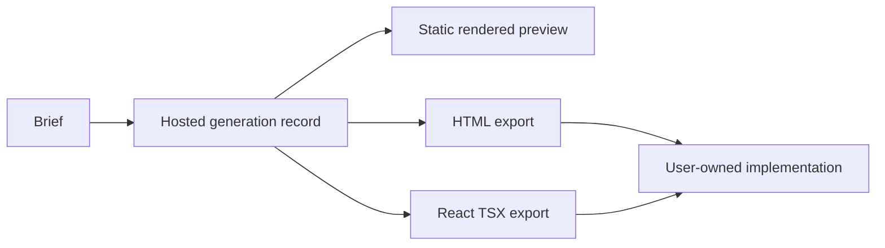

# AI UI Designer

> Research status: **Architecture-level** · Last reviewed: **2026-08-11**

| Field | Value |
|---|---|
| Team | AI UI Designer · public legal/team location not established |
| Ordinary job | describe one page or a full UI, inspect the generated result and take production-oriented HTML or React source |
| Strongest public evidence | prompt-bound example records with a static preview, HTML export and React TSX export |
| Unverified boundary | native layer editing, project recovery and round-trip source synchronization |

## This dossier is delivery-centered because that is where evidence is strongest

The live product offers one-page and full-UI generation and frames the loop as brief → design → ship. A public examples surface preserves the original prompt beside a static preview and two code representations: HTML and React TSX. That binding is stronger than a marketing screenshot because it lets a reviewer compare intent, rendered evidence and delivery artifact for the same generated object.

## Hosted record and exported source are different authorities

Within the service, a generation record binds prompt and preview. After download, HTML or TSX files can become implementation authority in the user's environment. First-party pages do not say that edited exports can be brought back or that visual selection maps to source locations. This record is therefore classified as a hosted generated-artifact workspace with design-code materialization, not a source-authority visual IDE.

## What inclusion does and does not assert

The product has a real ordinary Design loop and inspectable delivery outputs, so it is more than a directory lead or a generic model wrapper. Inclusion does not validate the site's “production-ready” quality claim. Responsive behavior, accessibility, component abstraction, state logic and code maintainability require artifact-level tests.

The product page mentions unlimited creative directions, but it does not expose a durable comparison or promotion mechanism. Variant exploration is recorded as an adopted definition without assigning candidate-promotion as the decisive architecture.

## Public evidence ceiling

No first-party documentation found in this pass established editable native layers, saved-version semantics, collaboration, source round-trip, internal implementation or an attributable company region. Those unknowns are retained rather than filled with inferences from model-provider names or localized pages.

## Primary evidence

- [AI UI Designer product](https://www.aiuidesigner.com/)
- [Public generated examples](https://www.aiuidesigner.com/examples)
