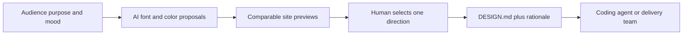

# DESIGN.md Maker JP

> Research status: **Architecture-level** · Last reviewed: **2026-08-11**

| Field | Value |
|---|---|
| Team | Elephancube Inc. · Japan |
| Ordinary job | turn an imprecise visual direction into a reviewable Japanese web-design instruction file |
| Authority | the user-selected and downloaded `DESIGN.md` |
| Lifecycle | active |

## Candidate promotion happens before the specification exists

The user chooses audience and site purpose then expresses mood through text tags cards and sliders. AI proposes as many as ten font and color directions. A preview supports comparison; only the accepted direction becomes the final Markdown file with a rationale.

This is not a canvas editor. It defines Design as a portable constraint artifact: fonts palette accessibility targets and reasoning can travel into another tool. The terms assign the generated `DESIGN.md` to the user and allow commercial use redistribution and client delivery.

## Accessibility is encoded intent not certification

The product provides Japanese font and traditional-color presets and says it can configure WCAG AA and color-universal-design choices. Its terms explicitly disclaim guaranteed compliance and leave final judgment to the user. The artifact can record a rule but cannot prove that downstream markup interactions or content satisfy it.

## Evidence ceiling

The generation schema prompt format model identity version history and downstream consumers are not published. A downloaded file is a snapshot; later changes to the form or design do not automatically update copies already handed to agents.

## Primary evidence

- [DESIGN.md Maker JP product](https://designmdmaker.jp/)
- [Terms and output ownership](https://designmdmaker.jp/terms)
- [Elephancube company and Tokyo team](https://www.elephancube.co.jp/company/)
