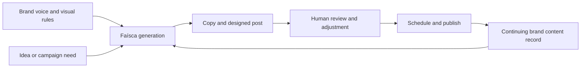

# Faísca

> Research status: **Architecture-level** · Last reviewed: **2026-08-11**

| Field | Value |
|---|---|
| Team | Faísca · team region not established by attributable evidence |
| Ordinary job | turn a brand brief into recurring social content, adjust it and publish it on a schedule |
| Continuing authority | provider-managed brand, content and publishing project |
| Lifecycle | active-transition; the public site still carries waitlist language while a separate application is live |

## The artifact is a governed publishing stream

Faísca is not counted because it can generate an isolated image. Its ordinary loop binds a brand's voice and visual rules to copy, design, review, adjustment, scheduling and publication. Agencies can organize more than one brand in the same service. The durable object is therefore a managed content program: assets, brand context and a release calendar continue after any individual generation.

## Product delivery is the decisive definition

Delegated creation and native adjustment are present, but the mechanism becomes distinctive at delivery. A generated post stays inside a project where it can be organized, approved and scheduled. This is a different authority boundary from a prompt-to-image utility: the service owns the operational state between creative intention and a published channel.

The current public pages do not disclose whether visual adjustments are layer-based, template-parameter based or regenerated; they also do not document version restore, approval roles, channel APIs or export ownership. The dossier therefore does not claim a native scene graph or source-level round trip.

## Regional evidence is intentionally separated

The product is explicitly made for Brazilian brands and Portuguese-language workflows. Market localization is not sufficient proof of where the responsible team works, so the census keeps team region unknown until an attributable company or team source is available.

## Evidence ceiling

First-party pages establish the user journey, multi-brand organization and publishing boundary. No public source, schema or detailed help center establishes internal orchestration, content versioning or the representation used by the visual editor. Simulated testimonials on the landing page are not treated as adoption evidence.

## Primary evidence

- [Faísca product site](https://faisca.ia.br/)
- [Faísca application](https://app.faisca.ia.br/)
