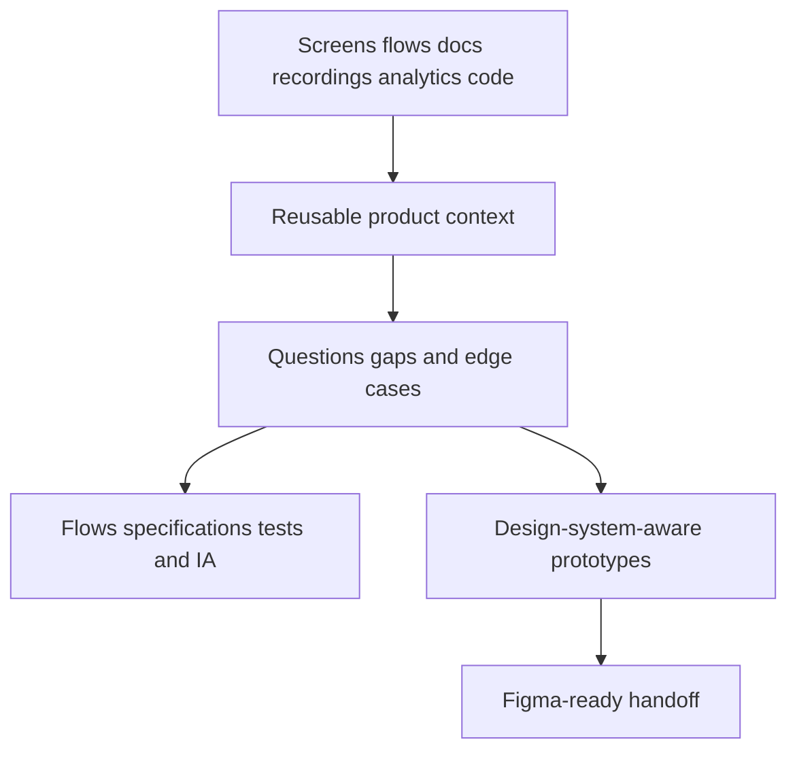

# Figr

> Research status: **Architecture-level** · Last reviewed: **2026-08-12**

Figr positions itself as a product-design context and decision layer. It collects research implementation and prior decisions so an agent can produce more than a visually plausible isolated screen.

## Context is accumulated before generation

Projects can ingest screens flows documents design systems recordings analytics code and earlier decisions. Figr then asks clarifying questions maps missing states and edge cases and explains why a recommendation follows from the available context.

Outputs include user flows information architecture PRDs test scenarios acceptance criteria reviews and high-fidelity prototypes. Design-system-aware screens can be handed to Figma; Figr explicitly does not claim to replace the native Figma editor.

## The artifact is a decision package

Figr's value lies in keeping evidence and generated deliverables associated. A high-fidelity prototype alone can be replaced; the context and rationale explain what constraints should survive later editing. Public evidence does not specify immutable citations or prove that every generated claim links to an exact source span so “context-aware” must not be read as fully auditable provenance.

## Identity and evidence ceiling

The first-party footer identifies Figrfast Systems Private Limited and supports an India organization boundary. The hosted implementation remains closed. Ingestion parsers retrieval ranking prompt construction model routing project-version semantics Figma transfer format and deletion guarantees are unknown. There is no evidence of live two-way Figma synchronization after handoff.

## Primary evidence

- [Figr product](https://figr.design/product)
- [Figr company and legal footer](https://figr.design/)
