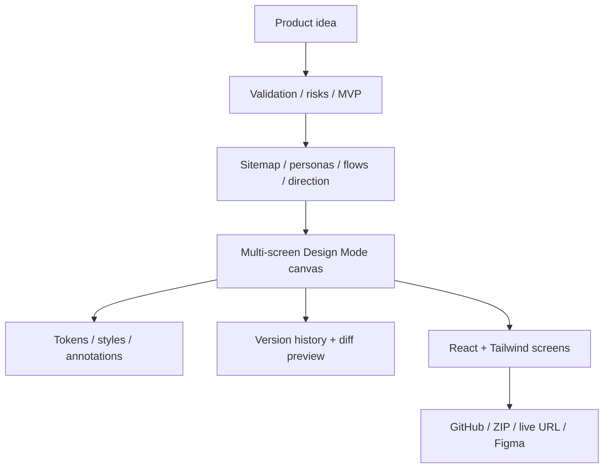

# Fleck

> Research status: **Architecture-level** · Last reviewed: **2026-08-11**

| Field | Value |
|---|---|
| Team | Fleck Agent Ltd. · London, United Kingdom |
| Ordinary job | move from idea validation and information architecture into a multi-screen design canvas, coded prototype and deployable project |
| Managed authority | Fleck project containing reasoning artifacts, flows, screens, tokens, annotations and version history |
| Delivery projections | React/Tailwind repository, GitHub sync, ZIP, Figma export or hosted preview |

## Fleck keeps the “thinking layer” inside the project

Fleck positions itself upstream of pixel execution. A project can contain market and feasibility analysis, personas, sitemap, user flows, product direction and technology recommendations before screen generation. Design Mode then lays multiple screens on a canvas with sticky notes, annotations, connection diagrams, token controls, style presets and per-screen code generation.

That combination is the decisive product model: reasoning and visual artifacts are not separate chat attachments. They guide the generated screens and can be carried into case-study and handoff outputs.

## Canvas and code are related but not proven identical

The first-party site states that each screen can generate component-based React/Tailwind and that the project can sync to GitHub. It does not publicly specify a round-trip protocol by which arbitrary repository edits return to every canvas object. The safest interpretation is a managed design project that materializes code, not a verified bidirectional source-authority editor.

Likewise, “Figma export” identifies a handoff path but not whether the export preserves components, tokens and prototypes with stable identity. Those details remain explicit acceptance questions.

## Version history belongs to the managed canvas

Design Mode advertises version history with diff preview. Public evidence does not reveal granularity, retention, branching or whether code exports are immutably linked to versions. A useful test must restore a prior multi-screen state and check its flows, tokens and generated code, not merely confirm that a timestamp appears.

## Distinct workflows share the same account graph

Screenshot UX audit, design conversion, case-study generation and mentoring are additional product surfaces. They are not counted separately because the official product presents them as modules in the same Fleck Agent project/account lineage. The record does not infer that a screenshot audit result can be applied atomically to the canvas unless observed.

## Evidence ceiling

First-party evidence supports the user journey, artifact classes, managed version concept and export channels. Source code and internal data schemas are not public, so claims about node IDs, transactions, storage backend, Figma fidelity and Git reconciliation remain unknown.

## Primary evidence

- [Fleck product page](https://fleck.ai/)
- [Fleck company page](https://fleck.ai/about)
- [Fleck UX audit surface](https://fleck.ai/ux-audit)
