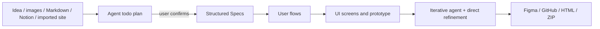

# Paraflow

> Research status: **Architecture-level** · Last reviewed: **2026-08-11**

| Field | Value |
|---|---|
| Team | Paraflow |
| Ordinary job | turn an idea or imported site into confirmed product specs, user flows, UI screens and a prototype, then hand it off in the team's preferred format |
| Canonical working artifact | managed Paraflow project joining structured Specs and visual designs |
| Delivery | Figma, GitHub, HTML or ZIP export |

## The agent exposes its plan before generating screens

Paraflow's official quick start replaces the discovery directory as decisive evidence. The agent first proposes a todo list for confirmation. It then generates structured Specs rather than jumping directly to pixels: global context, product requirements, users/constraints and other planning artifacts feed flows and UI work.

This creates a visible adoption point. The user can correct scope before a large screen set is produced, and later visual choices remain connected to a product model rather than a single prompt.

## Specs and screens are different project layers

The agent's global context and PRD-like material define what should exist; visual screens and prototype interactions show how it behaves. Paraflow's value proposition depends on keeping those layers in one continuing project. Exporting only a screenshot or only HTML loses part of that project reasoning.

The public help center documents new-project and import paths, agent credit usage and handoff formats. It does not publish the exact internal schema or stable object-ID semantics between Specs, flow nodes and screen layers.

## Handoff is multi-authority by design

Figma export gives designers a native downstream document, while GitHub/HTML/ZIP give development teams executable source. After export, Paraflow, Figma and the repository can diverge. No public evidence reviewed here establishes continuous three-way synchronization or merge conflict handling. Each export is best treated as an explicit materialization at a moment in project history.

## Persistence and version ceiling

An account dashboard and project-based editor establish managed continuation, but public documentation reviewed here does not specify immutable versions, branching or retention guarantees. The dossier therefore avoids claiming a version graph. Acceptance should reopen a project, change a Spec after screens exist, verify which downstream objects update, export twice and compare identities and code diffs.

## Team region

Official pages and events show a global product and activity in Copenhagen, but that is not sufficient evidence of the product team's attributable home. Region remains unknown rather than inferred from a meetup or localized market.

## Primary evidence

- [Official Paraflow quick start](https://help.paraflow.com/Welcome-to-Paraflow-27304388e52c80d582b9e4054f9c5ce8)
- [Official product updates and handoff formats](https://paraflow.com/whats-new)
- [Official pricing and ownership boundary](https://paraflow.com/pricing)
