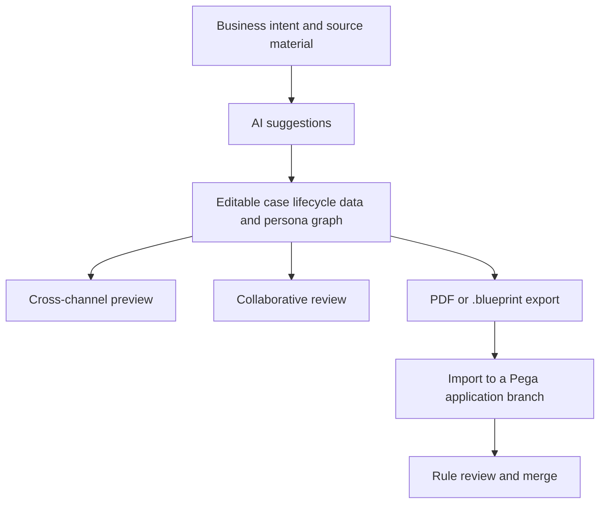

# Pega Blueprint

> Research status: **Architecture-level** · Last reviewed: **2026-08-12**

Pega Blueprint treats Design as defining an application operating model before or alongside implementation. The central artifact is not a collection of mockup frames: it is an editable blueprint containing case types lifecycle stages data objects personas and channel projections that can later enter Pega development.

## AI proposes a model that people govern

A user describes an application or imports background material. AI suggests case types stages steps data relationships and personas. Every element can be reviewed and edited before a cross-channel preview is used to inspect the intended experience.

The explicit review step after import is decisive. A `.blueprint` is an upstream authority but does not silently become production rules. Existing and new applications can receive it on a branch where generated rules are inspected before merge.

## Separate persistence clocks

The Blueprint dashboard retains SaaS artifacts and collaboration state. PDF is a human-readable snapshot; `.blueprint` carries structured transfer state; the Pega branch and rule repository govern implemented application state. Those clocks can diverge after export. Public documentation does not claim live bidirectional synchronization.

## Product boundary and unknowns

Blueprint is a SaaS application distinct from Pega Infinity even though its main delivery path enters Pega. It therefore has an independently surfaced ordinary-user loop but remains under Pegasystems. First-party company evidence supports a United States organization boundary.

The model prompts object schema import diff rules conflict semantics permission model and generated-rule coverage remain closed. A preview demonstrates the current blueprint projection not production integration behavior performance accessibility or policy compliance.

## Primary evidence

- [Pega Blueprint](https://www.pega.com/blueprint)
- [Pega Academy Blueprint workflow](https://academy.pega.com/topic/pega-blueprint/v1)
- [Pegasystems company](https://www.pega.com/about)
