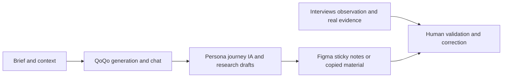

# QoQo

> Research status: **Architecture-level** · Last reviewed: **2026-08-12**

QoQo is a Figma companion for the discovery side of product design. Its center of gravity is not pixel generation: it turns a designer's brief into structured research and planning material such as personas, journeys, information architecture, affinity groups, interview prompts, discovery questions and UX copy.

## Synthetic structure is a draft, not user evidence

The product's most important boundary is stated by QoQo itself: generated material should complement real user research. A persona or journey produced from public model knowledge can help expose assumptions and missing questions, but it does not prove how a particular population behaves.

## Figma is the working artifact boundary

Outputs can be copied or made into sticky notes, so a designer can arrange, annotate and revise them with the rest of the team's discovery material. Public evidence does not establish durable two-way synchronization: once material is copied into Figma, that native file should be treated as the collaborative authority rather than assuming later QoQo history updates it automatically.

The product also exposes its own history, but the public contract does not disclose the history schema, model versions, prompt construction, retrieval sources or whether a restored result preserves exact generation parameters.

## Team boundary

QoQo names Valérie Pegon, Tamer Okail, Amgad Okail and Yuri Karkhachev and states that the team is based in Malaysia, France and Egypt. This is recorded as a multi-region team rather than forcing one country.

## Primary evidence

- [QoQo product, FAQ and team](https://qoqo.ai/index.html)
- [QoQo Figma entry point](https://qoqo.ai/index.html)
