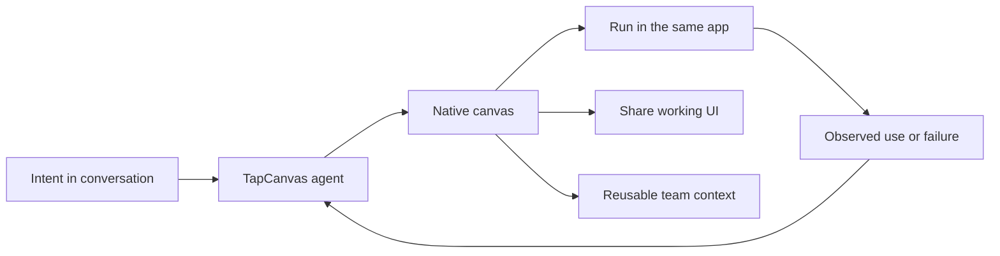

# TapCanvas

> Research status: **Architecture-level** · Last reviewed: **2026-08-12**

TapCanvas is pre-release. The interesting boundary is not a design-to-code export: the generated interface itself is the answer inside the mobile product.

## Canvas as a runnable native capability

A person asks for a checklist dashboard form guide or other small tool in conversation. The agent creates a native canvas inside the app and the person immediately uses it there. The same agent can inspect a broken canvas guide troubleshooting and reuse a successful canvas or its learned pattern for a later request.

This makes runtime behavior and reuse part of the artifact boundary. There is no advertised second builder surface and no rebuild required for a recipient: creation execution repair teaching and sharing occur under one safe native runtime.

## Authority and persistence limits

The first-party contract calls each working interface a canvas and says useful canvases become reusable context. That establishes retained product identity and reuse but does not disclose a node schema storage engine native framework or version-history protocol. Those details remain unknown rather than inferred from the word “native.”

The pre-release state matters. This record captures an independently surfaced product contract and ordinary-user loop; it does not claim general availability or production maturity.

## Primary evidence

- [TapCanvas pre-release product surface](https://tapcanvas.com/)
- [TapCanvas privacy policy](https://tapcanvas.com/privacy-policy)
- [TapCanvas terms of service](https://tapcanvas.com/terms-of-service)
