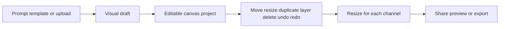

# Taploop Studio

> Research status: **Architecture-level** · Last reviewed: **2026-08-12**

Taploop Studio is an editable campaign-asset workspace. The user starts with a prompt, template or existing image; generation creates a draft, and the same project continues through canvas editing, aspect-ratio adaptation, public preview and export.

## Generation is only the first canvas operation

Official interactive lessons expose concrete operations: add a generated result to canvas, rename it, select and transform layers, remove or restyle backgrounds, place QR codes, save a project, adapt to square/story/banner/thumbnail formats and create a public link. Brand kits couple palette, typography, logo and campaign guidance to later generations.

The hosted project is therefore the observable durable authority, not the initial raster generation. Public evidence does not disclose its project schema, layer types, responsive reflow algorithm, model providers, history depth, collaboration semantics or export formats. An authenticated browser acceptance run and team-region attribution remain open.

## Primary evidence

- [Official product](https://taploop.design/)
- [Official workflow lessons](https://taploop.design/learn)
- [Official brand-kit surface](https://taploop.design/templates)
