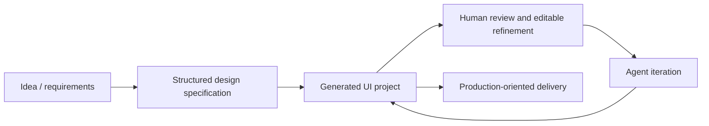

# UXCanvas.ai

> Research status: **Architecture-level** · Last reviewed: **2026-08-11**

| Field | Value |
|---|---|
| Team | UXCanvas.ai · team region not established |
| Ordinary job | turn a product idea into a structured UI specification and then refine the generated interface toward delivery |
| Managed authority | hosted UXCanvas design project |
| Evidence constraint | the public site exposes less persistence detail than the larger UI-canvas products |

## Specification precedes visual generation

UXCanvas describes an intermediate design specification containing layout direction visual style and component hierarchy before it creates screens. That planning artifact distinguishes the mechanism from an unstructured image prompt: it gives subsequent generation and conversational refinement a shared account of what the interface is supposed to contain.

## Authority is recorded at the observable boundary

The first-party surface calls the output editable and supports continuing iteration. It does not publish whether the canonical representation is a native node graph or generated source. The census therefore uses managed-app-project architecture instead of inventing a schema. Code-oriented delivery is a projection until a round-trip contract is documented.

The small evidence surface also limits lifecycle claims. A live sign-in route and current product page establish an operating service. They do not establish collaboration semantics, autosave durability, named versions or export fidelity.

## Evidence ceiling

No public documentation or source was found for persistence structure, agent tool calls, undo/redo, code format or recovery. This record should be upgraded only after installed-product evidence or a detailed first-party contract becomes available.

## Primary evidence

- [UXCanvas.ai product](https://uxcanvas.ai/)
- [UXCanvas sign-in surface](https://uxcanvas.ai/sign-in)
- [UXCanvas privacy contract](https://uxcanvas.ai/privacy)
