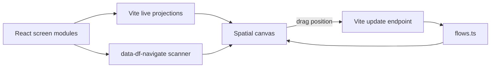

# DesignFlow

> Research status: **Source-level** · Last reviewed: **2026-08-12**

| Field | Verified value |
|---|---|
| Maintainer | Jason / `jason301c` |
| Canonical authority | React screen modules plus `flows.ts` and `designflow.theme.ts` |
| Visual surface | zoomable live screen-flow canvas and individual viewer |
| Pinned source | [`2456c4a238d81502cf207cffbd0498d6eacaf1f7`](https://github.com/jason301c/designflow/tree/2456c4a238d81502cf207cffbd0498d6eacaf1f7) |

DesignFlow turns source-authored screens into a spatial design board. It is not a parallel mockup graph: the canvas renders the actual React components and writes only its own flow metadata back to source.

## Three files divide responsibility

- screen modules own executable screen content;
- `flows.ts` owns screen metadata positions viewports colors and explicit edges;
- `designflow.theme.ts` owns design tokens compiled into `--df-*` CSS variables with HMR.

A `data-df-navigate="screenId"` attribute in a screen is both runtime navigation intent and source-readable edge evidence. `screen-scanner.ts` extracts those attributes and the canvas combines inferred and explicit edges.

## Dragging writes a bounded source change

`Canvas.tsx` posts stopped node positions to `/__designflow/update-positions`. The Vite plugin loads the current config and `flow-writer.ts` serializes the updated position into `flows.ts`. The implementation does not pretend that dragging an arbitrary DOM element rewrites JSX.

| Pinned path | Mechanism |
|---|---|
| [`src/runtime/screen-scanner.ts`](https://github.com/jason301c/designflow/blob/2456c4a238d81502cf207cffbd0498d6eacaf1f7/src/runtime/screen-scanner.ts) | screen discovery and navigation extraction |
| [`src/runtime/vite-plugin.ts`](https://github.com/jason301c/designflow/blob/2456c4a238d81502cf207cffbd0498d6eacaf1f7/src/runtime/vite-plugin.ts) | virtual modules HMR and write/export endpoints |
| [`src/runtime/flow-writer.ts`](https://github.com/jason301c/designflow/blob/2456c4a238d81502cf207cffbd0498d6eacaf1f7/src/runtime/flow-writer.ts) | serialized flow-config mutation |
| [`src/app/Canvas.tsx`](https://github.com/jason301c/designflow/blob/2456c4a238d81502cf207cffbd0498d6eacaf1f7/src/app/Canvas.tsx) | spatial canvas drag and share/export controls |
| [`src/app/Viewer.tsx`](https://github.com/jason301c/designflow/blob/2456c4a238d81502cf207cffbd0498d6eacaf1f7/src/app/Viewer.tsx) | live screen navigation and viewport projection |

## Delivery and limits

The system exports canvas or screen PNG and a read-only static HTML share. Those are projections; source remains authoritative. Regex-based navigation extraction can miss computed attributes and dynamic routes. Default-exported zero-prop screens are the supported contract so stateful application shells and backend-dependent screens require adaptation. Concurrent manual edits to `flows.ts` during a write are not shown to have semantic merge handling.

Team region remains unknown from the maintainer evidence reviewed.

## Primary evidence

- [Pinned repository](https://github.com/jason301c/designflow/tree/2456c4a238d81502cf207cffbd0498d6eacaf1f7)
- [Source-format documentation](https://github.com/jason301c/designflow/blob/2456c4a238d81502cf207cffbd0498d6eacaf1f7/README.md)
