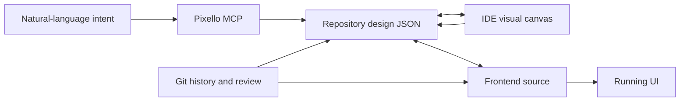

# Pixello

> Research status: **Architecture-level** · Last reviewed: **2026-08-12**

| Field | Value |
|---|---|
| Team | Pixello · team region not established |
| Ordinary job | design and revise frontend UI inside the code editor while keeping a reviewable design file beside source |
| Canonical authority | human-readable design JSON and frontend files in the user's Git repository |
| Lifecycle | closed beta / active transition |

## The repository owns both sides of the projection

Pixello runs in Cursor or VS Code. Intent enters through an MCP-enabled agent and produces a design document plus frontend code. The visual canvas edits the design projection; code edits affect the implementation projection. Official documentation says design data is human-readable JSON stored locally in the repository so normal Git history reviews and branches apply.

This is stronger than a hosted-canvas export claim because the documented durable artifact is in the user's codebase. Code is described as the source of truth while JSON keeps visual intent explicit and reviewable. “Two-way sync” remains limited to Pixello's supported design and frontend representation.

## Captured live UI is material not authority

The browser extension can bring elements from a live or local page into the canvas with code and token context and attach visual feedback. The imported page is an input snapshot. Once edited and committed the repository files—not the external website—own the new direction.

## Evidence ceiling

The JSON schema synchronization algorithm AST/CSS coverage identity mapping conflict rules and rollback behavior are not public. Closed-beta documentation is a current product contract and must be acceptance-tested on real frameworks before assuming lossless round trip.

## Primary evidence

- [Pixello product](https://pixello.tech/)
- [Repository and authority model](https://docs.pixello.tech/)
- [IDE extension and MCP setup](https://marketplace.visualstudio.com/items?itemName=Pixello.pixello)
