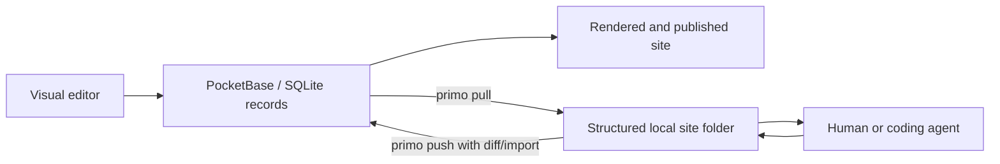

# Primo

> Research status: **Source-level** · Last reviewed: **2026-08-11**

| Field | Value |
|---|---|
| Team | Primo CMS |
| Ordinary job | build and publish a site visually, or pull the same site into structured local files for an agent to edit and push back |
| Managed authority | PocketBase/SQLite records used by the visual CMS and server |
| Agent-facing authority | an explicit structured site folder synchronized by `primo pull` and `primo push` |
| Pinned source | [`30ff2de047c59083e3c774b487233558d71aca78`](https://github.com/primocms/primo/tree/30ff2de047c59083e3c774b487233558d71aca78) |

## The filesystem is a synchronization surface, not a hidden cache

Primo is a visual CMS with a second, intentionally exposed representation for editors, Git and coding agents. `primo pull <server>` exports a site to local files; an agent or human edits those files; `primo push` imports the changes and updates the CMS. The beta workflow gives agents ordinary file semantics without replacing the service's relational model.

Typical exported structure separates site settings and content from reusable blocks, page types, pages and uploads. YAML carries structured configuration/content, while source and asset files remain inspectable. This is more specific than “the AI can access the CMS”: the transport and convergence points are implemented in the repository.

## Pull and push have asymmetric responsibilities

The exporter serializes the current managed site into a stable folder. The importer validates and diffs local state before changing CMS records. Source comments and tests show special handling for unchanged pages, upload hashes, canonical filenames and deletion safety. Missing local uploads are not silently treated as a request to erase server data; pruning requires an explicit path.

This is not continuous collaborative synchronization. A local folder can become stale while someone edits the visual CMS. The safe ordinary loop is pull, edit, inspect the push diff, then push. The repository's no-op and idempotence tests reduce accidental churn, but they do not turn two concurrent writers into a CRDT.

## What each representation owns

The database remains necessary for permissions, multi-site serving, relationships, publishing and the browser editor. The folder is the durable collaboration contract for code tools and can be placed under Git. Neither should be described as a disposable projection: a successful push deliberately changes managed records, while a later pull can rewrite the local representation to match server canonicalization.

Site snapshots provide a managed recovery concept separate from Git history. Git can version the exported folder; Primo snapshots can version service-side site state. The pinned evidence does not establish a single atomic transaction that couples one Git commit to one CMS snapshot.

## Source map

| Pinned path | Evidence |
|---|---|
| `README.md` | ordinary `pull` / edit / `push` workflow and beta boundary |
| `internal/export.go` | database-to-folder serialization and upload manifests |
| `internal/import.go` | validation, diff, idempotence and folder-to-CMS mutation |
| `internal/import_test.go` | no-op re-push and preservation invariants |
| `migrations/1763028006_site_snapshots.go` | managed site snapshot storage |
| `src/lib/builder/` | visual editing projection over managed site records |

## Acceptance questions created by this architecture

The useful tests are round trips, not screenshots: change the same page visually and locally between pulls; rename and replace an upload; push an unchanged large site; interrupt an import; inspect what happens to an unknown field; restore a service snapshot after local edits; and verify the published output. A successful agent edit to YAML is incomplete until the push result and visual/runtime site are inspected.

## Primary evidence

- [Pinned repository](https://github.com/primocms/primo/tree/30ff2de047c59083e3c774b487233558d71aca78)
- [Pinned export implementation](https://github.com/primocms/primo/blob/30ff2de047c59083e3c774b487233558d71aca78/internal/export.go)
- [Pinned import implementation](https://github.com/primocms/primo/blob/30ff2de047c59083e3c774b487233558d71aca78/internal/import.go)
