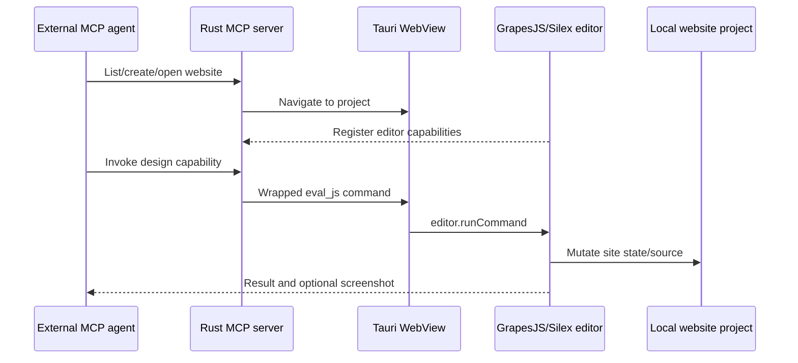

# Silex Desktop AI

> Research status: **Source-level** · Last reviewed: **2026-08-11**

| Field | Value |
|---|---|
| Team | Silex Labs nonprofit · France |
| Ordinary job | create or open a local website, let an external AI manipulate it through the same visual editor, refine it by hand and publish standard HTML/CSS |
| Canonical project | local Silex website project and its editable web source/state |
| Lifecycle | desktop/MCP path is alpha and transitioning into the established Silex product |
| Pinned source | [`a3fe989803cda6d3da30a3b1bef166dd63516d4f`](https://github.com/silexlabs/Silex/tree/a3fe989803cda6d3da30a3b1bef166dd63516d4f) |

## The desktop shell turns editor capabilities into tools

Silex has long been a GrapesJS-based visual static-site builder. The new AI boundary lives in the Tauri desktop application. On startup it embeds the Silex server at `localhost:6805`, opens the dashboard/editor in a WebView and starts a streamable HTTP MCP server at `localhost:6807`.

The MCP server has static project and screenshot tools, then discovers dynamic capabilities registered by the open editor. Each capability becomes an MCP tool. When the AI client invokes one, the Rust server evaluates a carefully wrapped JavaScript call in the WebView; the editor runs its own command and returns the result through a callback channel.

## Capability discovery keeps MCP aligned with the editor

Instead of hard-coding a second copy of every GrapesJS operation in Rust, `mcp.rs` polls the editor's `grapesjs-ai-capabilities` registry after a project opens. Capability metadata supplies description, input schema and annotations such as read-only, destructive or idempotent. This reduces protocol drift as editor features evolve.

It also means the security boundary is broad: some MCP calls ultimately execute JavaScript in the live editor. The wrapper escapes code and correlates asynchronous results, but a host must still treat agent access as authority over the current local website.

## The artifact stays on the open web path

The desktop product is local-first and requires no hosted account for its ordinary path. Silex visually edits web structures and builds static HTML/CSS that can be hosted anywhere. MCP does not create a separate “AI file”; it controls the project already visible in Silex. Manual editor changes and agent changes therefore converge before build/publish.

Clean HTML/CSS output is a delivery and exit property, but the project state remains important for continuing structured visual editing. A published static site is not guaranteed to round-trip with every editor-level component and data binding intact.

## Source-level evidence and lifecycle ceiling

| Pinned path | Evidence |
|---|---|
| `desktop/src-tauri/src/main.rs` | local server, window and MCP startup |
| `desktop/src-tauri/src/mcp.rs` | static tools, dynamic capability loading and WebView execution |
| `desktop/src-tauri/scripts/desktop-bridge.js` | Tauri/editor bridge |
| `desktop/MCP_E2E_TESTS.md` | ordinary cross-boundary test scenarios |
| `packages/grapesjs-ai-capabilities/` or integrated submodule capability source | editor command registry consumed by MCP |
| core Silex editor/server source | project persistence, visual authoring and static build |

The implementation is present at the pinned commit, so this is source-level rather than a roadmap-only entry. Lifecycle remains active-transition because first-party pages still describe Desktop/AI as alpha or in development. Evidence of code does not convert an early release into a mature availability claim.

## Primary evidence

- [Pinned repository](https://github.com/silexlabs/Silex/tree/a3fe989803cda6d3da30a3b1bef166dd63516d4f)
- [Silex AI product page](https://www.silex.me/ai/)
- [Pinned desktop architecture](https://github.com/silexlabs/Silex/blob/a3fe989803cda6d3da30a3b1bef166dd63516d4f/desktop/README.md)
- [Pinned MCP implementation](https://github.com/silexlabs/Silex/blob/a3fe989803cda6d3da30a3b1bef166dd63516d4f/desktop/src-tauri/src/mcp.rs)
