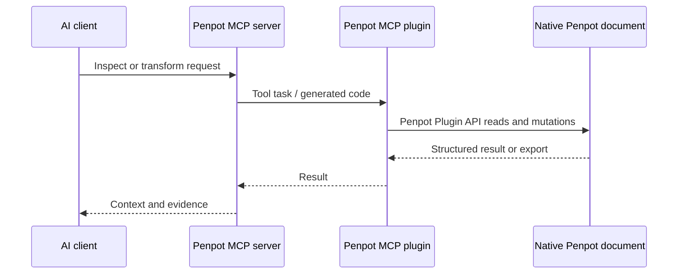

# Penpot

> Research status: **Source-level** · Last reviewed: **2026-08-11**

| Field | Value |
|---|---|
| Team | Penpot |
| Ordinary job | let an external AI client inspect, create and transform objects inside the Penpot file currently open to the user |
| Canonical artifact | Penpot's native design document graph and open `.penpot` file representation |
| Agent boundary | official MCP server plus an in-editor Penpot plugin |
| Pinned source | [`044d7ac15f91b23cef0800367dad4376485a62d3`](https://github.com/penpot/penpot/tree/044d7ac15f91b23cef0800367dad4376485a62d3) |

## The official MCP was absorbed into the main product repository

Penpot's earlier `penpot-mcp` repository was archived after its contents were integrated under `mcp/` in the main Penpot repository. That identity transition matters: the MCP server is now a product surface of Penpot, not a separate third-party bridge and not a second census record.

The architecture has two active pieces. An MCP server presents tools to the model client. A Penpot plugin, opened in the target design file, connects to the server over WebSocket and executes operations through the Penpot Plugin API. The design file remains visible and editable in the ordinary editor while the agent works.

## A small tool surface permits broad document operations

The server exposes high-level overview and API-information tools, shape export/import helpers and an `execute_code` path. Instead of enumerating every possible design operation as a separate MCP tool, it supplies API documentation and allows generated code to run inside the plugin context. That provides broad reach across pages, shapes, components, styles and tokens, but also creates a wide trust boundary.

The plugin must be open and connected for local operation. Closing it closes the bridge. Remote/multi-user modes change transport and deployment, not the authority of the native Penpot document.

## Native document remains the recovery boundary

Agent operations modify the same file the designer is using. Exported screenshots or SVG are evidence and delivery formats, not replacement authorities. Penpot's own persistence, collaboration and file/version mechanisms govern durability. The MCP source does not add an independent transactional branch around each prompt.

Generated code can perform several mutations before an error. A serious acceptance test should therefore combine a constrained initial file, host undo/version recovery, screenshots before and after, and an exported `.penpot` file. “The tool returned success” is weaker evidence than reopening the design and inspecting its real node graph.

## Open file format reduces exit risk

Penpot documents can be exported in the documented open `.penpot` format. That gives the artifact a public interchange boundary independent of the MCP protocol. It does not imply that arbitrary MCP-generated code will preserve every semantic invariant; the Plugin API and Penpot schema still determine valid operations.

## Commit-level map

| Pinned path | Evidence |
|---|---|
| `mcp/README.md` | integrated product architecture and setup |
| `mcp/packages/server/src/PenpotMcpServer.ts` | MCP transport and tool registration |
| `mcp/packages/server/src/tools/ExecuteCodeTool.ts` | broad generated-code invocation surface |
| `mcp/packages/server/src/PluginBridge.ts` | server-to-plugin task channel |
| `mcp/packages/plugin/src/task-handlers/ExecuteCodeTaskHandler.ts` | execution inside the active Penpot plugin |
| `mcp/packages/server/src/tools/ExportShapeTool.ts` | visual evidence/materialization path |

## Primary evidence

- [Pinned Penpot repository](https://github.com/penpot/penpot/tree/044d7ac15f91b23cef0800367dad4376485a62d3)
- [Official MCP documentation](https://help.penpot.app/mcp/)
- [Open Penpot file format](https://help.penpot.app/user-guide/export-import/penpot-file-format/)
- [Integrated pinned MCP source](https://github.com/penpot/penpot/tree/044d7ac15f91b23cef0800367dad4376485a62d3/mcp)
