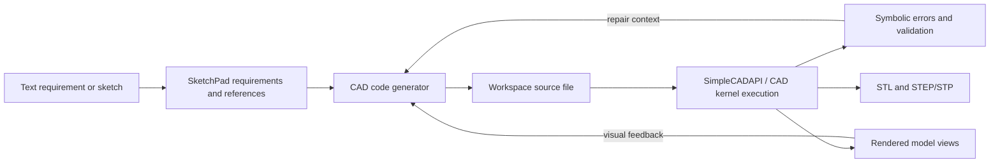

# CADDesigner (`562590763/CADDesigner-Code`)

> Research status: **Source-level** · Last reviewed: **2026-08-11**

| Field | Value |
|---|---|
| Organization / team | Zhejiang University CADDesigner research team |
| Ordinary job | turn text or a sketch into precise editable CAD, inspect code and geometry, repair failures and deliver valid manufacturing exchange files |
| Canonical working artifact | executable CAD source in a per-task workspace; SimpleCADAPI / CAD kernel execution resolves geometry |
| Required delivery artifacts | STL plus STEP or STP output, with rendered views used as verification evidence |
| Status | active research release with React frontend, FastAPI backend and local/container startup paths |
| Project page | [CADDesigner](https://562590763.github.io/CADDesigner/) |
| Source repository | [562590763/CADDesigner-Code](https://github.com/562590763/CADDesigner-Code) |
| Pinned source revision | [`65b5f5219974eadbd3ea1d117e467f47cefb69b7`](https://github.com/562590763/CADDesigner-Code/commit/65b5f5219974eadbd3ea1d117e467f47cefb69b7) |

## Code is the editable engineering intent

CADDesigner does not ask a model to emit an opaque mesh and then call the result CAD. Its specialist agent writes executable CAD source, runs it through a domain API/kernel, checks required outputs and uses failures or rendered views to revise the same source.

The rendered solid is a projection. The source file carries reproducible construction intent, and the kernel decides whether that intent produces valid geometry.

## The generator receives a concrete file contract

`agent/CADAgent.py` orchestrates specialized roles and tools. Code tools create or update files in the workspace and execute them. The CAD code generator is instructed to operate on the exact target file rather than return an unattached snippet. Completion requires generated model artifacts, including STL and STEP/STP forms.

That contract creates several independent checks:

- the target source exists and contains the intended operations;
- execution finishes rather than only producing plausible text;
- the kernel creates valid geometry;
- required delivery formats exist;
- rendered evidence matches the requirement and reference;
- later requirements can revise the source without discarding the project.

A successful `.stl` alone is insufficient because tessellation can lose parametric construction and precise exchange semantics. A STEP result alone is also insufficient if the source cannot be regenerated or changed.

## SketchPad is semantic working memory, not geometry

`context/sketch_pad.py` and `context/sketch_manager.py` hold structured requirements, reference images and visual facts keyed by IDs. Tools can add and retrieve those facts so later agent turns remain grounded in the user's intent.

SketchPad helps answer *why* the model should look or behave a certain way. It does not replace the CAD source or kernel object. If semantic memory says a bore is 8 mm while the executable model makes it 10 mm, the geometry and the recorded requirement conflict and must be reconciled; neither a chat summary nor a screenshot resolves that automatically.

## Symbolic and visual feedback close different failure loops

Execution errors expose syntax, API and kernel failures. Model-view tools render outputs for visual inspection. The agent can receive both failure context and view evidence before modifying the file.

| Feedback | Detects well | Does not prove |
|---|---|---|
| interpreter/API error | invalid code or unsupported operation | visual or engineering correctness |
| kernel/export success | buildable geometry and file production | intended dimensions or manufacturability |
| rendered view | gross shape, composition and missing features | hidden topology, tolerances or exact dimensions |
| requirement/SketchPad facts | intended constraints and references | that source and geometry obey them |

An ordinary acceptance run should inspect all four rather than treating the latest thumbnail as success.

## Persistence spans conversations and workspace files

The context system separates conversation state from model artifacts. `RedisFileContextBackend` provides immediate Redis access and file persistence under `contexts/ctx_<id>.json`. Conversation managers save context and SketchPad state. The `workspace/` tree contains code and generated model files, while web artifact routes locate and serve the latest code/model/output paths.

This supports recovery after a process restart, but it is not a CAD-native version graph:

- “latest artifact” is resolved from conversation evidence and paths;
- files can be overwritten without an automatic immutable revision;
- Redis and JSON persistence can be newer or older than workspace files after a partial failure;
- there is no built-in three-way merge for parallel model directions;
- restoring a conversation context does not automatically rewind the CAD workspace.

For durable engineering use, the exact source and outputs should be placed under an explicit version/release discipline outside this research implementation.

## Web projection follows artifact paths

The React frontend and FastAPI layer stream agent events and expose the latest artifact for a conversation. `web_interface/artifacts.py` resolves code, model and output paths from allowed workspace roots and assigns content types including STEP. `conversation_router.py` returns those files to the UI.

This is path-based source mapping: the viewer knows which generated file it is showing. The repository does not establish stable selectable face/edge identity from a browser click back into a specific source operation. Visual targeting is therefore model-level feedback, not a full bidirectional CAD feature mapper.

## Implementation map

| Concern | Pinned path | Evidence |
|---|---|---|
| agent orchestration | `agent/CADAgent.py` | specialized CAD agent and tool loop |
| source-file mutation | `tools/code_tools.py`, `tools/builtin_file_toolkit.py` | exact workspace file operations |
| execution | `tools/command_tools.py` | runs generated CAD programs and returns failures |
| visual evidence | `tools/model_view_tools.py` | model rendering/inspection returned to the agent |
| semantic memory | `context/sketch_pad.py`, `context/sketch_manager.py` | requirements, references and visual facts |
| context persistence | `context/context.py`, `context/context_manager.py` | Redis plus JSON file recovery |
| artifact projection | `web_interface/artifacts.py`, `web_interface/routers/conversation_router.py` | code/model/output discovery and browser delivery |
| domain API knowledge | `workspace/skills/simplecad-self-evolve/` | CAD API documentation, examples and validation workflow |

## Source lineage and unresolved engineering gates

The pinned repository was published in one visible commit on 2026-07-22. A related SimpleCADAPI revision `1f6734f32d31b6d3d7234c0bcc3a3c9ad6772ee2` identifies itself as the CADDesigner research artifact, while that dependency has since continued evolving. Reproduction must therefore pin both the CADDesigner checkout and a compatible domain API/environment.

Still unresolved by source inspection alone:

- topological naming stability across regeneration;
- constraint or feature-tree semantics beyond what generated code expresses;
- atomic rollback across code write, execution, context save and artifact publication;
- dimension/tolerance validation against an explicit engineering specification;
- safe adoption of two simultaneous agent revisions;
- downstream manufacturing validation beyond file creation.

## Primary evidence

- [Pinned CADDesigner source](https://github.com/562590763/CADDesigner-Code/tree/65b5f5219974eadbd3ea1d117e467f47cefb69b7)
- [Official project page](https://562590763.github.io/CADDesigner/)
- [CADDesigner paper](https://arxiv.org/abs/2508.01031)
- [SimpleCADAPI](https://github.com/daijunhaoGitHub/SimpleCADAPI)
