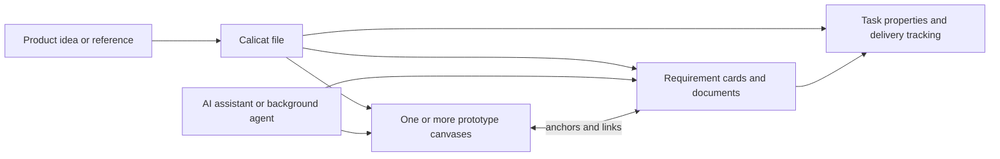

# Calicat

> Research status: **Architecture-level / closed-source boundary reached** · Last reviewed: **2026-08-11**

| Field | Value |
|---|---|
| Organization / team | Calicat; official FAQ says it and ProcessOn are separate products of the same Beijing company |
| Ordinary job | keep prototype design, requirements and delivery tasks together while an AI assistant or background agent creates and edits the prototype graph |
| Status | active public beta; release notes show version `1.11.8` on 2026-07-14 and later fixes |
| Canonical artifact | a Calicat file containing prototype design, requirement documents and task state across one or more canvases |
| Canonical URL | [calicat.cn](https://www.calicat.cn/) |
| Documentation | [help.calicat.cn](https://help.calicat.cn/) |
| Source availability | closed source |
| Pinned source revision | N/A — closed source |
| Evidence ceiling | official documentation and release history expose the user loop, graph concepts, AI tools, recovery and failure behavior; renderer, storage schema, collaboration protocol and agent implementation are undisclosed |

## The unit of work is a product iteration, not an isolated mockup

Calicat's [file contract](https://help.calicat.cn/quickStart/createFile) says every file contains prototype design, requirement documents and task management, and recommends using a file for a major product iteration. Multiple canvases inside that file can organize smaller iterations. This makes the product's working center broader than a prompt-to-image generator:

The [product page](https://www.calicat.cn/) describes a browser-based multiplayer editor with reusable components, auto layout and prototype interactions. The AI participates in that same structured workspace rather than returning only a flat screenshot.

## AI has graph tools and two different mutation modes

The [AI assistant guide](https://help.calicat.cn/aiAssistant/aiAssistant) documents tool access to canvas structure, layer data, requirement lists, requirement-card content and interaction data. A user can attach a selected layer, requirement, image or extracted webpage, or let the assistant fetch named objects. The assistant can then generate frames, directly edit a target layer, create requirement cards and add prototype interactions.

Calicat exposes two distinct control loops:

| Loop | Invocation | Mutation and review boundary |
|---|---|---|
| foreground AI assistant | open the assistant in the file and converse; selected layers or attachments scope the request | draws or edits in the live canvas; user continues the chat and can undo or redo |
| background Agents | add an anchored comment and mention `@Calicat AI`; multiple jobs can run in parallel after the editor is closed | replies when work is ready; narrow work can edit the original while large work tends to create a copy for one-click application |

This is more than one-shot generation. The documented edit loop lets the agent retrieve the target structure, mutate it, retrieve it again for verification and correct errors. The pricing guide explicitly describes that multi-step tool sequence as a higher-complexity task.

## Native layers carry design authority

AI-generated prototypes use Calicat's auto-layout containers and remain manually editable. The [prototype guide](https://help.calicat.cn/quickStart/quickDesignAPrototype) documents frames, parent components, child instances, local and space component libraries and explicit adoption of published component updates. The FAQ explains that generated content follows the same auto-layout and clipping rules as human-authored content.

The graph visible from public behavior includes at least:

- file, canvas and first-level page/frame ids;
- nested layers and auto-layout containers;
- reusable parent components and instances;
- prototype actions such as navigate, back, show/hide and open link;
- requirement cards anchored to a prototype location;
- task properties derived from those requirement cards;
- AI conversations and attachments that reference graph objects.

An image export is therefore a delivery representation, not the working authority. The FAQ says page designs export as JPG, PNG or WebP and specifically says Calicat does not export HTML or another design-tool format. Developers instead consume structured design and requirement data through the Calicat MCP server.

## Variants, undo and snapshots are separate recovery layers

The AI guide documents `Cmd/Ctrl+Z` undo and redo after direct edits. For a large change the agent tends to create a duplicate page, while a user can also clone an entire canvas manually; the [canvas guide](https://help.calicat.cn/canvasOperation) says that cloning copies prototype design but not requirement cards.

Release history adds evidence for a durable snapshot system. Version `1.11.0` changed historical-snapshot creation logic, and `1.11.3` improved snapshot stability. Public docs do not expose snapshot frequency, retention, restore semantics or whether one agent run is one snapshot. These mechanisms must therefore remain distinct:

| Mechanism | Established use | Unresolved boundary |
|---|---|---|
| undo/redo | immediate recovery from an edit in the active editor | grouping of multi-tool and concurrent edits |
| copied page | preserve a large agent alternative beside the original | whether one-click apply replaces, merges or copies objects |
| cloned canvas | branch prototype geometry at a coarser level | requirement cards are deliberately omitted |
| historical snapshot | durable file recovery is implemented and actively fixed | public restore UI, retention and snapshot transaction model |

Deletion semantics also reveal coupled state. Release notes document a fix where deleting a canvas made linked requirement cards unrecoverable; the repaired behavior moves them to the first canvas. That is evidence that prototype and requirements are connected but not one indivisible object.

## The changelog exposes real failure boundaries

Calicat's [release notes](https://help.calicat.cn/releaseNote) are unusually useful because they name failures that marketing pages hide:

- AI has used wrong ids while editing and has emitted invalid data;
- a multi-tool call can partially fail;
- a move into a newly created frame has made the object disappear;
- interrupted or output-limited generation has produced incomplete pages that needed explicit save handling;
- long MCP responses can be truncated by an external agent's context/output limit;
- renderer performance remains a known issue and the FAQ says the underlying render path is being rebuilt;
- AI-generated auto-layout may clip content or resist free dragging even though the data is present;
- collaboration, reconnect and export paths have each needed targeted repairs.

These are not reasons to exclude the product. They define the acceptance boundary: a task is not complete merely because the chat reports success. The resulting layers, hierarchy, interactions, requirement links, history and export/MCP handoff must be inspected.

## MCP is a delivery bridge rather than the file authority

The public FAQ recommends Calicat MCP for developer handoff and says the service exposes design data and requirement cards to AI IDEs. Release `1.11.4` added separate tools for listing canvas ids and page ids to reduce context volume. OAuth reliability and truncated page data appear in the changelog and FAQ.

The durable design remains in the Calicat file. MCP moves a bounded representation of that graph into another agent context; public material does not say that downstream source changes round-trip automatically into the original prototype. Exporting a bitmap likewise loses editable structure.

## Team identity can be bounded without guessing an internal squad

Calicat's FAQ and pricing page say Calicat and ProcessOn are separate products from the same company, with separate memberships. ProcessOn's official [about page](https://www.processon.com/about) attributes that company to 北京大麦地信息技术有限公司 and gives a Beijing address. This supports a China-based organization boundary for the candidate register.

It does not reveal whether the Calicat product group is a stable internal team, its headcount, or whether infrastructure is shared with ProcessOn. The verified sample therefore represents one Calicat product lineage under the public company umbrella rather than inventing a precise squad.

## Evidence boundary

- **Established:** Calicat is an active AI-assisted prototype, requirements and task workspace; AI can read and mutate structured canvas objects; background agents can run asynchronously; native layers remain editable; the product exposes undo, copies, snapshots, exports and an MCP handoff.
- **Inference:** the Calicat file graph is the working authority because AI and manual operations converge there and exports/MCP are outward representations.
- **Unknown:** renderer and collaboration implementations, storage schema, operation-log design, snapshot retention, model orchestration, tool authorization and exact one-click-apply merge semantics.
- **Not tested in this pass:** account creation, a full background-agent run, concurrent editing, snapshot restore and MCP-to-code handoff in an ordinary user file.

## Primary sources

- [Calicat product page](https://www.calicat.cn/)
- [AI design assistant and background Agents](https://help.calicat.cn/aiAssistant/aiAssistant)
- [File and canvas model](https://help.calicat.cn/quickStart/createFile)
- [Prototype components and auto layout](https://help.calicat.cn/quickStart/quickDesignAPrototype)
- [FAQ, export and MCP boundaries](https://help.calicat.cn/frequentlyAskedQuestions)
- [Release notes](https://help.calicat.cn/releaseNote)
- [ProcessOn company attribution and location](https://www.processon.com/about)

## Research gaps

- Run one ordinary-user file from prompt through direct edit, parallel background task, apply, undo and history restore.
- Inspect the current MCP schemas and verify how stable canvas, page, layer and requirement ids remain after duplication or agent replacement.
- Determine whether historical snapshots include conversations, tasks and external attachments or only the file graph.
