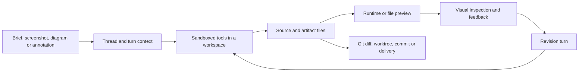

# Codex

> Research status: **Source-level / v0.3** · Last reviewed: **2026-08-11**

| Field | Value |
|---|---|
| Organization / team | OpenAI |
| Category | Multi-surface coding agent and agent harness with visual workflows |
| Status | Active |
| Product surfaces in scope | ChatGPT desktop app in Codex mode, Codex CLI, IDE extension, Codex cloud, App Server integrations |
| Source availability | CLI, SDK and App Server open under Apache-2.0; desktop, IDE and cloud client implementations are not published in the canonical repository |
| Canonical product URL | https://chatgpt.com/codex |
| Canonical source repository | https://github.com/openai/codex |
| Audited stable release | [`rust-v0.147.0`](https://github.com/openai/codex/releases/tag/rust-v0.147.0), commit [`be6e8eac029b183056b7e4402879f15d2c85f61b`](https://github.com/openai/codex/commit/be6e8eac029b183056b7e4402879f15d2c85f61b) |
| Pinned source revision | [`d06dc73290729d2bcb464b955a4cfd9992abc35d`](https://github.com/openai/codex/commit/d06dc73290729d2bcb464b955a4cfd9992abc35d), `main` on 2026-08-10 |
| License of pinned repository | [Apache License 2.0](https://github.com/openai/codex/blob/d06dc73290729d2bcb464b955a4cfd9992abc35d/LICENSE) |

Codex is not one visual editor with one canonical canvas. It is a coding-agent harness exposed through several clients. Rich clients can add browser inspection, file previews, annotations, computer use, worktrees and review panes, while the open core turns those inputs into constrained tool execution against a workspace. In the ordinary design journey, the durable result is therefore a file or Git state that can be run and inspected—not the screenshot, browser selection, streamed tool event or thread transcript.

That distinction determines this dossier's structure: **surface boundary → repository-returning user journey → orchestration protocol → visual evidence → execution authority → three persistence clocks → failure and history evidence**.

## One harness, several surfaces, unequal capabilities

The official [open-source matrix](https://learn.chatgpt.com/docs/open-source) identifies the CLI, SDK and App Server as public source, while the IDE extension and cloud implementation are not open source. The current desktop app is also not present as a published client implementation in the canonical repository. Consequently, source inspection can establish the harness and protocol, but not the complete behavior of every visible client control.

| Surface | User-observable job | Public implementation boundary |
|---|---|---|
| ChatGPT desktop app, Codex mode | Organize project chats; work locally or in worktrees; preview files and local web apps; use browser, computer use and review panes | Product behavior is documented; the rich desktop client itself is not in `openai/codex` |
| Codex CLI | Inspect and edit a local repository, run commands, review changes and accept image inputs from the terminal | CLI, core, tools, persistence and protocol are in the public repository |
| IDE extension | Supply editor/workspace context and review changes beside source | The client is closed; the public App Server explicitly exists to power rich clients such as the VS Code extension |
| Codex cloud | Run delegated work in a managed environment | Cloud implementation and persistence are closed; only shared client/core contracts are visible here |
| Third-party rich client | Embed authentication, conversation history, approvals and streamed events | The open App Server is the supported integration boundary |

Capabilities are deliberately surface-specific. For example, the [built-in browser](https://learn.chatgpt.com/docs/browser) is available in the desktop app and web experience but not in Codex CLI or the IDE extension. The [file-preview documentation](https://learn.chatgpt.com/docs/artifacts-viewer) likewise says the desktop app can preview and annotate supported generated files, whereas the CLI edits files without a visual preview interface. “Codex supports visual work” therefore does not mean every Codex client exposes the same observation or correction loop.

### Stable product, current source and experimental API are separate evidence layers

| Evidence layer | Snapshot used here | What it can establish |
|---|---|---|
| Current official product documentation | Observed 2026-08-11 | Publicly described client behavior and surface availability |
| Stable local distribution | `codex-cli 0.147.0`; release commit `be6e8eac...` | A user-obtainable binary and its version-matched stable App Server schema |
| Current source | Pinned `main` commit `d06dc732...`, 119 commits after `rust-v0.147.0` | Current architecture and explicit experimental directions, not an assertion that every field has shipped stably |

The repository manifests intentionally use development versions (`0.0.0-dev` in the npm wrapper and `0.0.0` in the Rust workspace). Release tags, packages and binaries—not those manifest literals—carry distribution truth. Fields marked `experimental`, `unstable` or internal in the pinned source are treated as such below.

## The ordinary design journey returns to a repository

The critical path for a frontend or design-artifact task is:

1. **Choose the actual workspace.** A local chat has a working directory and may run in the main checkout or a Git worktree. The desktop [worktree flow](https://learn.chatgpt.com/docs/environments/git-worktrees) exists to isolate parallel chats rather than make the chat itself a version.
2. **Provide intent and visual evidence.** The user can attach screenshots, diagrams and references; the CLI accepts them with `--image`. Current [image-input guidance](https://learn.chatgpt.com/docs/image-inputs) explicitly recommends naming the relevant area and the desired outcome.
3. **Let the agent inspect and mutate the workspace.** Shell, patch, MCP, plugin and other tools operate under the selected cwd, workspace roots, permissions and sandbox.
4. **Render the result in the medium that matters.** A local web app can be opened in the desktop browser; documents, presentations, spreadsheets, PDFs and supported HTML can use file previews; a desktop-only bug may require Computer Use.
5. **Return evidence as another turn.** A screenshot, browser observation, supported-preview annotation, diff comment or plain-language correction becomes new context for another execution pass.
6. **Review repository state, not only agent narration.** The official [review pane](https://learn.chatgpt.com/docs/code-review) reflects the Git repository, including Codex, user and other uncommitted changes. A user can inspect unstaged, staged, commit, branch or last-turn views.
7. **Deliver a real artifact.** The result becomes useful when the expected files, render, tests and Git state are independently obtainable.

This loop can feel canvas-like in a rich client, but it remains repository-returning. A browser frame is an observation surface. An annotation is correction context. A thread coordinates the work. None replaces the authored files.

## A thread is an orchestration record; the workspace is the artifact

App Server exposes a three-level conversation model. The pinned source defines a [`Thread`](https://github.com/openai/codex/blob/d06dc73290729d2bcb464b955a4cfd9992abc35d/codex-rs/app-server-protocol/src/protocol/v2/thread_data.rs#L184-L250) with identity, persistence mode, cwd, runtime status, source and optional Git metadata; a [`Turn`](https://github.com/openai/codex/blob/d06dc73290729d2bcb464b955a4cfd9992abc35d/codex-rs/app-server-protocol/src/protocol/v2/thread_data.rs#L256-L276) contains items and completion state; and [`ThreadItem`](https://github.com/openai/codex/blob/d06dc73290729d2bcb464b955a4cfd9992abc35d/codex-rs/app-server-protocol/src/protocol/v2/item.rs#L226-L397) covers messages, reasoning, commands, file changes, MCP calls, image views and review events.

| Object | What it records | What it does not own |
|---|---|---|
| Thread | Conversation identity, cwd, source, status, turns, optional path and Git metadata | A snapshot of every workspace file |
| Turn | One unit of user input and agent work, with model/execution overrides and streamed lifecycle | A transaction that atomically commits every side effect |
| Item | Typed observations of messages, commands, patches, tool calls and images | Independent proof that the intended artifact exists or renders correctly |
| Workspace | The actual files read and written by tools and external processes | Conversation history or automatic version labels |
| Git repository/worktree | Diff, index, branches and commits over the files | A guarantee that the latest turn was reviewed, committed or merged |

The public [`TurnStartParams`](https://github.com/openai/codex/blob/d06dc73290729d2bcb464b955a4cfd9992abc35d/codex-rs/app-server-protocol/src/protocol/v2/turn.rs#L71-L160) reinforces this separation: a turn references a thread and carries input, but can also override cwd, runtime workspace roots, approval policy, reviewer, sandbox/permissions profile and model. Conversation state is the coordination envelope around an execution environment.

### “Completed” is not artifact proof

App Server emits typed command and file-change items, patch updates and a turn-level diff. Those are valuable evidence, but their scope is narrower than the workspace:

- A `FileChange` item reports patch changes and patch status; a `CommandExecution` item reports a command, cwd, output and exit status. An arbitrary command can still modify files without becoming a typed patch.
- The [`TurnDiffTracker`](https://github.com/openai/codex/blob/d06dc73290729d2bcb464b955a4cfd9992abc35d/codex-rs/core/src/turn_diff_tracker.rs#L47-L115) explicitly tracks exact committed `apply_patch` deltas **without rereading the workspace filesystem**. It invalidates itself when the delta is inexact.
- `apply_patch` performs file hunks sequentially through the executor filesystem. The implementation can [add, delete, move and update real files](https://github.com/openai/codex/blob/d06dc73290729d2bcb464b955a4cfd9992abc35d/codex-rs/apply-patch/src/lib.rs#L480-L653), but a later write failure can leave an already committed prefix. The core explicitly preserves that prefix in the diff even when the visible tool item fails or is denied ([source](https://github.com/openai/codex/blob/d06dc73290729d2bcb464b955a4cfd9992abc35d/codex-rs/core/src/tools/events.rs#L399-L421)).
- `turn/completed` closes the orchestration lifecycle. It does not assert that a page matches a reference, a document opens, tests pass, or a branch was committed.

For acceptance, the evidence chain is therefore:

`turn completed → inspect expected paths → inspect repository diff/status → run deterministic checks → render in the relevant runtime → visually inspect → commit/export/deliver`

## App Server is the client boundary, not a design format

The open [`codex app-server`](https://github.com/openai/codex/blob/d06dc73290729d2bcb464b955a4cfd9992abc35d/codex-rs/app-server/README.md#L1-L83) is a bidirectional JSON-RPC-style interface with the `jsonrpc` header omitted on the wire. Stable stdio uses newline-delimited JSON; WebSocket is explicitly experimental in the pinned source. A connection initializes once, starts/resumes/forks a thread, starts a turn, streams item and turn events, and eventually receives `turn/completed`.

That boundary is deliberately general enough for different clients:

| Client concern | App Server representation | Guarantee deliberately left outside the protocol |
|---|---|---|
| Conversation continuity | `thread/start`, `thread/resume`, `thread/fork`, thread history | Restoring an earlier filesystem snapshot |
| Agent work | `turn/start`, item lifecycle, output deltas, `turn/completed` | That a client displayed or verified every side effect |
| Workspace selection | thread/turn cwd and runtime workspace roots | Correct repository choice by the hosting client |
| Mutation review | file-change items and `turn/diff/updated` | A complete Git diff after arbitrary shell or external edits |
| Authority | sandbox, permissions, approval policy and server-initiated approval requests | Automatic rollback after a declined or failed operation |
| Rich context | image/local-image inputs and experimental client-supplied context | A universal browser-element or design-node identity schema |

The protocol source maps [`item/commandExecution/requestApproval`](https://github.com/openai/codex/blob/d06dc73290729d2bcb464b955a4cfd9992abc35d/codex-rs/app-server-protocol/src/protocol/common.rs#L1537-L1551), thread/turn lifecycle, diff notifications and item deltas into explicit request/notification types. It also generates version-specific TypeScript and JSON Schema bundles; the pinned README states those outputs match the binary that generated them.

This matters for evidence. The current `main` README is a bleeding-edge protocol document, and many fields carry experimental annotations. A stable client should generate bindings from its installed Codex version rather than copy the latest source schema and assume compatibility. Official [feature-maturity definitions](https://learn.chatgpt.com/docs/feature-maturity) likewise say experimental behavior may change or disappear.

## Visual evidence is content, not canonical element identity

Codex has several visual entry and observation routes, but they do different jobs:

| Route | Publicly established payload/behavior | Identity that survives into the open harness |
|---|---|---|
| Image input | Screenshot, diagram or asset attached to a prompt; CLI accepts paths | Image URL/data or local path plus optional detail |
| `view_image` | Agent reads a local image under filesystem sandbox rules and returns image content to the model | An `ImageView` item with tool-call id and path |
| Built-in browser | Shared view of websites and local web apps; can preview and leave visual feedback | Client/tool-supplied context; no public core DOM-source type |
| File preview and annotation | Desktop can preview supported file types and target a supported preview region | Rich-client correction context; public core does not expose a canonical document-node protocol for it |
| Appshot | macOS frontmost-window image plus available text, stored like an attachment | Session attachment, not an application object identity |
| Computer Use | Visually inspects and operates an allowed GUI when structured integrations are insufficient | Plugin/tool observations and actions under separate app permissions |
| Review-pane inline comment | Feedback tied to a Git diff line | File/diff line context, which is source review identity rather than rendered DOM identity |

The open input types are concrete about the first two routes. Core [`UserInput`](https://github.com/openai/codex/blob/d06dc73290729d2bcb464b955a4cfd9992abc35d/codex-rs/protocol/src/user_input.rs#L15-L55) accepts text, image data, local image paths, audio, skills and mentions. The [`view_image` handler](https://github.com/openai/codex/blob/d06dc73290729d2bcb464b955a4cfd9992abc35d/codex-rs/core/src/tools/handlers/view_image.rs#L150-L200) checks sandboxed file metadata, reads bytes, emits an image-view item and returns a data URL to the model.

### There is no public core DOM-to-source contract

The most important negative result is in the protocol shape:

- The public image variants carry image URL/path and detail, not DOM selector, component, file, line or source-map identity.
- Experimental [`additionalContext`](https://github.com/openai/codex/blob/d06dc73290729d2bcb464b955a4cfd9992abc35d/codex-rs/app-server-protocol/src/protocol/v2/turn.rs#L49-L89) is a map from an opaque source key to a string classified as `untrusted` or `application` context. Core merges changed strings into user or developer context ([source](https://github.com/openai/codex/blob/d06dc73290729d2bcb464b955a4cfd9992abc35d/codex-rs/core/src/state/additional_context.rs#L10-L35)); it does not interpret a standardized browser-node identity.
- The `ThreadItem::ImageView` representation retains a path, not a coordinate-to-source binding.
- Diff-line comments do return to source lines, but only after Git has already produced a source diff. They do not prove that a rendered element was traced back to that line.

**Inference, explicitly labeled:** a desktop browser/plugin may deliver richer target data inside tool results or client-supplied text, and the model can use that context effectively. The pinned open core nevertheless establishes only a **tool-supplied visual-context route**, not an intrinsic, durable DOM/design-node-to-source mapping. A successful visual repair must still be verified against the resulting files and render.

## Execution authority is a separate plane

The visual surface does not decide what the agent may mutate. Authority is composed from the selected environment, cwd/workspace roots, sandbox or named permissions profile, approval policy and reviewer.

The current thread and turn protocol exposes those controls directly. Command approval requests include thread, turn and item identity, cwd, reason, parsed actions and optional policy amendments; file-change approvals carry the requested write root and decision ([source](https://github.com/openai/codex/blob/d06dc73290729d2bcb464b955a4cfd9992abc35d/codex-rs/app-server-protocol/src/protocol/v2/item.rs#L1442-L1541)). Official [sandbox documentation](https://learn.chatgpt.com/docs/sandboxing) separates technical enforcement from the approval policy: the sandbox defines reachable files/network, while approvals decide when crossing a boundary requires a decision.

This produces several non-obvious boundaries:

- Granting a browser or GUI app to Computer Use is separate from granting shell/file access. The official [Computer Use documentation](https://learn.chatgpt.com/docs/computer-use) says file reads, edits and shell commands still follow task sandbox and approval settings.
- A rendered page can be visible while its source directory is outside the current writable roots.
- Approval can authorize an operation but does not validate its design correctness.
- A rejected or failed multi-file patch is not guaranteed to be side-effect-free; the committed prefix must be inspected.
- A thread-level cwd can be overridden on later turns, so “same conversation” does not necessarily mean “same effective workspace.”
- The App Server transport itself can reject saturated ingress with retryable error `-32001`; the client must distinguish overload from an agent/product failure.

## Persistence runs on three clocks

Codex persistence is not one version graph. The thread ledger, workspace and Git each advance independently.

| Clock | Durable center | What advances it | What it cannot restore alone |
|---|---|---|---|
| Conversation clock | Canonical rollout JSONL under `$CODEX_HOME/sessions`; optional archived rollout | Persist/append/flush of session metadata, messages, events and items | The exact prior contents of the working directory |
| Artifact clock | Files in the selected local, worktree or managed workspace | Patch, shell, plugin/MCP, user edits and external processes | Conversation reasoning, approvals or a named release |
| Version clock | Git working tree, index, branches and commits | User/client/agent Git operations | Uncommitted state that was overwritten or never captured |

The pinned rollout implementation says its purpose is to persist session rollouts as inspectable/replayable JSONL and creates paths shaped like `$CODEX_HOME/sessions/YYYY/MM/DD/rollout-<timestamp>-<thread-id>.jsonl` ([source](https://github.com/openai/codex/blob/d06dc73290729d2bcb464b955a4cfd9992abc35d/codex-rs/rollout/src/recorder.rs#L1-L88), [path construction](https://github.com/openai/codex/blob/d06dc73290729d2bcb464b955a4cfd9992abc35d/codex-rs/rollout/src/recorder.rs#L1549-L1572)). Ephemeral threads deliberately have no on-disk path.

Local thread storage has two representations, with an explicit authority order. [`LocalThreadStore`](https://github.com/openai/codex/blob/d06dc73290729d2bcb464b955a4cfd9992abc35d/codex-rs/thread-store/src/local/mod.rs#L89-L101) calls JSONL the durable replay format and SQLite the queryable metadata index. Its writer flushes JSONL before projecting history into SQLite so the index may lag after failure but cannot get ahead of canonical history ([source](https://github.com/openai/codex/blob/d06dc73290729d2bcb464b955a4cfd9992abc35d/codex-rs/thread-store/src/local/live_writer.rs#L254-L320)). Archiving moves rollout files to the separate `archived_sessions` collection; it does not archive a project checkout.

Git worktrees solve another problem. They provide separate file checkouts for parallel chats while sharing repository metadata. They reduce write interference, but do not merge branches or make thread history a commit. A resumed thread can therefore find its conversation while the associated worktree has changed, moved or disappeared; conversely, a commit can survive after the local thread is deleted.

The safest recovery question is not “did the chat resume?” but three questions:

1. Did the expected rollout/thread history load?
2. Does the intended workspace or worktree still contain the expected files?
3. Does Git identify the desired diff/commit/branch, and does that state still render correctly?

## Failure atlas

| Break | User-visible symptom | Evidence-backed cause | Recovery/verification |
|---|---|---|---|
| Surface mismatch | Browser/preview control is missing in CLI or IDE | Rich-client capabilities are not uniform across Codex surfaces | Move to a documented surface or use an explicit external viewer/tool |
| Wrong workspace | Agent edits a similarly named checkout or later turn changes cwd | Thread and turn execution roots are configurable | Inspect effective cwd/workspace roots and Git repository before accepting output |
| Image unavailable | `view_image` reports missing/denied/non-file input | Handler enforces path existence and filesystem sandbox | Confirm path and read grant; do not substitute the path string for visual evidence |
| Visual target loses identity | Feedback describes the right pixel but the agent changes the wrong component | Open core carries images/opaque context, not a standard DOM-to-source pointer | Include unique text/structure and verify the resulting source diff plus render |
| Patch reports failure after changes | Some files changed even though the item failed/was denied | Patch hunks apply sequentially and can retain a committed prefix | Inspect filesystem and Git diff; repair or revert the actual prefix |
| Turn diff is empty/incomplete | Workspace changed but streamed patch diff does not explain every change | Turn diff tracks exact `apply_patch` deltas without rereading arbitrary command side effects | Run repository-level `git status`/`git diff` and inspect untracked files |
| Turn completes but design is wrong | Transcript looks successful; output does not match reference | Lifecycle completion is not render acceptance | Re-run the real runtime and compare visually at the required states/viewports |
| Resume restores conversation, not artifact | Old discussion returns but files differ | Rollout and workspace clocks are independent | Reconcile thread path, workspace path and Git state explicitly |
| SQLite/listing lag | Recent thread/item metadata is absent from a query view | SQLite is a projection that may lag canonical JSONL after failure | Repair/rebuild from rollout; do not treat missing index data as deleted history |
| Parallel work diverges | Worktree chat is isolated but its branch never reaches main | Worktrees isolate checkouts; they do not merge or publish automatically | Review branch diff, commit intentionally and merge/push through Git |
| Protocol feature disappears or changes | A client built from `main` schema fails against stable binary | Experimental/current-main API is not stable distribution truth | Generate schemas with the deployed Codex version and gate experimental fields |
| App Server overload | Request receives `-32001` rather than starting a turn | Bounded transport/request queues reject saturated ingress | Retry with bounded exponential backoff and do not duplicate a non-idempotent action blindly |

## Implementation map

| Project-specific concern | Pinned repository path | What it establishes |
|---|---|---|
| Rich-client boundary and lifecycle | [`codex-rs/app-server/README.md`](https://github.com/openai/codex/blob/d06dc73290729d2bcb464b955a4cfd9992abc35d/codex-rs/app-server/README.md#L20-L87) | JSONL/JSON-RPC transport, version-matched schemas, thread/turn/item lifecycle and overload behavior |
| Thread and turn data | [`app-server-protocol/.../thread_data.rs`](https://github.com/openai/codex/blob/d06dc73290729d2bcb464b955a4cfd9992abc35d/codex-rs/app-server-protocol/src/protocol/v2/thread_data.rs#L184-L288) | Persistent/runtime thread fields, cwd/Git metadata and item-bearing turn state |
| Thread execution configuration | [`app-server-protocol/.../thread.rs`](https://github.com/openai/codex/blob/d06dc73290729d2bcb464b955a4cfd9992abc35d/codex-rs/app-server-protocol/src/protocol/v2/thread.rs#L57-L149) | Initial cwd, sandbox, permissions, approval policy, ephemeral mode and experimental history/environment fields |
| Turn execution overrides | [`app-server-protocol/.../turn.rs`](https://github.com/openai/codex/blob/d06dc73290729d2bcb464b955a4cfd9992abc35d/codex-rs/app-server-protocol/src/protocol/v2/turn.rs#L71-L161) | Per-turn input, workspace, authority, model and collaboration settings |
| Item/event vocabulary | [`app-server-protocol/.../item.rs`](https://github.com/openai/codex/blob/d06dc73290729d2bcb464b955a4cfd9992abc35d/codex-rs/app-server-protocol/src/protocol/v2/item.rs#L226-L397) | Messages, command executions, patches, MCP calls, image views and review events |
| Visual input model | [`protocol/src/user_input.rs`](https://github.com/openai/codex/blob/d06dc73290729d2bcb464b955a4cfd9992abc35d/codex-rs/protocol/src/user_input.rs#L15-L55) | Images are data/paths with detail, not canonical rendered-element identities |
| Visual inspection tool | [`core/.../view_image.rs`](https://github.com/openai/codex/blob/d06dc73290729d2bcb464b955a4cfd9992abc35d/codex-rs/core/src/tools/handlers/view_image.rs#L150-L200) | Sandboxed file read, image content return and path-bearing history item |
| Client-supplied context | [`core/src/state/additional_context.rs`](https://github.com/openai/codex/blob/d06dc73290729d2bcb464b955a4cfd9992abc35d/codex-rs/core/src/state/additional_context.rs#L10-L35) | Opaque keyed strings are classified and injected; core does not decode a browser target schema |
| Real file mutation | [`apply-patch/src/lib.rs`](https://github.com/openai/codex/blob/d06dc73290729d2bcb464b955a4cfd9992abc35d/codex-rs/apply-patch/src/lib.rs#L319-L349) | Patches execute through an environment filesystem and sandbox rather than editing a chat-only shadow document |
| Turn-diff scope | [`core/src/turn_diff_tracker.rs`](https://github.com/openai/codex/blob/d06dc73290729d2bcb464b955a4cfd9992abc35d/codex-rs/core/src/turn_diff_tracker.rs#L47-L115) | Diff derives from exact patch deltas and is invalidated on uncertainty |
| Canonical conversation log | [`rollout/src/recorder.rs`](https://github.com/openai/codex/blob/d06dc73290729d2bcb464b955a4cfd9992abc35d/codex-rs/rollout/src/recorder.rs#L76-L105) | Ordered, inspectable JSONL rollout persistence |
| Local history/index authority | [`thread-store/src/local/mod.rs`](https://github.com/openai/codex/blob/d06dc73290729d2bcb464b955a4cfd9992abc35d/codex-rs/thread-store/src/local/mod.rs#L89-L117) | JSONL remains durable/replayable; SQLite accelerates queries and can be rebuilt |

## History changes the causal model

| Date | Commit | What changed in the product's causal model |
|---|---|---|
| 2025-04-24 | [`31d0d7a`](https://github.com/openai/codex/commit/31d0d7a305305ad557035a2edcab60b6be5018d8) | Imported the Rust Codex CLI implementation, establishing the local agent/sandbox/tool lineage audited here |
| 2025-09-30 | [`d9dbf48`](https://github.com/openai/codex/commit/d9dbf4882879577ae8a9d81946994b325e359ed7) | Separated `codex app-server` from the MCP server, making rich-client orchestration a first-class boundary |
| 2026-02-22 | [`335a4e1`](https://github.com/openai/codex/commit/335a4e1cbceb96c280e070729b8759af045b6211) | Made `view_image` return image content, strengthening visual observation inside the agent loop without creating element identity |
| 2026-04-14 | [`dae5699`](https://github.com/openai/codex/commit/dae56994da917ae7bff84dae6f633ad17e5e1293) | Introduced the `ThreadStore` interface, separating conversation storage from the executing session and later enabling local/remote stores |
| 2026-05-12 | [`7a113fc`](https://github.com/openai/codex/commit/7a113fc7e99bb2d61fac4bd6f2275ed6579a974d) | Added a managed worktree flow, turning parallel-chat isolation into an explicit repository operation rather than a conversation-only abstraction |
| 2026-08-10 | [`d06dc73`](https://github.com/openai/codex/commit/d06dc73290729d2bcb464b955a4cfd9992abc35d) | Routed intercepted exec approvals through shared review, continuing the convergence of execution decisions around a common authority plane |

The sequence is not “Codex became a design tool.” It is more specific: a local coding-agent runtime gained a separable rich-client protocol, multimodal observation, independent thread storage, Git-isolated concurrency and increasingly centralized execution review. Visual product workflows sit on top of that harness.

## Release and distribution truth

At the audit snapshot:

- The latest stable GitHub release and npm `latest` were `0.147.0`; the installed desktop-bundled executable also reported `codex-cli 0.147.0`.
- npm's `alpha` tag was `0.148.0-alpha.6`.
- Pinned `main` was 119 commits ahead of the stable tag and therefore included APIs and fields unavailable or experimental in the installed stable binary.
- The stable binary generated 285 JSON schema files without `--experimental`; those schemas are a stronger client contract for `0.147.0` than copying types from current `main`.

This dossier uses stable product/schema evidence for “obtainable now” claims and the pinned `main` commit for explicitly source-derived architecture. It does not collapse the two.

## Verification performed for this dossier

| Check | Result |
|---|---|
| Canonical source and revision | Cloned `https://github.com/openai/codex.git`; pinned `main` at `d06dc73290729d2bcb464b955a4cfd9992abc35d` |
| Release lineage | Confirmed `rust-v0.147.0` at `be6e8eac029b183056b7e4402879f15d2c85f61b`; pinned head is 119 commits ahead |
| Distribution metadata | Confirmed npm `latest=0.147.0`, `alpha=0.148.0-alpha.6`; confirmed source manifests remain development versions |
| Installed binary | `codex --version` returned `codex-cli 0.147.0` from the desktop installation |
| Real App Server handshake | Started installed `codex app-server --stdio` with an isolated temporary `CODEX_HOME`; `initialize` returned a successful Windows response identifying `Codex Desktop/0.147.0` and the audit client |
| Version-matched schema generation | `codex app-server generate-json-schema --out <temp>` produced 285 JSON files containing stable thread, turn, local-image, file-change and approval contracts |
| Product-surface audit | Read current official browser, image input, file preview, Appshots, Computer Use, worktree, review, App Server, CLI, source-availability and maturity documentation |
| Source trace | Followed thread/turn/item protocol, image handling, context injection, patch execution/diff, rollout persistence and SQLite projection at the pinned commit |
| Commit evidence | Read path history and the six boundary-changing commits listed above |
| Focused source test suite | Not run: the source repository requires `just test ...`, and `just` was not installed in the audit environment. No direct `cargo test` substitute was used because repository instructions prohibit it |

The App Server smoke did not start a model turn or mutate a project. The isolated temporary home emitted a warning that PATH helper aliases are refused under the system temp directory; initialization and clean process exit still succeeded.

## Evidence boundary and remaining research gaps

### Established directly

- Current client-surface behavior comes from official OpenAI documentation observed on 2026-08-11.
- The stable installed CLI/App Server version, initialization response and generated schema were exercised directly.
- Protocol, input, tool, patch, diff and persistence claims are pinned to immutable source revision `d06dc732...`.
- The open-source boundary and Apache-2.0 license are established by official docs and the canonical repository.
- Release/tag/package facts were checked against GitHub, npm and the installed binary.

### Source-derived inference, labeled rather than presented as observed

- The filesystem is the durable product artifact for repository-returning design work because the harness writes real workspace files while thread records only coordinate and describe those operations.
- The public core provides tool-supplied visual context rather than intrinsic rendered-element-to-source identity because its image and additional-context types contain no such standardized binding.
- A streamed file-change/diff event is insufficient acceptance evidence because arbitrary tools and external processes can mutate workspace state outside its exact tracked patch delta.

### Still unknown or unverified here

- The desktop app's internal framework, browser instrumentation, annotation serialization and any private target-selection schema are not published and are not guessed.
- The IDE extension and Codex cloud's full client/runtime persistence implementations remain closed.
- No clean end-to-end desktop acceptance run was performed here for “attach a design reference → edit an app → annotate the live preview → verify multiple UI states → commit.” That run could refine the client-specific failure atlas without changing the open-core artifact boundary.
- Remote/cloud handoff, worktree cleanup and recovery were not exercised against a disposable real repository in this audit.
- The focused current-source test suite remains unexecuted until the repository-prescribed `just` runner is available.

## Primary sources

- https://learn.chatgpt.com/docs/app
- https://learn.chatgpt.com/docs/codex/cli
- https://learn.chatgpt.com/docs/app-server
- https://learn.chatgpt.com/docs/browser
- https://learn.chatgpt.com/docs/image-inputs
- https://learn.chatgpt.com/docs/artifacts-viewer
- https://learn.chatgpt.com/docs/computer-use
- https://learn.chatgpt.com/docs/appshots
- https://learn.chatgpt.com/docs/environments/git-worktrees
- https://learn.chatgpt.com/docs/code-review
- https://learn.chatgpt.com/docs/open-source
- https://learn.chatgpt.com/docs/feature-maturity
- https://github.com/openai/codex/tree/d06dc73290729d2bcb464b955a4cfd9992abc35d
- https://github.com/openai/codex/releases/tag/rust-v0.147.0
- https://www.npmjs.com/package/@openai/codex
