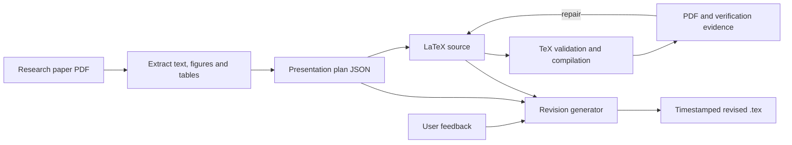

# Auto-Slides (`Westlake-AGI-Lab/Auto-Slides`)

> Research status: **Source-level** · Last reviewed: **2026-08-11**

| Field | Value |
|---|---|
| Organization / team | AGI Lab, Westlake University, with a University of California Merced collaborator |
| Ordinary job | convert an academic paper into a teachable multimodal presentation, verify coverage and compilation, then revise it from natural-language feedback |
| Canonical working artifacts | presentation-plan JSON and LaTeX source; compiled PDF is the visual delivery projection |
| Status | active open-source research system; ICME 2026 acceptance is recorded in the repository |
| Source repository | [Westlake-AGI-Lab/Auto-Slides](https://github.com/Westlake-AGI-Lab/Auto-Slides) |
| Pinned source revision | [`d07d547553d91322215f9ee2de24e8346aef2345`](https://github.com/Westlake-AGI-Lab/Auto-Slides/commit/d07d547553d91322215f9ee2de24e8346aef2345) |
| License | MIT |

## The presentation is a build, not a hidden canvas

Auto-Slides turns a source PDF into extracted content, a planned narrative and LaTeX Beamer files. It then compiles those files and uses verification or repair stages before offering interactive revision.

The editable authority is visible on disk. The PDF is the rendered result that people review or present; changing the PDF does not change the plan or TeX source.

## Plan and TeX answer different questions

The plan captures narrative intent: title, authors, slide sequence, source coverage and selected material. LaTeX owns the exact executable presentation composition. They can diverge, so neither can silently stand in for the other.

`modules/tex_workflow.py` loads or writes the presentation plan, generates `output.tex`, validates/compiles it and can feed errors into a repair step. `modules/direct_tex_generator.py` writes the initial TeX. `modules/revision_tex_generator.py` explicitly accepts both the original plan and previous TeX when incorporating user feedback.

This makes a revision more grounded than regenerating from the original PDF alone: the agent sees the intended narrative and the exact previous implementation.

## Compilation is a deterministic gate with a narrow meaning

`TexValidator` checks whether the generated source can compile. On failure, the workflow reads the current TeX, asks a repair component to address the error and writes the repaired code back before another attempt.

Compilation proves that the source is syntactically and operationally acceptable to the configured TeX environment. It does not prove:

- that important paper content was preserved;
- that figures are semantically paired with the right claims;
- that the deck is legible at presentation distance;
- that the story is pedagogically effective;
- that citations or mathematical statements are correct.

The separate verification and repair modules exist precisely because a clean build is only one acceptance layer.

## Visual and content evidence return to source

The repository contains verification agents, repair agents, figure matching and speech generation. These stages operate on extracted content, the plan, source files and compiled results. When a defect is accepted for repair, the mutation returns to LaTeX or planning state rather than painting over the rendered PDF.

The source-to-projection relationship is therefore stable:

| State | Authority or evidence |
|---|---|
| extracted raw content | grounded source material |
| plan JSON | narrative and slide-level intent |
| `.tex` | exact editable layout/content implementation |
| compiled PDF | visual projection and delivery |
| verification report | diagnostic evidence |
| speech script | optional companion artifact |

## Interactive revision is file-explicit

Revision mode requires `--original-plan`, `--previous-tex` and `--feedback`. The revision generator reads those exact files and writes a timestamped `revised_*.tex` into a new output location. Assets are copied or resolved from prior image directories before validation.

This is a useful form of version clarity: the operator chooses the predecessor. It is not a full version-control system. There is no built-in semantic branch graph, named promotion step or three-way merge. Two revisions can coexist as files, but the software does not decide which is canonical beyond the paths supplied to the next run.

## Persistence follows session directories

The documented output structure separates `raw`, `plan`, `tex`, `images`, `verification`, `repair` and `speech` by session. That makes provenance inspectable and allows operators to preserve intermediate evidence.

Risks remain:

- moving a TeX file without its image tree can break later compilation;
- changing the TeX environment can change or fail the projection;
- a revised source can drift from the original plan unless both are reviewed;
- generated timestamps are identifiers rather than causal version metadata;
- deleting a session directory removes both authority and diagnostic evidence.

Git can version the output tree, but the ordinary workflow does not automatically commit each accepted revision.

## Implementation map

| Concern | Pinned path | Evidence |
|---|---|---|
| CLI and mode selection | `main.py` | generation, interactive and revision entry points |
| source extraction | `modules/pdf_parser.py`, `modules/lightweight_extractor.py` | paper content and asset ingestion |
| narrative authority | `modules/presentation_planner.py`, `modules/lightweight_planner.py` | structured presentation plan |
| TeX authority | `modules/direct_tex_generator.py` | initial source creation and write |
| build/repair loop | `modules/tex_workflow.py`, `modules/tex_validator.py` | validation, compilation, error feedback and rewrite |
| content verification | `modules/verification_agent.py` | checks beyond compilation |
| repair | `modules/repair_agent.py`, `modules/simplified_repair_agent.py` | returns detected problems to source |
| user revision | `modules/revision_tex_generator.py` | previous plan + previous TeX + feedback → new TeX |

## Commit-level evidence

The public lineage begins at `99536057e273e9d554dafa1cb77e11e7c059101c` on 2025-09-17. Revision `5f7cc77` expanded API/model compatibility, and the pinned `d07d547553d91322215f9ee2de24e8346aef2345` records the ICME 2026 status.

The code supports a complete file-based authoring and repair loop. It does not expose a WYSIWYG native slide editor or PowerPoint round trip; those are not required to understand its actual authority, which is plan plus LaTeX.

## Primary evidence

- [Pinned repository](https://github.com/Westlake-AGI-Lab/Auto-Slides/tree/d07d547553d91322215f9ee2de24e8346aef2345)
- [Auto-Slides paper](https://arxiv.org/abs/2509.11062)
- [Westlake University location](https://en.westlake.edu.cn/)
