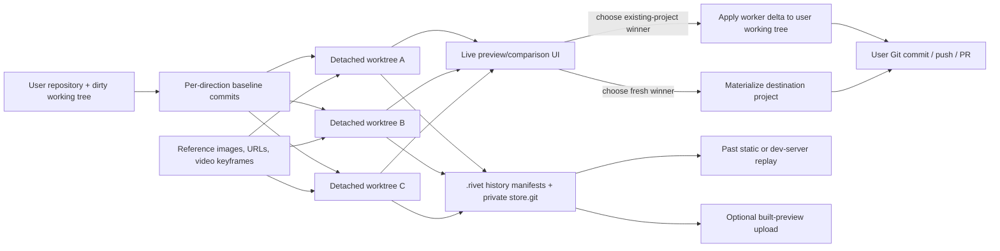

# Rivet

> Research status: **Architecture-level / published-distribution boundary reached / v1.0** · Last reviewed: **2026-08-11**

| Field | Value |
|---|---|
| Organization / team | Rivet Design |
| Current category | Local code-variant decision system with a visual comparison/editor surface |
| Status | Active; current npm/CLI release `0.14.19`, dated 2026-07-31 in the official release notes |
| Ordinary integration | Cursor, Claude Code, Claude Desktop and Codex; CLI first, optional resident stdio MCP |
| Source availability | `GPL-3.0-or-later` is declared for the npm distribution, but no corresponding current source revision is publicly reachable |
| Pinned distribution | `rivet-design@0.14.19`; tarball SHA-256 `4bd3c985ba537c3ca7999fa79bc5d4553cc66eeb7f77dc0fe025b17c415a274a` |
| Published metadata | npm `gitHead` `b4a184be3aeba05d55262a3fd222b117fa819e48`; not found in the repository named by the package |
| Public repository boundary | `rivet-design/rivet` is archived at `87b51a15c4e19417b490b28445a718ddf4852720` and contains only a README at that revision |
| Evidence ceiling reached | Current docs/release notes plus the hash-pinned, readable compiled distribution; unpublished TypeScript sources, service schemas, hosted worker/proxy code and production behavior remain unknown |

## Executive finding

Rivet's current center of gravity is **not a visual document and not a single agent answer**. It is a local decision system that asks several workers to mutate isolated copies of a real project, renders those copies as live alternatives, preserves their trees, and lets the user promote one result back into a working project.

That produces two materially different journeys:

- for an existing repository, each direction is a detached Git worktree whose agent delta is captured as a unified diff; “commit variant” applies that diff to the user's working tree **without creating a Git commit**;
- for a fresh exploration, each direction is either an inline static artifact or a scaffolded Vite application; choosing one writes or moves a project into its destination and can preserve the other runnable directions beside it.

The browser grid is therefore a comparison projection. It is not the durable authority. The durable authorities are split across the user's repository, Rivet's private history store, per-run manifests, live processes, agent runtime state and optional public preview deployments. A ready card, a chosen variant, a Git commit, a pushed branch, a PR and a hosted share link are six different receipts.

## The ordinary journey and its real receipts

The [current introduction](https://docs.rivet.design/index.md), [first-design guide](https://docs.rivet.design/first-designs.md) and [comparison guide](https://docs.rivet.design/comparing-variants.md) describe a user asking an existing coding agent for several directions, watching cards turn into live previews, refining or branching promising options, and keeping a winner.

### 1. Install a control surface into the coding agent

[`rivet install`](https://docs.rivet.design/quickstart.md) writes agent-specific guidance, command allowlists and, when requested, MCP registration. The documented write surface is broader than one executable:

| Host | Documented files or registrations |
|---|---|
| Cursor | global permissions/MCP config and a project `.cursor/rules/rivet.mdc` |
| Claude Code | a Rivet skill, worker-agent definition and settings under `~/.claude/` |
| Claude Desktop | the desktop MCP configuration |
| Codex | `~/.codex/AGENTS.md`, exec-policy rules and `config.toml` |

The [`0.14.19` launcher](https://unpkg.com/rivet-design@0.14.19/bin/rivet.js) also checks npm for updates, may replace the globally installed package, refreshes existing integrations, and then re-executes the original command. Installation is consequently a persistent mutation of the host-agent environment, not a project-local capability toggle. `rivet uninstall <name>` is the documented inverse, but an audit should still diff the relevant host files because user-authored content may share them.

### 2. Attach a local server to the actual project

`rivet open --project <path>` starts or attaches to a per-project server recorded in `.rivet/cli/server.json`. The [technical reference](https://docs.rivet.design/mcp-guide.md) says Rivet detects Next.js, Vite, Create React App, Remix, SvelteKit and static HTML, normally uses port 4000 for its own UI, and either finds or starts the product's development server.

The shipped [`DevServerRuntimeService`](https://unpkg.com/rivet-design@0.14.19/dist/services/DevServerRuntimeService.d.ts) is conservative about the original app: it resolves a cached, discovered or deterministic start command but does not install dependencies or otherwise repair the project. Failure returns diagnostics for the host agent to act on. Static HTML needs no child dev server.

Receipt: a healthy Rivet server plus a reachable upstream preview. Neither proves the project builds from a clean checkout.

### 3. Author distinct directions, then provision isolated baselines

Current MCP uses three tools—`rivet_status`, `rivet_variants` and `rivet_design_context`—while CLI exposes the same lifecycle through `rivet variants ...`. A start carries an instruction, count, short direction briefs, optional element/file scope, fidelity and reference assets.

For an existing repository, the published [`WorktreeManager`](https://unpkg.com/rivet-design@0.14.19/dist/services/WorktreeManager.js) performs a subtle baseline operation:

1. ensure the project has a Git repository and a `HEAD`; a blank/non-repository folder can be initialized and receive a `rivet: initial` commit;
2. create one detached worktree per direction under an OS-temporary Rivet path;
3. capture the user's tracked dirty diff and copy non-ignored untracked files into every worktree;
4. commit that current dirty state inside each worktree as `rivet: variant baseline`;
5. let each worker change only its assigned worktree;
6. calculate `git diff HEAD`, using intent-to-add so new files appear, as the agent delta.

This is why the original working files can remain untouched while alternatives build even when the user started dirty. It also identifies the key failure boundary: applying the dirty patch into a worktree is best-effort. If that patch fails, the implementation logs a warning and continues from repository `HEAD`; a variant may then be generated against a state different from the one visible in the user's original checkout.

### 4. Execute workers under leases, not as one opaque chat turn

The published [`contracts`](https://unpkg.com/rivet-design@0.14.19/dist/agent-variants/contracts.d.ts) define a real work graph rather than a fire-and-forget prompt:

- stages: `awaiting_source_plan` → `awaiting_briefs` → `awaiting_approval` → `work_items_ready` → `waiting_for_results` → terminal `ready`, `degraded`, `failed` or `cancelled`;
- work kinds: source planning, briefs, base scaffolding, static preview, refinement, code generation and runtime cleanup;
- work status: pending, running, succeeded, failed or cancelled;
- leases: owner, issue/expiry timestamps and attempt number;
- dependencies: code-generation items can wait for an internal scaffold item;
- idempotency: accepted report fingerprints and per-session chosen-variant records suppress duplicate completion/application.

The current [`SessionStore`](https://unpkg.com/rivet-design@0.14.19/dist/agent-variants/SessionStore.d.ts) gives code-generation leases a 20-minute default and scaffold leases 30 minutes. A stale or mismatched lease is refused; a timed-out `rivet wait` exits with code 5 while work remains live rather than declaring failure. A QA failure can requeue one direction for a single regeneration, and deletion/cancellation returns an abort signal so a worker stops instead of re-reporting deleted work.

The server can run workers itself through installed Claude, Codex or Cursor CLIs after a per-request preflight. If no suitable runtime is healthy, status exposes `nextAction: complete_host_variant_work` and asks the host coding agent to spawn the work. The [`worker runtime resolver`](https://unpkg.com/rivet-design@0.14.19/dist/agent-variants/workerRuntime.js) keeps a user-selected vendor strict by default; cross-vendor fallback is opt-in because it changes subscription, data-handling and permissions boundaries. The completed history row records the actual vendor/model/effort when the server executor supplied it.

Receipt: terminal work-item reports plus preview QA. This proves only that Rivet accepted the outputs and could prepare previews; it is not repository promotion.

### 5. Compare live code, refine in place or fork lineage

Each card carries direction identity, brief, status and a live preview. The current model supports three different continuations:

- **refine in place**: reopen the selected variant from its current artifact and overwrite that direction after another leased work item;
- **vary/fork**: create sibling directions seeded from a selected parent rather than from the original baseline;
- **adopt from history**: rehydrate a past static variant into a live session so it can be refined or varied after restart.

The distinction is durable. Forked manifests retain a `parentVariant` and a comparison-only parent tree pointer, while their apply base remains the original session base. That prevents a parent-relative diff from being mistaken for the full change that must land in the user's project.

Past full application variants can also be replayed. The [`HistoryReplayService`](https://unpkg.com/rivet-design@0.14.19/dist/services/HistoryReplayService.d.ts) checks out their exact private-store tree into a detached temporary worktree, substitutes a new preview port into the saved serve recipe, overlays current `.env*` files and symlinks current `node_modules`, then keeps a small LRU pool of live replays. The source tree is historical; the secrets, dependencies and external services can be current. A replay is therefore reproducible code evidence, not a reproducible environment.

### 6. Promote the winner through the correct lane

The word “commit” is overloaded.

#### Existing project: variant commit means apply, not Git commit

The current [`commitVariant`](https://unpkg.com/rivet-design@0.14.19/dist/agent-variants/WorktreeOrchestrator.js) serializes commits per session, rejects a second different winner, and applies the selected worktree's unified diff to the repository root. Its result is explicitly `diff-applied` and says the change remains uncommitted.

Because the diff is calculated from the worktree's dirty-state baseline, it contains only the worker delta. If the original tree has drifted since provisioning, plain `git apply` can refuse. Rivet does not silently merge a different variant into the same session after a winner has been recorded.

Receipt: changed files in the user's working tree. The user still needs to inspect, test, stage, commit, push and review.

#### Fresh static project: write the document

For a `static_preview` run, the chosen HTML and its selected assets are flattened into the destination and written as `index.html`. Static HTML is the deliverable, not a patch against an earlier application.

#### Fresh application: materialize a project

For `vite_app`, Rivet normally scaffolds worktrees under the destination parent's `.rivet-variants/` directory. On the same volume, choosing a variant stops its dev server, resolves shared `node_modules`, atomically renames the whole worktree into the final destination and initializes a fresh user-facing repository history. Cross-volume fallback copies the project, excludes install artifacts, installs dependencies in the background, and restarts a preview later.

The unchosen fresh applications may be moved to a sibling `<slug>-variants/NN-<label>/` directory with a manifest and dependency links. “Rejected” in Rivet history therefore does not necessarily mean physically deleted or unrunnable.

Receipt: a real destination directory. It still needs clean-install/build validation and an explicit remote/publish workflow.

### 7. Use Git/PR delivery as a separate promotion clock

The [Git workflow guide](https://docs.rivet.design/git-workflow.md) describes branch creation, file diff inspection, commit, push and GitHub PR creation from the visual editor. The published [`SessionService`](https://unpkg.com/rivet-design@0.14.19/dist/services/SessionService.js) confirms that this plane tracks the current branch, can generate a commit message, commit a change, push and call GitHub CLI to create a PR.

This Git panel is downstream of variant selection. A selected existing-project variant becomes uncommitted working-tree content first; only the Git panel or the user's normal Git tooling makes a repository commit. A PR URL proves remote review state, not merge or deployment.

## Authority topology: two Git stores and several clocks



| State plane | Durable unit | Authority and clock |
|---|---|---|
| User repository | files, index, commits, branches, remote refs | implementation authority after review; can remain dirty after variant selection |
| Live variant session | in-memory stage, work items, leases, previews and chosen record | process/session clock; terminal work is not a Git receipt |
| Variant worktrees | one baseline plus worker delta per direction | isolated execution state; normally disposable for existing projects |
| `.rivet/variants/` | session/variant manifests, legacy diff/files, `DESIGN.md`, deploy records | durable local exploration history, ignored by the user's Git repository |
| `.rivet/store.git` | private base and variant refs over exact trees | content authority for replay/diff regeneration; deliberately separate from user Git |
| `.rivet/rivet.db` | rebuildable metadata projection | read-performance index, not canonical history |
| Dev-server processes | port, command and current runtime memory | live validation projection; can crash or use current dependencies/secrets |
| Host-agent config | skills/rules/allowlists/MCP config and auto-update state | machine-level integration, outside project history |
| Rivet account | JWT, connectors and service-side records | cloud identity/integration clock, outside `.rivet` and user Git |
| Public prototype host | uploaded built file bundle and share URL | delivery artifact; no source tree or authenticated review state |

No public evidence establishes an atomic transaction across these planes.

## The durable variant model

The published [`VariantHistoryService`](https://unpkg.com/rivet-design@0.14.19/dist/services/VariantHistoryService.d.ts) writes:

```text
<project>/.rivet/
├── variants/
│   └── <sessionId>/
│       ├── session.json
│       └── <variantId>/
│           ├── manifest.json
│           ├── diff.patch          # legacy/current compatibility for existing projects
│           ├── files/              # copied project/static artifact when applicable
│           └── DESIGN.md           # fresh design-context artifact when present
├── store.git/                       # self-contained bare Git object store
├── cache/                           # content-addressed extracted trees
└── rivet.db                         # rebuildable SQLite projection
```

A manifest binds:

- session and variant IDs, request correlation, label, brief and session prompt;
- existing versus fresh project kind;
- lifecycle status: completed, committed, rejected, cancelled or removed;
- artifact kind: diff or created project;
- preview kind: static, dev server or none;
- exact variant tree ref/commit/tree SHA and, for existing projects, the exact session-base ref/commit;
- optional parent lineage for a fork;
- a port-parameterized serve recipe rather than a dead captured port;
- design-source provenance, worker runtime and public deployment history.

Persistence stages a complete variant directory and renames it into place so readers do not see a partial entry. The tree ref is written before the manifest that points at it; a crash can leave an unreferenced object reclaimed by GC, but should not publish a manifest with a missing newly-written ref. The SQLite index is explicitly rebuildable from manifests and marked stale on projection failure.

The [`TreeStore`](https://unpkg.com/rivet-design@0.14.19/dist/services/TreeStore.d.ts) uses Git plumbing with a temporary index to snapshot source directories into a self-contained bare repository. It avoids alternates into the user's object database, so user `git gc` cannot invalidate Rivet history and deleting `.rivet` remains a complete local-history uninstall. This is a second Git authority, but its refs are intentionally invisible to `git log --all` and remote pushes.

Important consequence: the saved `diff.patch` is not the strongest artifact. Where tree pointers exist, Rivet can regenerate `diff(base, variant)` from exact trees. The manifest and private refs together are the durable source of truth.

## Visual grounding is runtime identity plus heuristic source evidence

Rivet's comparison and comment surface operates over an iframe proxy. The published [`preview bridge`](https://unpkg.com/rivet-design@0.14.19/dist/proxy-middleware/preview-bridge.js) injects a same-origin-checked script into HTML responses and can return:

- tag, ID, classes, text/HTML snippets and attributes;
- full computed styles and bounding rectangle;
- an XPath;
- nearby sibling/parent summaries;
- a runtime-generated `data-rivet-id` used to re-resolve that DOM node during the current document lifetime.

Target reduction prefers, in order, a single known file, `data-rivet-id`, DOM ID, XPath, then one dominant class. The published [`elementRefToTarget`](https://unpkg.com/rivet-design@0.14.19/dist/agent-variants/elementRefToTarget.js) does not return an authored byte range, AST identity, source revision or framework compiler mapping.

A [`ComponentSearchService`](https://unpkg.com/rivet-design@0.14.19/dist/services/ComponentSearchService.js) exists in the distribution and can heuristically search React component definitions, IDs, meaningful classes and literal text across TSX/JSX/JS/TS/HTML/CSS. In the current published server graph it is not wired into a route or imported by the active server. Current variant intake instead accepts `sourceFiles`/`filePaths` supplied by the caller/UI. It would be unsafe to present that dormant heuristic as a guaranteed current source map.

Therefore Rivet reinforces the existing landscape family “runtime element context plus heuristic/agent source resolution”; it does not establish a new deterministic target-return family. The normal failure modes are DOM remount, duplicate text/classes, hashed utilities, one component rendered many times, XPath drift, a stale runtime ID, or an agent choosing the wrong authored location.

## Design context changes the brief, not artifact authority

The [design-context guide](https://docs.rivet.design/design-context.md) supports:

- Pinterest boards and Are.na channels through connected accounts;
- arbitrary sites rendered into screenshot, CSS variables, computed styles and font evidence;
- up to six local images;
- up to three reference pages for a fresh run;
- up to two local videos sampled into keyframes.

The media/evidence is staged into each direction's briefing. Workers see the source media rather than only a text summary. The planning contract can enrich raw context with design-system or motion guidance and chooses between `static_preview` and `vite_app` based on runtime/asset needs.

These references constrain generation but do not become the implementation authority. A screenshot cannot prove typography licenses, responsive states, accessibility, interaction logic or ownership. Pinterest/Are.na connectivity and arbitrary-page capture cross account/network boundaries even though project execution is local.

## Sharing publishes a built projection

The [sharing guide](https://docs.rivet.design/sharing.md) distinguishes a single variant from a canvas of directions. Recipients get a live clickable build and framing labels without source code or sign-in. Current docs limit public sharing to fresh-project directions; an existing product is handed off through its repository/PR path.

The [`PrototypeDeployService`](https://unpkg.com/rivet-design@0.14.19/dist/services/PrototypeDeployService.d.ts) builds locally, gzips a file list and uploads it with the user's Rivet JWT. Deployments append `{deployId, shareUrl, deployedAt}` to the local manifest without changing the variant's lifecycle status. A completed, rejected or otherwise uncommitted variant can therefore have a live public URL.

“Source stays local” must be read narrowly: ordinary worktree files are local, but AI requests and attached context go to the selected model/runtime, connected-reference flows use Rivet services, and explicit Share uploads the built preview. A build may still contain public environment values, source maps, API endpoints or embedded assets, so the bundle needs a release review of its own.

## Interface contract and current documentation skew

The [current reference](https://docs.rivet.design/mcp-guide.md) and published [`mcpServe`](https://unpkg.com/rivet-design@0.14.19/dist/cli/commands/mcpServe.js) agree on the three-tool MCP surface:

| Tool | Role | Mutation boundary |
|---|---|---|
| `rivet_status` | health, active work and per-variant progress | read-only polling; no blocking MCP wait |
| `rivet_variants` | start, complete host work, commit or cancel | controls the variant state machine and can eventually write project files |
| `rivet_design_context` | fetch/render a URL into design evidence | network/render bound; returns connected data or screenshot/style evidence |

CLI control commands emit one schema-versioned JSON envelope on stdout and human progress on stderr. The current compiled CLI additionally implements `variants get` and `variants complete`, although the concise docs list does not advertise every internal/recovery command.

One sharper skew must be preserved as negative evidence. The npm [`README.md`](https://unpkg.com/rivet-design@0.14.19/README.md) advertises `rivet changes request`, `rivet changes pull` and `--ack <leaseId>`. In the same `0.14.19` distribution:

- [`CLI_CONTROL_COMMANDS`](https://unpkg.com/rivet-design@0.14.19/dist/cli/commandNames.js) has no `changes` entry;
- the full CLI has no changes dispatcher;
- the current CLI router exposes only status and shutdown;
- [`SessionBridgeService`](https://unpkg.com/rivet-design@0.14.19/dist/services/SessionBridgeService.d.ts) returns empty/no-op apply and variant queue metadata.

The lease/ack “pull mode” must therefore not be treated as a working current contract without live contrary evidence. Active variant work has its own real lease model, but that is not the README's missing `changes pull --ack` interface.

## Security, privacy and mutation boundaries

### Local HTTP control

Variant/session and CLI control routes explicitly reject non-loopback clients. Embedded-agent mode binds to `127.0.0.1` and uses a random queue token header in addition to loopback checks. The preview bridge validates the parent origin and uses a response nonce.

The published [`server`](https://unpkg.com/rivet-design@0.14.19/dist/server.js) leaves the listen host unspecified outside embedded mode, while many sensitive routers perform their own loopback guards. A complete security conclusion requires launching every supported mode and probing every route; static inspection alone does not establish that all non-embedded endpoints are unreachable from another interface.

### Local credentials

The published [`ConfigManager`](https://unpkg.com/rivet-design@0.14.19/dist/services/ConfigManager.d.ts) stores access token, refresh token, email, user ID, telemetry identity and worker preferences in `~/.rivet/config.json`. The implementation requests mode `0600` on writes, but Windows ACL behavior and pre-existing file permissions need live verification. Logout clears the local credentials and also attempts server invalidation.

### Worker and reference boundaries

The selected local worker CLI inherits its own authentication and provider policy. Cross-vendor fallback is off by default. Host-agent fallback executes inside the user's already-authorized coding session. References can include local files and remote account content; their copies/derived screenshots/keyframes become worker context and may persist in local variant artifacts.

### Git and filesystem mutations

Rivet can initialize Git and create a commit in a blank folder, create detached worktrees, copy untracked files, write `.gitignore`, create `.rivet`, write host-agent configuration, apply a diff to the user checkout, move a fresh project into place, commit/push through the Git panel, and upload a build. These are distinct permissions and should not be collapsed into “open a visual editor.”

## Failure map

| Failure or ambiguity | Observable behavior | Required recovery/acceptance |
|---|---|---|
| Dirty baseline patch fails in one worktree | warning, then that direction continues from `HEAD` | compare variant base to the original dirty tree before trusting the result |
| Worker lease expires | stale completion rejected; work can be leased again | use current lease/attempt, not cached completion data |
| Worker runtime unavailable | host-agent `nextAction` fallback or honest failure | verify which provider/model actually executed from status/history |
| One direction fails | session can become degraded while siblings remain usable | judge successful variants individually; do not call the whole run complete |
| Preview server crashes | card can be ready in history while live runtime is unavailable | restart/replay and exercise the actual route, not only inspect manifest status |
| Existing project changes after provisioning | winner's plain patch may fail to apply | rebase/regenerate or review a manual merge; never force a stale patch blindly |
| Variant “commit” succeeds | existing project is modified but uncommitted | inspect status/diff, run tests, then make an intentional Git commit |
| History index write fails | `.rivet/rivet.db` marked stale | rebuild from manifests; do not delete canonical manifests/store refs |
| Store or manifest partially missing | history entry may not replay | run integrity checks and retain legacy files fallback where available |
| Historical replay starts | exact source with current env/dependencies | treat as hybrid-time evidence; retest clean install and historical config assumptions |
| Fresh same-volume rename fails | no chosen destination | do not infer copy fallback unless reported; inspect original worktree/destination |
| Fresh cross-volume copy returns early | dependency install/preview may still run in background | wait for clean install/build and stable preview before delivery |
| Share succeeds | public build exists independent of local lifecycle | inspect public bundle and revoke/replace through the hosting service if exposed |
| Public docs and npm README disagree | agent may invoke nonexistent commands | prefer the current executable contract; keep the discrepancy recorded |

## Product evolution: why old “four-tool MCP visual editor” descriptions are stale

The [release history](https://docs.rivet.design/releases.md) shows several architectural pivots:

| Period / release | Publicly evidenced shift |
|---|---|
| `0.5.x` (March 2026) | comments, images and Claude/Cursor/Codex integration; the product still centered visual feedback and apply |
| `0.6.x–0.7.x` | coding-agent chat connection, traceability, visual comment tooling and an MCP-focused layout |
| `0.8.0–0.8.2` | compact direction carousel and, decisively, per-variant Git worktrees with parallel builds |
| `0.9.0–0.9.5` | MCP-first variants, zero-to-one static/Vite paths and persistent local history |
| `0.9.6–0.10.x` | split comparison, image/video references, comments across variants, public prototype deploy and connected design references |
| `0.14.4–0.14.5` | stable persisted variant references, history re-adoption and exact live-row deduplication |
| `0.14.10–0.14.11` | per-request multi-vendor worker resolution, preflight, model selection and runtime attribution |
| `0.14.17–0.14.19` | automatic CLI/integration updates, localization and tighter artifact-output validation |

An older indexed MCP page described `detect_project`, `open_visual_editor`, `watch_for_changes` and `close_visual_editor`, with style/text/comment batches keyed by selector and XPath. Those are useful historical lineage, but the current official page and current distribution expose the three-tool variants contract instead. This dossier uses the current surface and retains selector/XPath only where the shipped preview bridge still proves it.

## Distribution and source-evidence boundary

The pinned [`package.json`](https://unpkg.com/rivet-design@0.14.19/package.json) and [`LICENSE.md`](https://unpkg.com/rivet-design@0.14.19/LICENSE.md) declare GPL-3.0-or-later. The tarball contains 695 files / 9,139,760 unpacked bytes, including readable compiled CommonJS, declaration files and 158 JavaScript source maps. None of those 158 maps embeds `sourcesContent`; they name TypeScript paths but do not contain the TypeScript source.

The metadata names [`rivet-design/rivet`](https://github.com/rivet-design/rivet) and `gitHead=b4a184be…`. Live verification on 2026-08-11 found:

```text
GitHub commit API for b4a184be…: 422, "No commit found for SHA"
git ls-remote ... HEAD/main:       87b51a15c4e19417b490b28445a718ddf4852720
public repository contents:        README.md only
public repository tags:            none returned
```

The archived [public revision](https://github.com/rivet-design/rivet/tree/87b51a15c4e19417b490b28445a718ddf4852720) is not implementation history for `0.14.19`. A license declaration and readable compiled package allow substantial architecture inspection, but they do not supply the corresponding preferred-form source or a reachable commit. Under this landscape's evidence rules Rivet therefore remains **Architecture-level**, not Source-level.

This is an evidence classification, not a legal conclusion about GPL compliance. The missing corresponding-source location should be requested from the publisher rather than inferred.

## What remains unknown

- the corresponding TypeScript source and reachable revision for `0.14.19`;
- production service schemas for authentication, integrations, design capture and prototype hosting;
- exactly which prompt/context fields each supported worker provider transmits and retains under production configuration;
- whether every non-embedded server mode is network-isolated in the shipped desktop/runtime combinations;
- public-share deletion, expiry, access logging and revocation semantics;
- connector token storage, scopes and server-side retention for Pinterest and Are.na;
- production QA thresholds and whether browser/functional checks cover more than the published static artifact validators;
- merge behavior when a user's working tree changes during a long variant run beyond plain patch refusal;
- live behavior of the stale npm README `changes` commands, which are absent from the pinned executable graph;
- full accessibility, responsive, performance and cross-browser acceptance of the visual UI itself.

## Practical acceptance checklist

For a Rivet run to count as a delivered product change rather than an attractive card:

1. record the Rivet package version and the worker vendor/model actually used;
2. record whether the original repository was dirty and whether every direction inherited that baseline;
3. inspect the selected worktree/diff or fresh destination, including new files and asset paths;
4. exercise the intended ordinary-user journey in the chosen preview, not only its first frame;
5. for an existing project, confirm variant selection changed the working tree but did not silently create/push a commit;
6. run project-native lint/type/test/build checks and a clean-install check where delivery risk warrants it;
7. inspect `.rivet` history separately from user Git and retain it only if local exploration history is desired;
8. commit, push and review the intended branch explicitly;
9. inspect the independently deployed environment or public prototype bundle if sharing/release was requested;
10. record unknown service-side retention/revocation instead of treating a copied URL as lifecycle closure.

## Evidence ledger

| Evidence | Pin / observation | What it supports |
|---|---|---|
| npm tarball | `rivet-design-0.14.19.tgz`; SHA-256 `4bd3c985ba537c3ca7999fa79bc5d4553cc66eeb7f77dc0fe025b17c415a274a`; npm integrity `sha512-h6SeyLKD9+W6qFB6Qt3AOe3X+YIQHAY2HinJYj68DQJ7ZxP/NDownVE+mcINH4d31B7XfcZot/anNwlknAXGYA==` | exact inspected distribution |
| package metadata | `0.14.19`, GPL declaration, repository field, unreachable `gitHead` | release/source boundary |
| docs snapshot | fetched 2026-08-11; `mcp-guide.md` SHA-256 `7de61694bc3d13f4535d25b8bf7c748d1796fc98b87fec988173ff60990ad3a9` | current public interface contract |
| release snapshot | fetched 2026-08-11; `releases.md` SHA-256 `dd7c28936d3fe081ef3925e656cc4971f198b48b6c232a67ec843b7f97068869` | product/architecture evolution through `0.14.19` |
| public repository | archived `main`/`HEAD` `87b51a15c4e19417b490b28445a718ddf4852720`, two commits, README only | proves it cannot anchor current implementation |
| compiled implementation | versioned unpkg paths within `0.14.19` | worktrees, leases, persistence, replay, source grounding, Git and sharing mechanics |

## Primary sources

- [Rivet official site](https://rivet.design/)
- [Current documentation index](https://docs.rivet.design/index.md)
- [Install and host mutations](https://docs.rivet.design/quickstart.md)
- [First designs / fresh mode](https://docs.rivet.design/first-designs.md)
- [Comparison, refinement and history](https://docs.rivet.design/comparing-variants.md)
- [Design context](https://docs.rivet.design/design-context.md)
- [Sharing](https://docs.rivet.design/sharing.md)
- [Git workflow](https://docs.rivet.design/git-workflow.md)
- [Current CLI/MCP reference](https://docs.rivet.design/mcp-guide.md)
- [Troubleshooting](https://docs.rivet.design/troubleshooting.md)
- [Release history](https://docs.rivet.design/releases.md)
- [Pinned npm distribution tarball](https://registry.npmjs.org/rivet-design/-/rivet-design-0.14.19.tgz)
- [Pinned published package metadata](https://unpkg.com/rivet-design@0.14.19/package.json)
- [Pinned published implementation directory](https://unpkg.com/browse/rivet-design@0.14.19/dist/)
