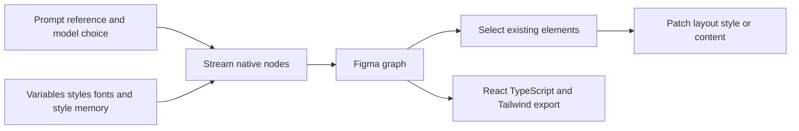

# Aesthetron AI

> Research status: **Architecture-level** · Last reviewed: **2026-08-12**

Aesthetron AI is a Figma plugin that streams frames, Auto Layout, text, icons and images directly into the native canvas. It supports in-place changes to selected nodes, captures local visual style, binds to Figma variables and styles, constructs component variants and exports a selection to React and Tailwind.

## Generation and patching share native identity

Selected-node patching is a stronger intent boundary than regenerating an entire screen. Component-set generation also claims a Cartesian-complete matrix of size, state and style variants, including interaction states; the closed implementation does not reveal how missing or contradictory combinations are validated.

## Model and code boundaries

The user can choose among providers per request and a paid mode supports BYOK plus MCP. The site states local encryption for keys, but public evidence does not expose the plugin source, MCP tool schema, encryption implementation, node protocol or retention behavior.

React/Tailwind export is a one-way materialization into a distinct code artifact. There is no verified code-to-Figma round trip or guarantee that token bindings and component semantics survive export. Team region remains unknown.

## Primary evidence

- [Aesthetron product, mechanism and pricing](https://aesthetron.com/)
- [Figma Community entry](https://aesthetron.com/)
