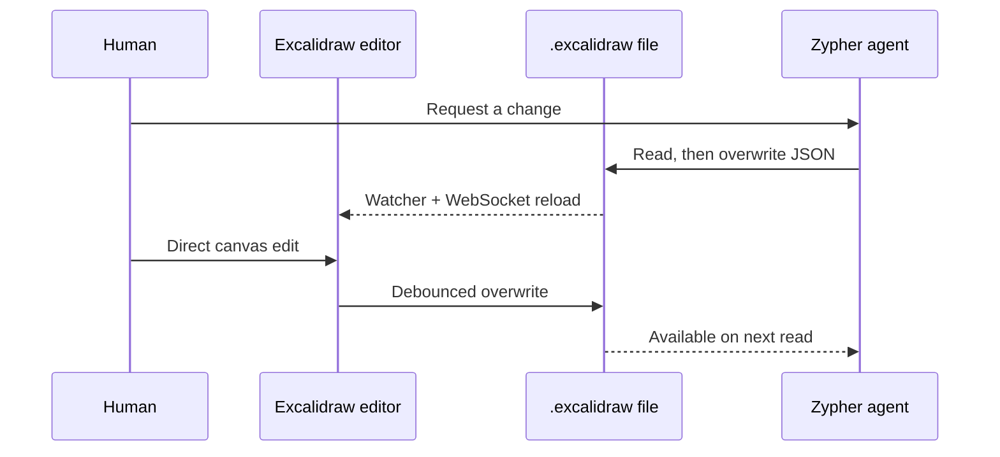

# AG0 Diagramming Agent

> Research status: **Source-level** · Lifecycle: **active** · Last reviewed: **2026-08-12**

AG0 Diagramming Agent defines collaboration between a model and a human as shared file authorship. The agent does not call a bespoke diagram API; it uses general filesystem tools to write native `.excalidraw` JSON, while an embedded Excalidraw editor reads and overwrites that same file.

## The file is both artifact and synchronization protocol

At commit [`192a2416`](https://github.com/corespeed-io/ag0-template-diagramming-agent/tree/192a2416014e715b898d11ab6b8644e69af5f8a4), [`agent.ts`](https://github.com/corespeed-io/ag0-template-diagramming-agent/blob/192a2416014e715b898d11ab6b8644e69af5f8a4/api/agent.ts) extends the Zypher system prompt with the Excalidraw file schema and a simple rule for revision: read the current file first, then write the updated version back. The agent runs through Cloudflare AI Gateway and receives filesystem plus terminal tools rooted at the project working directory.

[`api/mod.ts`](https://github.com/corespeed-io/ag0-template-diagramming-agent/blob/192a2416014e715b898d11ab6b8644e69af5f8a4/api/mod.ts) watches that directory recursively. A changed `.excalidraw` file becomes a WebSocket notification; the browser reloads the file into the native editor. In the other direction, [`useAutoSave`](https://github.com/corespeed-io/ag0-template-diagramming-agent/blob/192a2416014e715b898d11ab6b8644e69af5f8a4/ui/src/hooks/useAutoSave.ts) serializes human edits back to the same path after a one-second debounce.

This yields unusually direct source mapping: everything visible is already represented in a native Excalidraw file that either participant can inspect. There is no parallel semantic spec to drift from the canvas.

## Synchronization is reload-or-overwrite, not collaborative merge

[`ExcalidrawEditor`](https://github.com/corespeed-io/ag0-template-diagramming-agent/blob/192a2416014e715b898d11ab6b8644e69af5f8a4/ui/src/components/ExcalidrawEditor.tsx) suppresses watcher echoes for five seconds after a client save; an external change otherwise reloads the whole scene and remounts Excalidraw. Concurrent human and agent edits are not merged element-by-element. The last completed file write wins, with the read-before-write prompt as the primary coordination mechanism.

The repository also has no artifact revision store. Files are ordinary project files and can be committed with Git, but the application overwrites them in place. Clearing chat in [`App.tsx`](https://github.com/corespeed-io/ag0-template-diagramming-agent/blob/192a2416014e715b898d11ab6b8644e69af5f8a4/ui/src/App.tsx) additionally calls `DELETE /api/files`, coupling conversation reset to deletion of every discovered `.excalidraw` file.

## A local developer tool with a broad authority boundary

The backend exposes CORS-enabled file routes without an application authentication layer. Read/write/create endpoints reject paths outside the project root but do not require an `.excalidraw` extension, and the agent itself has general terminal access. That can be an intentional trusted-workspace design; it should not be treated as a safely multi-tenant or internet-facing diagram service without an additional isolation layer.

## What AG0 contributes

AG0 shows the minimal viable architecture for agent-native visual work: use the editor's real artifact format, let the model operate through ordinary file tools, and make filesystem change events the bridge to the canvas. Its simplicity removes a custom translation layer, while exposing the next research problem cleanly—conflict-aware co-editing and recoverable versions when two authors share one mutable file.

## Evidence

- [Pinned product contract](https://github.com/corespeed-io/ag0-template-diagramming-agent/blob/192a2416014e715b898d11ab6b8644e69af5f8a4/README.md)
- [Agent model, prompt and tool authority](https://github.com/corespeed-io/ag0-template-diagramming-agent/blob/192a2416014e715b898d11ab6b8644e69af5f8a4/api/agent.ts)
- [Filesystem API and watcher bridge](https://github.com/corespeed-io/ag0-template-diagramming-agent/blob/192a2416014e715b898d11ab6b8644e69af5f8a4/api/mod.ts)
- [Human-edit autosave path](https://github.com/corespeed-io/ag0-template-diagramming-agent/blob/192a2416014e715b898d11ab6b8644e69af5f8a4/ui/src/hooks/useAutoSave.ts)
