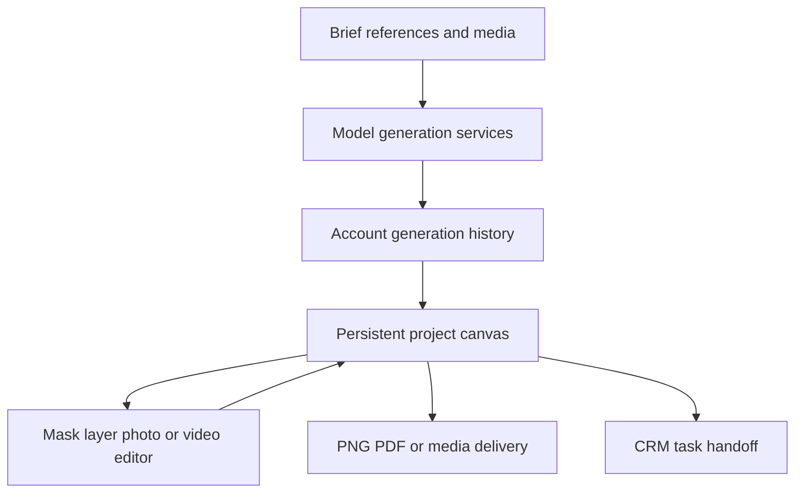

# AI DESIGN SPACE

> Research status: **Architecture-level** · Last reviewed: **2026-08-12**

| Field | Value |
|---|---|
| Team | AI DESIGN SPACE · team region not established |
| Ordinary job | organize references generations and revisions into a production project across visual-design domains |
| Authority | saved project folders canvas objects media resources and editor state |
| Lifecycle | active beta studio |

## The production layer is the product distinction

AI DESIGN SPACE aggregates text image and video models but does not stop at an endpoint picker. Its live surfaces expose generation history grouped into project folders an infinite canvas for references and compositions and dedicated image and video editing modes. The canvas adds object placement grouping locking layer ordering project tabs comments roles and export to PNG or PDF. Generated or uploaded media can also be retained in a resource library.

The editor separates mask-based inpainting layered photo work sketch-to-render background removal upscaling and video assembly. Canvas objects can become CRM tasks so a visual decision can move into team production without pretending the CRM task itself is the Design artifact.

## Evidence boundary

Public live pages establish persistent project organization and named editing operations. They do not expose the canvas object schema conflict model revision history model routing or export implementation. Russian-language branding alone is not used to assign the team a region.

## Primary evidence

- [AI DESIGN SPACE platform and canvas contract](https://aidesignspace.pro/)
- [Live project-history surface](https://aidesignspace.pro/projects/)
- [Live production editor modes](https://aidesignspace.pro/editor/)
