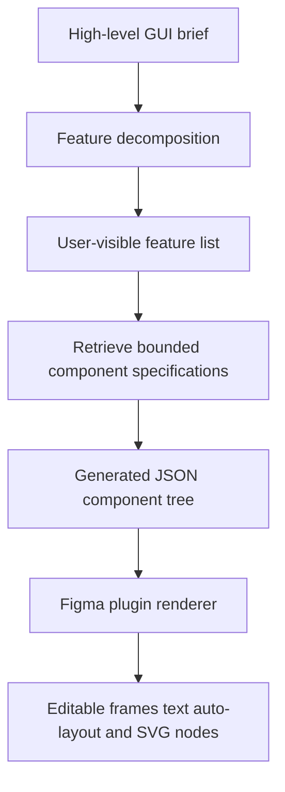

# AI Prototyper

> Research status: **Source-level** · Last reviewed: **2026-08-12**

| Field | Verified value |
|---|---|
| Project | open-source research release of a Figma plugin and local Node.js backend |
| Ordinary input | a high-level GUI brief plus accepted or custom feature descriptions |
| Intermediate authority | feature list and model-produced JSON component tree |
| Durable design authority | native editable nodes in the current Figma file |
| Model integration | Google Generative AI SDK through the local backend |
| Pinned source | [`3814c95a2558bd42fcb424699bb151fb386ada2a`](https://github.com/tongsalangsingha/AI-prototyper-tool/tree/3814c95a2558bd42fcb424699bb151fb386ada2a) |

AI Prototyper is included because the paper's claims are backed by a released implementation that actually writes the host document. It should not be generalized into a full app builder: its vocabulary is deliberately bounded and its output is a visual Figma prototype.

## Two model passes constrain generation before Figma mutation

The backend first decomposes a high-level brief into named GUI features. For each feature it asks the model to select relevant entries from `my_components.js`, retrieves the complete specs for only those entries and then asks for a JSON tree using the retrieved vocabulary. A separate consistency endpoint turns free-form custom-feature text into a normalized name and description.

Retrieval is a grounding mechanism rather than deterministic validation. The model can still emit malformed or semantically weak structures; plugin code and the fixed switch over supported component names determine what can actually materialize.

## The plugin materializes a native graph

`plugin.js` creates frames, text nodes, vectors and nested component structures through the Figma Plugin API. Layout containers use horizontal or vertical auto-layout and explicit spacing/padding rules. Fonts are loaded with fallbacks before characters are assigned. The resulting nodes remain editable with normal Figma tools and persist with the host file.

The plugin does not maintain its own mirror database or node-to-JSON synchronization after creation. Once materialized, Figma is authoritative; a later manual change does not update the earlier model JSON or train the retriever.

## Source evidence map and limits

| Pinned path | Evidence |
|---|---|
| [`server.js`](https://github.com/tongsalangsingha/AI-prototyper-tool/blob/3814c95a2558bd42fcb424699bb151fb386ada2a/server.js) | feature decomposition, component selection, retrieval, JSON generation and consistency normalization |
| [`my_components.js`](https://github.com/tongsalangsingha/AI-prototyper-tool/blob/3814c95a2558bd42fcb424699bb151fb386ada2a/my_components.js) | bounded component vocabulary and full specifications |
| [`plugin.js`](https://github.com/tongsalangsingha/AI-prototyper-tool/blob/3814c95a2558bd42fcb424699bb151fb386ada2a/plugin.js) | native Figma node creation and auto-layout materialization |
| [`my_icons_svg.js`](https://github.com/tongsalangsingha/AI-prototyper-tool/blob/3814c95a2558bd42fcb424699bb151fb386ada2a/my_icons_svg.js) | fixed SVG icon material used by the renderer |
| [`evaluation/`](https://github.com/tongsalangsingha/AI-prototyper-tool/tree/3814c95a2558bd42fcb424699bb151fb386ada2a/evaluation) | research evaluation artifacts rather than runtime authority |

No license file is present at the pinned revision. Public source visibility supports analysis but must not be mistaken for an explicit redistribution license. The implementation also exposes no product account system, collaborative project store or release/version protocol beyond Figma's own document lifecycle.

## Primary evidence

- [Pinned source repository](https://github.com/tongsalangsingha/AI-prototyper-tool/tree/3814c95a2558bd42fcb424699bb151fb386ada2a)
- [Primary research paper](https://arxiv.org/abs/2607.14830)
- [Pinned plugin manifest](https://github.com/tongsalangsingha/AI-prototyper-tool/blob/3814c95a2558bd42fcb424699bb151fb386ada2a/manifest.json)
