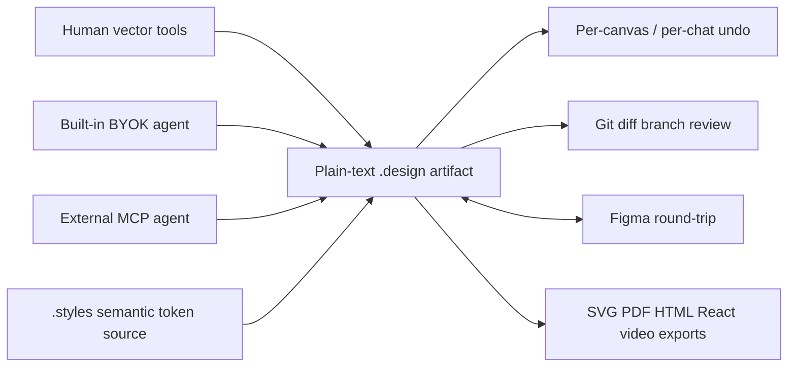

# Brilliant

> Research status: **Architecture-level** · Last reviewed: **2026-08-11**

| Field | Value |
|---|---|
| Team | Brilliant Design Ltd · team region not established |
| Ordinary job | design native vectors with direct tools built-in agents and external MCP agents while keeping the artifact as a Git-friendly local file |
| Canonical artifact | autosaved plain-text YAML `.design` files plus `.styles` sources |
| Recovery | per-canvas undo per-chat undo file copies and Git history |

## Agents execute native design commands

The built-in AI reads the current file and selection and runs the same create property layout component search and export commands available to the application. External MCP clients use the same canvas tool surface. Each action produces native frames text vectors components styles and effects rather than an opaque raster or embedded HTML document.

## Design systems have source and generated layers

`Styles/default.styles` is edited by people and agents. Brilliant resolves it into `.gen/default.gen.yaml`; generated values are not an authoring target and are ignored by Git. Semantic names can map across light/dark or density modes while primitive values remain fixed. This makes system governance executable and reviewable in the repository.

Every change autosaves to disk. Undo histories are per canvas and include AI operations. Git supplies durable named versions branches and review beyond the in-memory undo stack. Figma import/export promises layer component and style continuation; fidelity still depends on supported models and is not assumed perfect.

## Agent privacy and evidence ceiling

The built-in chat is BYOK and requests go directly to the selected model provider according to the documented contract. The desktop implementation is closed so the vector command language validation engine Figma converter and exact YAML schema are architecture evidence rather than source-audited claims.

## Primary evidence

- [Brilliant product](https://brilliant.design/)
- [Built-in AI command boundary](https://brilliant.design/docs/ai/overview)
- [Editor autosave undo and Git model](https://brilliant.design/docs/editor/overview)
- [Design-system source model](https://brilliant.design/docs/design-system/overview)
