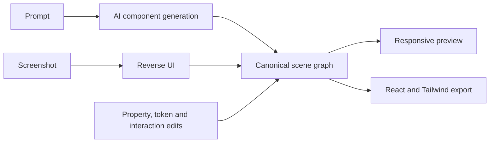

# Buildev by Jun Rod

> Research status: **Source-level** · Lifecycle: **active** · Last reviewed: **2026-08-13**

This Buildev is unrelated to the separately counted `bryfar/Buildev`. Its defining choice is to make a scene graph canonical: AI generation, screenshot reverse-engineering, manual property changes, responsive variants and React/Tailwind export all pass through a structured visual model.

## The scene graph prevents preview code from becoming hidden truth

Pinned revision: `9d589e82b0b32047eb35d099829757c318011b62`.

The project's architecture decision records the scene graph as the authoritative representation. Nodes carry component identity, props, styles, layout, tokens, interactions and responsive state. The editor store mutates that graph; preview and code export compile it. The AI component and reverse-UI routes must return data that can enter the same model rather than bypassing it with an opaque screenshot.

## Identity and persistence boundaries

The duplicate name is recorded explicitly in the identity map. The inspected source establishes local editor/store mechanics but not a server-backed version ledger, so this dossier does not claim collaborative or cross-device recovery.

## Pinned evidence

- [Repository](https://github.com/isjunrod/buildev)
- [Scene-graph authority decision](https://github.com/isjunrod/buildev/blob/9d589e82b0b32047eb35d099829757c318011b62/docs/adr/0002-scene-graph-as-canonical-model.md)
- [Editor store](https://github.com/isjunrod/buildev/blob/9d589e82b0b32047eb35d099829757c318011b62/apps/web/lib/store.ts)
- [Reverse UI route](https://github.com/isjunrod/buildev/blob/9d589e82b0b32047eb35d099829757c318011b62/app/api/reverse-ui/route.ts)
